# Comprehensive 4NF Database Architecture, Schema & ER Model

---

## 1. Executive Summary & Domain Scope

This enterprise data model provides a robust foundation for a **Configure, Price, Quote (CPQ)** and **Order-to-Cash (O2C)** platform. It handles the complete lifecycle:
- **Identity, Access & Multi-Tenant CRM**: Hierarchical sales teams, customers, tiers, and role assignments.
- **CPQ & Dynamic Pricing Engine**: Products, variants, tiered price lists, multi-dimensional discount rules, and automated cross-sell/upsell suggestions.
- **Quotation, Negotiation & Approvals**: Multi-line quotations, line item negotiation comments, version revisions, and risk-evaluated multi-tier approval chains.
- **Order Management, Warehousing & Fulfillment**: Quotation conversion into firm commercial orders, multi-warehouse split allocations, and backorder tracking.
- **Recurring Billing, Invoicing & Payments**: Subscription schedule generation, milestone/recurring invoice generation, payment reconciliation, and credit notes.
- **Enterprise Observability & Security**: Anomaly detection/deal health scores, tamper-evident audit trails, in-app notifications, and JWT session refresh tokens.

---

## 2. 4th Normal Form (4NF) Normalization Deep-Dive

To eliminate redundancy and update/insert/delete anomalies, this schema strictly adheres to **Fourth Normal Form (4NF)**:

1. **First Normal Form (1NF)**:
   - All attribute values are atomic (no comma-separated lists or multi-item fields).
   - Every table has a distinct Primary Key (UUID/Bigserial).
2. **Second Normal Form (2NF)**:
   - No partial dependencies; non-prime attributes are fully functionally dependent on the entire primary key.
3. **Third Normal Form (3NF)**:
   - No transitive dependencies ($A \rightarrow B$ and $B \rightarrow C$ are separated into dedicated relations).
4. **Boyce-Codd Normal Form (BCNF)**:
   - Every determinant is a candidate key.
5. **Fourth Normal Form (4NF)**:
   - **Condition**: Eliminates non-trivial **Multi-Valued Dependencies (MVDs)** ($X \twoheadrightarrow Y$).
   - **Resolution**: Independent multi-valued attributes are separated into distinct associative tables.

### 4NF Decomposition Highlights:
- **User Roles vs. Sales Teams**: A User can have multiple Roles and belong to multiple Sales Teams. Storing them in a single table creates an MVD ($User \twoheadrightarrow Role$, $User \twoheadrightarrow SalesTeam$), leading to cartesian product anomalies. These are split into `user_roles` and `sales_team_members`.
- **Product Variants & Attributes**: Product variants and dynamic attribute pairs are normalized into `product_variants` and typed attribute structures.
- **Price Lists vs. Tiers**: Price lists decouple currency, customer tier, and minimum quantity thresholds into `price_list_items` ($PriceList \times Product \times Tier \times MinQty$).
- **Fulfillment & Backorders**: Order lines decouple discrete warehouse allocations (`warehouse_allocations`) from unfulfilled deficits (`backorders`).

---

## 3. Visual Entity-Relationship (ER) Diagram

```mermaid
erDiagram
    ROLES ||--o{ USER_ROLES : "assigned to"
    USERS ||--o{ USER_ROLES : "possesses"
    USERS ||--o{ REFRESH_TOKENS : "holds"
    USERS ||--o{ NOTIFICATIONS : "receives"
    USERS ||--o{ AUDIT_LOGS : "triggers"
    USERS ||--o{ SALES_TEAM_MEMBERS : "member of"
    SALES_TEAMS ||--o{ SALES_TEAM_MEMBERS : "includes"

    CUSTOMER_TIERS ||--o{ CUSTOMERS : "classifies"
    CUSTOMER_TIERS ||--o{ DISCOUNT_RULES : "qualifies for"
    CUSTOMER_TIERS ||--o{ PRICE_LIST_ITEMS : "applies to"
    CUSTOMERS ||--o{ USERS : "grants portal access"
    CUSTOMERS ||--o{ QUOTATIONS : "requests"
    CUSTOMERS ||--o{ ORDERS : "places"
    CUSTOMERS ||--o{ INVOICES : "billed to"

    PRODUCT_CATEGORIES ||--o{ PRODUCTS : "categorizes"
    PRODUCT_CATEGORIES ||--o{ DISCOUNT_RULES : "governs"
    PRODUCT_CATEGORIES ||--o{ PRODUCT_CATEGORIES : "parent of"

    PRODUCTS ||--o{ PRODUCT_VARIANTS : "has variants"
    PRODUCTS ||--o{ PRICE_LIST_ITEMS : "priced via"
    PRICE_LISTS ||--o{ PRICE_LIST_ITEMS : "contains"
    PRODUCTS ||--o{ INVENTORY_STOCKS : "tracked in"
    WAREHOUSES ||--o{ INVENTORY_STOCKS : "stores"
    WAREHOUSES ||--o{ REPLENISHMENT_RULES : "governed by"
    PRODUCTS ||--o{ REPLENISHMENT_RULES : "threshold for"
    PRODUCTS ||--o{ SUBSCRIPTION_PLANS : "offered as"
    PRODUCTS ||--o{ UPSELL_CROSS_SELL_RULES : "source product"
    PRODUCTS ||--o{ UPSELL_CROSS_SELL_RULES : "suggested product"

    QUOTATIONS ||--o{ QUOTATION_LINES : "contains"
    QUOTATIONS ||--o{ QUOTATION_CHANGES : "audited by"
    QUOTATIONS ||--o{ APPROVAL_REQUESTS : "triggers"
    QUOTATIONS ||--o{ DEAL_HEALTH_SNAPSHOTS : "evaluated by"
    QUOTATION_LINES ||--o{ QUOTATION_LINE_COMMENTS : "discussed via"
    APPROVAL_RULES ||--o{ APPROVAL_REQUESTS : "matched against"
    APPROVAL_REQUESTS ||--o{ APPROVAL_ACTIONS : "progressed by"
    USERS ||--o{ APPROVAL_ACTIONS : "decided by"

    QUOTATIONS ||--o| ORDERS : "converted into"
    ORDERS ||--o{ ORDER_LINES : "consists of"
    ORDER_LINES ||--o{ WAREHOUSE_ALLOCATIONS : "fulfilled by"
    WAREHOUSES ||--o{ WAREHOUSE_ALLOCATIONS : "allocates from"
    ORDER_LINES ||--o{ BACKORDERS : "splits into"
    WAREHOUSES ||--o{ BACKORDERS : "assigned to"
    ORDER_LINES ||--o{ BILLING_SCHEDULES : "generates"
    SUBSCRIPTION_PLANS ||--o{ BILLING_SCHEDULES : "regulates"

    ORDERS ||--o{ INVOICES : "billed via"
    INVOICES ||--o{ INVOICE_LINES : "itemizes"
    INVOICES ||--o{ PAYMENTS : "reconciled by"
    INVOICES ||--o{ CREDIT_NOTES : "adjusted by"
```



---

## 4. Comprehensive Data Dictionary (All 36 Entities)

| # | Entity Name | Primary Key | Foreign Keys | Business Purpose & Invariants |
|---|---|---|---|---|
| 1 | `roles` | `id` (UUID) | None | System role catalog (e.g. Sales Rep, Approver Level 1, Admin). |
| 2 | `users` | `id` (UUID) | `customer_id` | Core identity table for internal staff and external customer portal contacts. |
| 3 | `user_roles` | `(user_id, role_id)` | `user_id`, `role_id` | 4NF associative table mapping multiple roles to users without MVD anomalies. |
| 4 | `customer_tiers` | `id` (UUID) | None | Commercial ranking (Bronze, Silver, Gold, Platinum) with baseline spend and discount limits. |
| 5 | `customers` | `id` (UUID) | `tier_id` | Master commercial accounts with tax identifiers, credit lines, and default addresses. |
| 6 | `sales_teams` | `id` (UUID) | None | Geographic or vertical sales groupings for reporting and quota allocation. |
| 7 | `sales_team_members` | `(team_id, user_id)` | `team_id`, `user_id` | 4NF associative table linking sales reps and team leads to sales teams. |
| 8 | `product_categories` | `id` (UUID) | `parent_category_id` | Adjacency-list hierarchical category catalog. |
| 9 | `products` | `id` (UUID) | `category_id` | Master catalog item for Physical, Service, or Subscription offerings. |
| 10 | `product_variants` | `id` (UUID) | `product_id` | Specific SKU variants with attribute combinations (e.g. Color, Size, Specs). |
| 11 | `price_lists` | `id` (UUID) | None | Named, currency-specific, time-bound price books (e.g. 2026 Enterprise USD). |
| 12 | `price_list_items` | `id` (UUID) | `price_list_id`, `product_id`, `tier_id` | Volume-tiered and customer-tier specific baseline unit pricing. |
| 13 | `discount_rules` | `id` (UUID) | `tier_id`, `category_id` | Guardrails specifying max permissible discount % per tier/category before triggering approvals. |
| 14 | `approval_rules` | `id` (UUID) | `required_role_id` | Tiered escalation thresholds based on discount depth and margin degradation. |
| 15 | `warehouses` | `id` (UUID) | None | Distribution centers with physical locations and shipping cost weighting factors. |
| 16 | `inventory_stocks` | `id` (UUID) | `warehouse_id`, `product_id` | Real-time on-hand, reserved, and computed available inventory counts. |
| 17 | `replenishment_rules` | `id` (UUID) | `warehouse_id`, `product_id` | Automated reorder points and safety stock levels per warehouse facility. |
| 18 | `subscription_plans` | `id` (UUID) | `product_id` | Billing cadence (Monthly/Annual), contract duration, and proration logic. |
| 19 | `upsell_cross_sell_rules` | `(source_product_id, suggested_product_id, rule_type)` | `source_product_id`, `suggested_product_id` | CPQ recommendation matrix with target margin thresholds and promotional incentives. |
| 20 | `quotations` | `id` (UUID) | `customer_id`, `owner_user_id` | Commercial offer header containing totals, gross margins, risk scores, and lifecycle states. |
| 21 | `quotation_lines` | `id` (UUID) | `quotation_id`, `product_id`, `variant_id` | Line items with quantity, unit cost, list price, discount %, and net totals. |
| 22 | `quotation_line_comments` | `id` (UUID) | `quotation_line_id`, `user_id` | Collaboration thread for customer questions or internal rep pricing justifications. |
| 23 | `quotation_changes` | `id` (UUID) | `quotation_id`, `changed_by_user_id` | Full versioned delta changelog of quotation revisions during customer negotiations. |
| 24 | `approval_requests` | `id` (UUID) | `quotation_id`, `approval_rule_id` | Active or archived approval workflow tickets generated for out-of-policy quotes. |
| 25 | `approval_actions` | `id` (UUID) | `approval_request_id`, `approver_user_id` | Audit trail of individual approval decisions (Approved, Rejected, Returned). |
| 26 | `orders` | `id` (UUID) | `quotation_id`, `customer_id` | Confirmed binding commercial contracts converted from accepted quotations. |
| 27 | `order_lines` | `id` (UUID) | `order_id`, `product_id`, `variant_id` | Snapshot of confirmed product quantities, pricing, and fulfillment status counters. |
| 28 | `warehouse_allocations` | `id` (UUID) | `order_line_id`, `warehouse_id` | Multi-warehouse split assignments tracking picking, packing, and shipment progress. |
| 29 | `backorders` | `id` (UUID) | `order_line_id`, `warehouse_id` | Unfulfilled quantities pending restocking, linked to expected arrival dates. |
| 30 | `billing_schedules` | `id` (UUID) | `order_line_id`, `subscription_plan_id` | Milestone or recurring schedule generator for future invoice creation. |
| 31 | `invoices` | `id` (UUID) | `order_id`, `customer_id` | Official fiscal billing document containing subtotals, taxes, and balance due. |
| 32 | `invoice_lines` | `id` (UUID) | `invoice_id`, `product_id` | Granular billed items and descriptions mirroring order lines or subscription intervals. |
| 33 | `payments` | `id` (UUID) | `invoice_id` | Financial ledger entries capturing transaction references, methods, and amounts. |
| 34 | `credit_notes` | `id` (UUID) | `invoice_id`, `order_line_id` | Fiscal adjustment documents for returns, billing disputes, or goodwill credits. |
| 35 | `deal_health_snapshots`| `id` (UUID) | `quotation_id`, `order_id` | Computed deal scoring and anomaly detection metrics generated by ML/rules engine. |
| 36 | `audit_logs` | `id` (BIGSERIAL) | `user_id` | Immutable security audit log tracking all DDL/DML state changes with old/new JSON diffs. |
| 37 | `notifications` | `id` (UUID) | `user_id` | In-app user notifications for pending approvals, deal updates, and restock alerts. |
| 38 | `refresh_tokens` | `id` (UUID) | `user_id` | Secure cryptographic session refresh tokens with revocation support. |

---

## 5. Complete Production DDL Implementation (PostgreSQL)

```sql
-- Enable necessary extensions
CREATE EXTENSION IF NOT EXISTS "uuid-ossp";

-- ============================================================================
-- 1. IAM, ACCESS CONTROL & CUSTOMER MASTER
-- ============================================================================

CREATE TABLE roles (
    id UUID PRIMARY KEY DEFAULT uuid_generate_v4(),
    code VARCHAR(50) NOT NULL UNIQUE,
    name VARCHAR(100) NOT NULL,
    description TEXT,
    created_at TIMESTAMPTZ NOT NULL DEFAULT NOW()
);

CREATE TABLE customer_tiers (
    id UUID PRIMARY KEY DEFAULT uuid_generate_v4(),
    name VARCHAR(50) NOT NULL UNIQUE,
    min_annual_spend NUMERIC(12, 2) NOT NULL DEFAULT 0.00,
    credit_limit NUMERIC(12, 2) NOT NULL DEFAULT 0.00,
    max_discount_percentage NUMERIC(5, 2) NOT NULL DEFAULT 0.00,
    created_at TIMESTAMPTZ NOT NULL DEFAULT NOW()
);

CREATE TABLE customers (
    id UUID PRIMARY KEY DEFAULT uuid_generate_v4(),
    tier_id UUID NOT NULL REFERENCES customer_tiers(id) ON DELETE RESTRICT,
    company_name VARCHAR(255) NOT NULL,
    tax_id VARCHAR(50) UNIQUE,
    email VARCHAR(255) NOT NULL,
    phone VARCHAR(50),
    billing_address JSONB NOT NULL,
    shipping_address JSONB NOT NULL,
    is_active BOOLEAN NOT NULL DEFAULT TRUE,
    created_at TIMESTAMPTZ NOT NULL DEFAULT NOW(),
    updated_at TIMESTAMPTZ NOT NULL DEFAULT NOW()
);

CREATE TABLE sales_teams (
    id UUID PRIMARY KEY DEFAULT uuid_generate_v4(),
    name VARCHAR(100) NOT NULL UNIQUE,
    region VARCHAR(50) NOT NULL,
    created_at TIMESTAMPTZ NOT NULL DEFAULT NOW()
);

CREATE TABLE users (
    id UUID PRIMARY KEY DEFAULT uuid_generate_v4(),
    customer_id UUID REFERENCES customers(id) ON DELETE SET NULL,
    email VARCHAR(255) NOT NULL UNIQUE,
    password_hash VARCHAR(255) NOT NULL,
    first_name VARCHAR(100) NOT NULL,
    last_name VARCHAR(100) NOT NULL,
    is_active BOOLEAN NOT NULL DEFAULT TRUE,
    created_at TIMESTAMPTZ NOT NULL DEFAULT NOW(),
    updated_at TIMESTAMPTZ NOT NULL DEFAULT NOW()
);

CREATE TABLE user_roles (
    user_id UUID NOT NULL REFERENCES users(id) ON DELETE CASCADE,
    role_id UUID NOT NULL REFERENCES roles(id) ON DELETE CASCADE,
    assigned_at TIMESTAMPTZ NOT NULL DEFAULT NOW(),
    PRIMARY KEY (user_id, role_id)
);

CREATE TABLE sales_team_members (
    team_id UUID NOT NULL REFERENCES sales_teams(id) ON DELETE CASCADE,
    user_id UUID NOT NULL REFERENCES users(id) ON DELETE CASCADE,
    is_team_lead BOOLEAN NOT NULL DEFAULT FALSE,
    assigned_at TIMESTAMPTZ NOT NULL DEFAULT NOW(),
    PRIMARY KEY (team_id, user_id)
);

-- ============================================================================
-- 2. PRODUCT CATALOG & CPQ PRICING MATRIX
-- ============================================================================

CREATE TABLE product_categories (
    id UUID PRIMARY KEY DEFAULT uuid_generate_v4(),
    parent_category_id UUID REFERENCES product_categories(id) ON DELETE SET NULL,
    name VARCHAR(100) NOT NULL,
    code VARCHAR(50) NOT NULL UNIQUE,
    created_at TIMESTAMPTZ NOT NULL DEFAULT NOW()
);

CREATE TYPE product_type_enum AS ENUM ('PHYSICAL', 'SERVICE', 'SUBSCRIPTION');

CREATE TABLE products (
    id UUID PRIMARY KEY DEFAULT uuid_generate_v4(),
    category_id UUID NOT NULL REFERENCES product_categories(id) ON DELETE RESTRICT,
    sku VARCHAR(100) NOT NULL UNIQUE,
    name VARCHAR(255) NOT NULL,
    description TEXT,
    product_type product_type_enum NOT NULL DEFAULT 'PHYSICAL',
    base_cost NUMERIC(12, 2) NOT NULL DEFAULT 0.00,
    list_price NUMERIC(12, 2) NOT NULL DEFAULT 0.00,
    is_active BOOLEAN NOT NULL DEFAULT TRUE,
    created_at TIMESTAMPTZ NOT NULL DEFAULT NOW(),
    updated_at TIMESTAMPTZ NOT NULL DEFAULT NOW()
);

CREATE TABLE product_variants (
    id UUID PRIMARY KEY DEFAULT uuid_generate_v4(),
    product_id UUID NOT NULL REFERENCES products(id) ON DELETE CASCADE,
    variant_sku VARCHAR(100) NOT NULL UNIQUE,
    name VARCHAR(255) NOT NULL,
    additional_cost NUMERIC(12, 2) NOT NULL DEFAULT 0.00,
    additional_price NUMERIC(12, 2) NOT NULL DEFAULT 0.00,
    attributes JSONB NOT NULL DEFAULT '{}'::jsonb,
    is_active BOOLEAN NOT NULL DEFAULT TRUE,
    created_at TIMESTAMPTZ NOT NULL DEFAULT NOW()
);

CREATE TABLE price_lists (
    id UUID PRIMARY KEY DEFAULT uuid_generate_v4(),
    name VARCHAR(100) NOT NULL,
    currency VARCHAR(3) NOT NULL DEFAULT 'USD',
    valid_from DATE NOT NULL,
    valid_to DATE,
    is_active BOOLEAN NOT NULL DEFAULT TRUE,
    created_at TIMESTAMPTZ NOT NULL DEFAULT NOW()
);

CREATE TABLE price_list_items (
    id UUID PRIMARY KEY DEFAULT uuid_generate_v4(),
    price_list_id UUID NOT NULL REFERENCES price_lists(id) ON DELETE CASCADE,
    product_id UUID NOT NULL REFERENCES products(id) ON DELETE CASCADE,
    tier_id UUID REFERENCES customer_tiers(id) ON DELETE CASCADE,
    unit_price NUMERIC(12, 2) NOT NULL,
    min_quantity INT NOT NULL DEFAULT 1,
    created_at TIMESTAMPTZ NOT NULL DEFAULT NOW(),
    CONSTRAINT uq_pricelist_item UNIQUE (price_list_id, product_id, tier_id, min_quantity)
);

CREATE TABLE discount_rules (
    id UUID PRIMARY KEY DEFAULT uuid_generate_v4(),
    tier_id UUID REFERENCES customer_tiers(id) ON DELETE CASCADE,
    category_id UUID REFERENCES product_categories(id) ON DELETE CASCADE,
    min_order_value NUMERIC(12, 2) NOT NULL DEFAULT 0.00,
    max_discount_percentage NUMERIC(5, 2) NOT NULL,
    risk_level VARCHAR(20) NOT NULL DEFAULT 'LOW',
    is_active BOOLEAN NOT NULL DEFAULT TRUE,
    created_at TIMESTAMPTZ NOT NULL DEFAULT NOW()
);

CREATE TABLE subscription_plans (
    id UUID PRIMARY KEY DEFAULT uuid_generate_v4(),
    product_id UUID NOT NULL REFERENCES products(id) ON DELETE CASCADE,
    billing_frequency VARCHAR(20) NOT NULL,
    contract_months INT NOT NULL DEFAULT 12,
    proration_behavior VARCHAR(50) NOT NULL DEFAULT 'CALENDAR_PRO_RATA',
    created_at TIMESTAMPTZ NOT NULL DEFAULT NOW()
);

CREATE TABLE upsell_cross_sell_rules (
    source_product_id UUID NOT NULL REFERENCES products(id) ON DELETE CASCADE,
    suggested_product_id UUID NOT NULL REFERENCES products(id) ON DELETE CASCADE,
    rule_type VARCHAR(20) NOT NULL,
    min_margin_threshold NUMERIC(5, 2) NOT NULL DEFAULT 0.00,
    promo_discount_percentage NUMERIC(5, 2) NOT NULL DEFAULT 0.00,
    is_active BOOLEAN NOT NULL DEFAULT TRUE,
    PRIMARY KEY (source_product_id, suggested_product_id, rule_type)
);

-- ============================================================================
-- 3. WAREHOUSING & INVENTORY MANAGEMENT
-- ============================================================================

CREATE TABLE warehouses (
    id UUID PRIMARY KEY DEFAULT uuid_generate_v4(),
    code VARCHAR(50) NOT NULL UNIQUE,
    name VARCHAR(100) NOT NULL,
    location JSONB NOT NULL,
    shipping_weight_factor NUMERIC(4, 2) NOT NULL DEFAULT 1.00,
    is_active BOOLEAN NOT NULL DEFAULT TRUE,
    created_at TIMESTAMPTZ NOT NULL DEFAULT NOW()
);

CREATE TABLE inventory_stocks (
    id UUID PRIMARY KEY DEFAULT uuid_generate_v4(),
    warehouse_id UUID NOT NULL REFERENCES warehouses(id) ON DELETE RESTRICT,
    product_id UUID NOT NULL REFERENCES products(id) ON DELETE RESTRICT,
    quantity_on_hand INT NOT NULL DEFAULT 0 CHECK (quantity_on_hand >= 0),
    quantity_reserved INT NOT NULL DEFAULT 0 CHECK (quantity_reserved >= 0),
    quantity_available INT GENERATED ALWAYS AS (quantity_on_hand - quantity_reserved) STORED,
    updated_at TIMESTAMPTZ NOT NULL DEFAULT NOW(),
    CONSTRAINT uq_warehouse_product UNIQUE (warehouse_id, product_id)
);

CREATE TABLE replenishment_rules (
    id UUID PRIMARY KEY DEFAULT uuid_generate_v4(),
    warehouse_id UUID NOT NULL REFERENCES warehouses(id) ON DELETE CASCADE,
    product_id UUID NOT NULL REFERENCES products(id) ON DELETE CASCADE,
    reorder_point INT NOT NULL DEFAULT 10,
    reorder_quantity INT NOT NULL DEFAULT 50,
    safety_stock INT NOT NULL DEFAULT 5,
    is_active BOOLEAN NOT NULL DEFAULT TRUE,
    created_at TIMESTAMPTZ NOT NULL DEFAULT NOW(),
    CONSTRAINT uq_replenishment_rule UNIQUE (warehouse_id, product_id)
);

-- ============================================================================
-- 4. QUOTATION & MULTI-TIER APPROVAL WORKFLOW
-- ============================================================================

CREATE TYPE quote_status_enum AS ENUM (
    'DRAFT', 'SUBMITTED', 'PENDING_APPROVAL', 'APPROVED',
    'REJECTED', 'NEGOTIATION', 'ACCEPTED', 'EXPIRED'
);

CREATE TABLE approval_rules (
    id UUID PRIMARY KEY DEFAULT uuid_generate_v4(),
    min_discount_percentage NUMERIC(5, 2) NOT NULL,
    max_discount_percentage NUMERIC(5, 2) NOT NULL,
    min_margin_percentage NUMERIC(5, 2) NOT NULL,
    required_role_id UUID NOT NULL REFERENCES roles(id) ON DELETE RESTRICT,
    approval_order INT NOT NULL DEFAULT 1,
    is_active BOOLEAN NOT NULL DEFAULT TRUE
);

CREATE TABLE quotations (
    id UUID PRIMARY KEY DEFAULT uuid_generate_v4(),
    quote_number VARCHAR(100) NOT NULL UNIQUE,
    customer_id UUID NOT NULL REFERENCES customers(id) ON DELETE RESTRICT,
    owner_user_id UUID NOT NULL REFERENCES users(id) ON DELETE RESTRICT,
    status quote_status_enum NOT NULL DEFAULT 'DRAFT',
    total_list_amount NUMERIC(12, 2) NOT NULL DEFAULT 0.00,
    total_discount_amount NUMERIC(12, 2) NOT NULL DEFAULT 0.00,
    total_net_amount NUMERIC(12, 2) NOT NULL DEFAULT 0.00,
    overall_margin_percentage NUMERIC(5, 2) NOT NULL DEFAULT 0.00,
    risk_score NUMERIC(5, 2) NOT NULL DEFAULT 0.00,
    valid_until DATE NOT NULL,
    created_at TIMESTAMPTZ NOT NULL DEFAULT NOW(),
    updated_at TIMESTAMPTZ NOT NULL DEFAULT NOW()
);

CREATE TABLE quotation_lines (
    id UUID PRIMARY KEY DEFAULT uuid_generate_v4(),
    quotation_id UUID NOT NULL REFERENCES quotations(id) ON DELETE CASCADE,
    product_id UUID NOT NULL REFERENCES products(id) ON DELETE RESTRICT,
    variant_id UUID REFERENCES product_variants(id) ON DELETE RESTRICT,
    quantity INT NOT NULL CHECK (quantity > 0),
    unit_cost NUMERIC(12, 2) NOT NULL,
    unit_list_price NUMERIC(12, 2) NOT NULL,
    discount_percentage NUMERIC(5, 2) NOT NULL DEFAULT 0.00,
    unit_net_price NUMERIC(12, 2) NOT NULL,
    total_line_amount NUMERIC(12, 2) NOT NULL,
    margin_percentage NUMERIC(5, 2) NOT NULL,
    created_at TIMESTAMPTZ NOT NULL DEFAULT NOW()
);

CREATE TABLE quotation_line_comments (
    id UUID PRIMARY KEY DEFAULT uuid_generate_v4(),
    quotation_line_id UUID NOT NULL REFERENCES quotation_lines(id) ON DELETE CASCADE,
    user_id UUID NOT NULL REFERENCES users(id) ON DELETE RESTRICT,
    comment TEXT NOT NULL,
    is_internal_only BOOLEAN NOT NULL DEFAULT FALSE,
    created_at TIMESTAMPTZ NOT NULL DEFAULT NOW()
);

CREATE TABLE quotation_changes (
    id UUID PRIMARY KEY DEFAULT uuid_generate_v4(),
    quotation_id UUID NOT NULL REFERENCES quotations(id) ON DELETE CASCADE,
    changed_by_user_id UUID NOT NULL REFERENCES users(id) ON DELETE RESTRICT,
    revision_number INT NOT NULL DEFAULT 1,
    change_summary JSONB NOT NULL,
    created_at TIMESTAMPTZ NOT NULL DEFAULT NOW()
);

CREATE TABLE approval_requests (
    id UUID PRIMARY KEY DEFAULT uuid_generate_v4(),
    quotation_id UUID NOT NULL REFERENCES quotations(id) ON DELETE CASCADE,
    approval_rule_id UUID NOT NULL REFERENCES approval_rules(id) ON DELETE RESTRICT,
    current_status VARCHAR(20) NOT NULL DEFAULT 'PENDING',
    created_at TIMESTAMPTZ NOT NULL DEFAULT NOW(),
    updated_at TIMESTAMPTZ NOT NULL DEFAULT NOW()
);

CREATE TABLE approval_actions (
    id UUID PRIMARY KEY DEFAULT uuid_generate_v4(),
    approval_request_id UUID NOT NULL REFERENCES approval_requests(id) ON DELETE CASCADE,
    approver_user_id UUID NOT NULL REFERENCES users(id) ON DELETE RESTRICT,
    action VARCHAR(20) NOT NULL,
    comments TEXT,
    acted_at TIMESTAMPTZ NOT NULL DEFAULT NOW()
);

-- ============================================================================
-- 5. ORDERS & FULFILLMENT ORCHESTRATION
-- ============================================================================

CREATE TYPE order_status_enum AS ENUM (
    'CONFIRMED', 'PROCESSING', 'PARTIALLY_FULFILLED', 'FULFILLED', 'CANCELLED'
);

CREATE TABLE orders (
    id UUID PRIMARY KEY DEFAULT uuid_generate_v4(),
    order_number VARCHAR(100) NOT NULL UNIQUE,
    quotation_id UUID UNIQUE REFERENCES quotations(id) ON DELETE RESTRICT,
    customer_id UUID NOT NULL REFERENCES customers(id) ON DELETE RESTRICT,
    order_status order_status_enum NOT NULL DEFAULT 'CONFIRMED',
    total_amount NUMERIC(12, 2) NOT NULL,
    placed_at TIMESTAMPTZ NOT NULL DEFAULT NOW(),
    updated_at TIMESTAMPTZ NOT NULL DEFAULT NOW()
);

CREATE TABLE order_lines (
    id UUID PRIMARY KEY DEFAULT uuid_generate_v4(),
    order_id UUID NOT NULL REFERENCES orders(id) ON DELETE CASCADE,
    product_id UUID NOT NULL REFERENCES products(id) ON DELETE RESTRICT,
    variant_id UUID REFERENCES product_variants(id) ON DELETE RESTRICT,
    quantity_ordered INT NOT NULL CHECK (quantity_ordered > 0),
    quantity_allocated INT NOT NULL DEFAULT 0,
    quantity_backordered INT NOT NULL DEFAULT 0,
    unit_price NUMERIC(12, 2) NOT NULL,
    total_price NUMERIC(12, 2) NOT NULL,
    created_at TIMESTAMPTZ NOT NULL DEFAULT NOW()
);

CREATE TABLE warehouse_allocations (
    id UUID PRIMARY KEY DEFAULT uuid_generate_v4(),
    order_line_id UUID NOT NULL REFERENCES order_lines(id) ON DELETE CASCADE,
    warehouse_id UUID NOT NULL REFERENCES warehouses(id) ON DELETE RESTRICT,
    allocated_quantity INT NOT NULL CHECK (allocated_quantity > 0),
    status VARCHAR(30) NOT NULL DEFAULT 'ALLOCATED',
    allocated_at TIMESTAMPTZ NOT NULL DEFAULT NOW()
);

CREATE TABLE backorders (
    id UUID PRIMARY KEY DEFAULT uuid_generate_v4(),
    order_line_id UUID NOT NULL REFERENCES order_lines(id) ON DELETE CASCADE,
    warehouse_id UUID REFERENCES warehouses(id) ON DELETE SET NULL,
    unfulfilled_quantity INT NOT NULL CHECK (unfulfilled_quantity > 0),
    expected_restock_date DATE,
    status VARCHAR(30) NOT NULL DEFAULT 'OPEN',
    created_at TIMESTAMPTZ NOT NULL DEFAULT NOW()
);

-- ============================================================================
-- 6. BILLING, INVOICING, PAYMENTS & CREDIT ADJUSTMENTS
-- ============================================================================

CREATE TABLE billing_schedules (
    id UUID PRIMARY KEY DEFAULT uuid_generate_v4(),
    order_line_id UUID NOT NULL REFERENCES order_lines(id) ON DELETE CASCADE,
    subscription_plan_id UUID REFERENCES subscription_plans(id) ON DELETE RESTRICT,
    due_date DATE NOT NULL,
    amount NUMERIC(12, 2) NOT NULL,
    is_billed BOOLEAN NOT NULL DEFAULT FALSE,
    created_at TIMESTAMPTZ NOT NULL DEFAULT NOW()
);

CREATE TYPE invoice_status_enum AS ENUM (
    'DRAFT', 'ISSUED', 'PAID', 'PARTIALLY_PAID', 'VOID', 'CREDITED'
);

CREATE TABLE invoices (
    id UUID PRIMARY KEY DEFAULT uuid_generate_v4(),
    invoice_number VARCHAR(100) NOT NULL UNIQUE,
    order_id UUID NOT NULL REFERENCES orders(id) ON DELETE RESTRICT,
    customer_id UUID NOT NULL REFERENCES customers(id) ON DELETE RESTRICT,
    status invoice_status_enum NOT NULL DEFAULT 'ISSUED',
    subtotal_amount NUMERIC(12, 2) NOT NULL,
    tax_amount NUMERIC(12, 2) NOT NULL DEFAULT 0.00,
    total_amount NUMERIC(12, 2) NOT NULL,
    paid_amount NUMERIC(12, 2) NOT NULL DEFAULT 0.00,
    due_date DATE NOT NULL,
    issued_at TIMESTAMPTZ NOT NULL DEFAULT NOW()
);

CREATE TABLE invoice_lines (
    id UUID PRIMARY KEY DEFAULT uuid_generate_v4(),
    invoice_id UUID NOT NULL REFERENCES invoices(id) ON DELETE CASCADE,
    product_id UUID NOT NULL REFERENCES products(id) ON DELETE RESTRICT,
    quantity INT NOT NULL CHECK (quantity > 0),
    unit_price NUMERIC(12, 2) NOT NULL,
    total_line_amount NUMERIC(12, 2) NOT NULL,
    created_at TIMESTAMPTZ NOT NULL DEFAULT NOW()
);

CREATE TABLE payments (
    id UUID PRIMARY KEY DEFAULT uuid_generate_v4(),
    invoice_id UUID NOT NULL REFERENCES invoices(id) ON DELETE CASCADE,
    payment_method VARCHAR(50) NOT NULL,
    transaction_reference VARCHAR(100) UNIQUE,
    amount NUMERIC(12, 2) NOT NULL CHECK (amount > 0),
    status VARCHAR(30) NOT NULL DEFAULT 'COMPLETED',
    paid_at TIMESTAMPTZ NOT NULL DEFAULT NOW()
);

CREATE TABLE credit_notes (
    id UUID PRIMARY KEY DEFAULT uuid_generate_v4(),
    invoice_id UUID NOT NULL REFERENCES invoices(id) ON DELETE RESTRICT,
    order_line_id UUID REFERENCES order_lines(id) ON DELETE SET NULL,
    credit_number VARCHAR(100) NOT NULL UNIQUE,
    credit_amount NUMERIC(12, 2) NOT NULL CHECK (credit_amount > 0),
    reason TEXT NOT NULL,
    created_at TIMESTAMPTZ NOT NULL DEFAULT NOW()
);

-- ============================================================================
-- 7. OBSERVABILITY, AUDITING & SECURITY
-- ============================================================================

CREATE TABLE deal_health_snapshots (
    id UUID PRIMARY KEY DEFAULT uuid_generate_v4(),
    quotation_id UUID REFERENCES quotations(id) ON DELETE CASCADE,
    order_id UUID REFERENCES orders(id) ON DELETE CASCADE,
    health_score NUMERIC(5, 2) NOT NULL,
    anomaly_flags JSONB NOT NULL DEFAULT '[]'::jsonb,
    calculated_at TIMESTAMPTZ NOT NULL DEFAULT NOW()
);

CREATE TABLE audit_logs (
    id BIGSERIAL PRIMARY KEY,
    user_id UUID REFERENCES users(id) ON DELETE SET NULL,
    entity_name VARCHAR(100) NOT NULL,
    entity_id UUID NOT NULL,
    action VARCHAR(50) NOT NULL,
    old_values JSONB,
    new_values JSONB,
    ip_address INET,
    created_at TIMESTAMPTZ NOT NULL DEFAULT NOW()
);

CREATE TABLE notifications (
    id UUID PRIMARY KEY DEFAULT uuid_generate_v4(),
    user_id UUID NOT NULL REFERENCES users(id) ON DELETE CASCADE,
    title VARCHAR(255) NOT NULL,
    message TEXT NOT NULL,
    is_read BOOLEAN NOT NULL DEFAULT FALSE,
    action_url VARCHAR(500),
    created_at TIMESTAMPTZ NOT NULL DEFAULT NOW()
);

CREATE TABLE refresh_tokens (
    id UUID PRIMARY KEY DEFAULT uuid_generate_v4(),
    user_id UUID NOT NULL REFERENCES users(id) ON DELETE CASCADE,
    token_hash VARCHAR(255) NOT NULL UNIQUE,
    expires_at TIMESTAMPTZ NOT NULL,
    is_revoked BOOLEAN NOT NULL DEFAULT FALSE,
    created_at TIMESTAMPTZ NOT NULL DEFAULT NOW()
);

-- ============================================================================
-- 8. INDEXES & QUERY OPTIMIZATION
-- ============================================================================

CREATE INDEX idx_customers_tier ON customers(tier_id);
CREATE INDEX idx_products_category ON products(category_id);
CREATE INDEX idx_price_list_items_lookup ON price_list_items(price_list_id, product_id, tier_id);
CREATE INDEX idx_inventory_product ON inventory_stocks(product_id);
CREATE INDEX idx_quotations_customer_status ON quotations(customer_id, status);
CREATE INDEX idx_quotation_lines_quote ON quotation_lines(quotation_id);
CREATE INDEX idx_orders_customer ON orders(customer_id);
CREATE INDEX idx_order_lines_order ON order_lines(order_id);
CREATE INDEX idx_invoices_customer_status ON invoices(customer_id, status);
CREATE INDEX idx_payments_invoice ON payments(invoice_id);
CREATE INDEX idx_audit_logs_entity ON audit_logs(entity_name, entity_id);
CREATE INDEX idx_notifications_user_read ON notifications(user_id, is_read);
```

---

## 6. End-to-End Workflow Execution Lifecycle

```
 ┌───────────────┐
 │ Product/Price │ ──► Define Products, Variants, Price Lists & Discount Boundaries
 └───────┬───────┘
         │
         ▼
 ┌───────────────┐
 │   Quotation   │ ──► Build Quote Lines, Calculate Margins, Trigger Approval Engine
 └───────┬───────┘
         │
         ▼
 ┌───────────────┐
 │ Approvals &   │ ──► Multi-tier Approver Sign-off & Customer Negotiation History
 │ Negotiation   │
 └───────┬───────┘
         │ (Accepted)
         ▼
 ┌───────────────┐
 │ Commercial    │ ──► Order Created, Split Warehouse Allocations & Log Backorders
 │ Order & WMS   │
 └───────┬───────┘
         │
         ▼
 ┌───────────────┐
 │ Billing & AR  │ ──► Subscription Schedules, Invoices, Payment Capture & Credit Notes
 └───────────────┘
```
