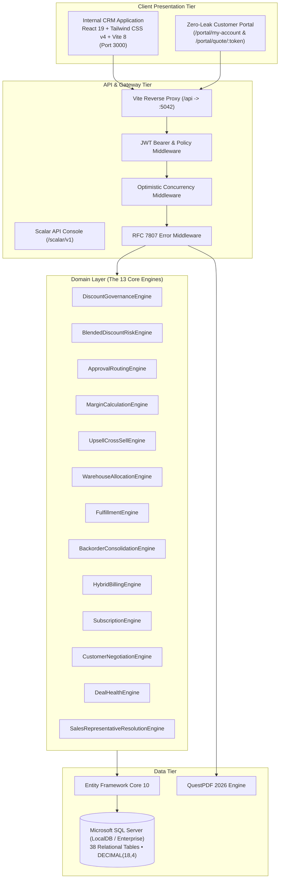

# DealFlow360: Intelligent, Self-Governing Sales Operations Platform

[](https://dotnet.microsoft.com/)
[](https://react.dev/)
[](https://tailwindcss.com/)
[](https://www.microsoft.com/sql-server)
[](LICENSE)

DealFlow360 is an enterprise-grade sales operations and revenue acceleration platform designed to eliminate margin leakage, enforce automated multi-tier discount governance, optimize multi-warehouse inventory fulfillment, orchestrate hybrid one-time and recurring SaaS billing, and provide a secure, **zero-leak** customer negotiation portal.

---

## ⚡ Quick Start (Under 1 Minute)

Run the entire platform locally in two terminals:

### Terminal 1: Backend (.NET 10 Web API)
```powershell
cd "backend\DealFlow360.API\DealFlow360.API"
dotnet run --configuration Release
```
*The backend compiles, auto-seeds all 38 SQL Server tables, and starts listening on `http://localhost:5042`.*

### Terminal 2: Frontend (React 19 / Vite)
```powershell
cd "frontend"
npm install
npm run dev -- --port 3000
```
*The frontend starts on `http://localhost:3000` with hot-module replacement and automated reverse-proxying to the backend.*

Open **`http://localhost:3000`** in your browser and log in with any demo persona below!

---

## 🔐 Safe Development & QA Test Accounts

The platform seeds a controlled reference dataset on startup. All accounts share the password standard:

| Persona | Email | Password | Role | Access Scope |
| :--- | :--- | :--- | :--- | :--- |
| **System Admin** | `admin@dealflow360.io` | `Admin@123` | `Admin` | Full platform superuser, catalogs, users, master data. |
| **Sales Manager** | `manager@dealflow360.io` | `Manager@123` | `SalesManager` | Approvals queue, deal health, pipeline Kanban, reporting. |
| **Sales Rep** | `rep@dealflow360.io` | `Rep@123` | `SalesRep` | Quotations builder, customer catalog, upsell engine, inquiries. |
| **Finance Director**| `finance@dealflow360.io` | `Finance@123` | `FinanceOperations` | High-risk approvals, invoices, payment recording, credit notes. |
| **Customer Portal** | `customer@dealflow360.io` | `Customer@123` | `Customer` | Isolated customer portal, proposal sign-off, counter-offers. |

---

## 🌟 Core System Capabilities

1. **Quotation Builder & Real-Time Governance:**  
   Enforces customer tier discount ceilings (**Bronze 5.0%**, **Silver 10.0%**, **Gold 15.0%**) at the line item level. Proposals within tier ceilings are **auto-approved instantly**.
2. **Blended Risk & Margin Scoring Engine:**  
   Computes a real-time $0–100$ composite risk score based on peak discount violation ($40\%$), volume-weighted margin loss ($35\%$), and gross margin deficit ($25\%$).
3. **Multi-Tier Sequential Approval State Machine:**  
   Exceeding tier ceilings routes proposals to Level 1 (Sales Manager). If risk $\ge 70$ or discount $> 15\%$, it automatically escalates to Level 2 (Finance Operations). **Self-approval is strictly forbidden.**
4. **Live Upsell & Cross-Sell Affinity Engine:**  
   Dynamically generates complementary product recommendations with real-time gross margin delta calculation and 1-click addition to proposals.
5. **Multi-Warehouse Allocation & Backorders:**  
   Greedy inventory allocation algorithm prioritizing primary fulfillment hubs (Pune, Ahmedabad, Bengaluru), minimizing split dispatches, and reserving backorders.
6. **Hybrid Billing & Invoicing Engine:**  
   Automatically segregates converted orders into immediate commercial invoices for physical hardware and recurring billing schedules for SaaS subscriptions.
7. **Strict Zero-Leak Customer Negotiation Portal:**  
   External buyers review and negotiate proposals via cryptographic HMAC-SHA256 magic links or authenticated portal accounts. Internal cost prices, margins, risk scores, and manager notes are physically excluded from client DTOs.
8. **Automated Re-Approval on Customer Counter-Offers:**  
   Customer counter-proposals increment versioning ($v1 \rightarrow v2$). If the counter exceeds the pre-approved tier ceiling, it automatically re-routes into the Manager's approval queue.
9. **QuestPDF Commercial Document Generation:**  
   High-performance C# document generation engine streaming pixel-perfect commercial quotation PDFs across CRM and customer portal surfaces.
10. **Deal Health & Pipeline Telemetry:**  
    Tracks deal velocity, identifies stalled proposals (>5 days inactive), and alerts managers to rep discount anomalies ($>2\sigma$).

---

## 🏛️ System Architecture



---

## 🛠️ Locked Technology Stack

| Layer | Technologies | Notes |
| :--- | :--- | :--- |
| **Frontend** | React `19.2.8`, Vite `8.2.2`, Tailwind CSS `v4.3.3`, React Router `7.18.3`, Lucide React `1.41.0`, oxlint `1.79.0` | High-performance SPA with modern CSS utility styling and hot module replacement. |
| **Backend** | ASP.NET Core Web API, C# 12, .NET `10.0`, FluentValidation `11.11.0`, BCrypt.Net `4.0.3` | Clean Architecture with 13 single-responsibility domain engines. |
| **ORM & Data** | Entity Framework Core `10.0.11`, Microsoft SQL Server (LocalDB / Express / Enterprise) | 38 relational tables with strict `DECIMAL(18, 4)` financial precision and optimistic concurrency. |
| **Document Generation** | QuestPDF `2026.8.0` (Community License) | Native C# vector layout engine streaming PDF documents without headless browsers. |
| **API Documentation** | Scalar `2.17.1` (`Scalar.AspNetCore`), Microsoft.AspNetCore.OpenApi `10.0.9` | Interactive API documentation accessible at `/scalar/v1`. |

---

## 📋 Prerequisites

- **.NET SDK:** .NET 10 (or .NET 9) installed (`dotnet --version`).
- **Node.js:** Node.js v18.18+ or v20+ (`node --version`).
- **npm:** npm v9+ (`npm --version`).
- **Database:** Microsoft SQL Server LocalDB (`(localdb)\mssqllocaldb`) or SQL Server 2019+ instance.

---

## ⚙️ Environment Configuration

Review the provided environment configuration references:
- **Root Reference:** [`.env.example`](.env.example)
- **Frontend Reference:** [`frontend/.env.example`](frontend/.env.example)
- **Backend Reference:** [`backend/DealFlow360.API/DealFlow360.API/appsettings.Example.json`](backend/DealFlow360.API/DealFlow360.API/appsettings.Example.json)

### Primary Configuration Keys:
```bash
# Frontend dev proxy target
VITE_API_BACKEND_URL=http://localhost:5042

# SQL Server connection string
ConnectionStrings__DefaultConnection="Server=(localdb)\\mssqllocaldb;Database=DealFlow;Integrated Security=True;TrustServerCertificate=True;MultipleActiveResultSets=True;"

# Cryptographic token signing secret (min 32 characters)
Jwt__SecretKey="DealFlow360SuperSecretMasterKeyThatIsAtLeast32BytesLongForHS256Encryption!"
Jwt__Issuer="DealFlow360API"
Jwt__Audience="DealFlow360App"
```

---

## 🧪 Automated Testing

Execute the end-to-end test suites verifying the full sales workflow against the live database:

```powershell
# 1. Master QA Dataset Verification
node scripts/test_qa_dataset_e2e.js

# 2. Complete Customer Counter-Offer & Negotiation Re-Approval
node scripts/test_sales_rep_negotiation_e2e.js

# 3. QuestPDF Commercial Proposal PDF Generation
node scripts/test_quotation_pdf_generation_e2e.js

# Reset test transactions back to baseline:
npm run db:reset:qa
```

---

## 📁 Project Structure

```text
DealFlow360/
├── .env.example                                      # Comprehensive environment variable reference
├── CONTRIBUTING.md                                   # Contribution guidelines and engineering standards
├── package.json                                      # Root package file with QA database scripts
├── README.md                                         # This authoritative platform entry point
├── backend/
│   └── DealFlow360.API/
│       └── DealFlow360.API/
│           ├── Controllers/                          # 13 REST API Controllers
│           ├── Data/                                 # AppDbContext & DbInitializer
│           ├── DTOs/                                 # Strongly-typed request & response contracts
│           ├── Middleware/                           # Concurrency & RFC 7807 Exception Middlewares
│           ├── Models/                               # 38 EF Core Domain Entities & Enums
│           ├── Services/                             # Application Services & 13 Core Domain Engines
│           │   ├── Engines/                          # Single-responsibility business engines
│           │   └── Pdf/                              # QuestPDF Commercial Proposal Generator
│           ├── Validators/                           # FluentValidation rules
│           ├── appsettings.json                      # Local development configuration
│           └── DealFlow360.API.csproj                # .NET 10 SDK project file
├── frontend/
│   ├── src/
│   │   ├── api/                                      # Centralized apiClient & domain API wrappers
│   │   ├── components/                               # Layouts, design system UI, and domain modals
│   │   ├── context/                                  # AuthContext and ToastContext
│   │   ├── pages/                                    # 22 role-based CRM & portal screens
│   │   └── App.jsx                                   # Route registry & ProtectedRoute guards
│   ├── package.json                                  # React 19 dependencies & scripts
│   └── vite.config.js                                # Vite 8 + Tailwind v4 + API reverse proxy
├── docs/                                             # Master Engineering Documentation Index
│   ├── README.md                                     # Documentation Directory Index
│   ├── INSTALLATION.md                               # Step-by-step developer installation guide
│   ├── ARCHITECTURE.md                               # System & component technical architecture
│   ├── WORKFLOWS.md                                  # End-to-end business workflows & state diagrams
│   ├── ROLES_AND_PERMISSIONS.md                      # Functional permission matrix
│   ├── API.md                                        # RESTful API route specification & DTOs
│   ├── DATABASE.md                                   # Relational schema, tables & DECIMAL(18,4)
│   ├── TESTING.md                                    # E2E test suites & QA verification
│   ├── QA_DATA.md                                    # 5 customers, 12 accounts, 24 products
│   ├── DEPLOYMENT.md                                 # Production packaging, Docker & Nginx
│   ├── SECURITY.md                                   # Zero-leak boundary, JWT & audit logging
│   ├── TROUBLESHOOTING.md                            # Operational diagnostics & issue resolutions
│   └── SCRIPTS.md                                    # Runbook for all npm & node automation scripts
└── scripts/                                          # Automated Node.js E2E test runners & DB tools
    ├── db_reset_qa.js                                # Transaction data reset script
    ├── clear_deals.js                                # Deal cleaner utility
    ├── test_qa_dataset_e2e.js                        # Master QA reference verification
    ├── test_sales_rep_negotiation_e2e.js             # Negotiation & re-approval test
    └── test_quotation_pdf_generation_e2e.js          # QuestPDF generation & byte validator
```

---

## 📖 Complete Documentation Index

For deep-dive technical specifications, consult the documents in the [`docs/`](docs/) directory:

- 🚀 [Installation Guide](docs/INSTALLATION.md)
- 🏛️ [System Architecture](docs/ARCHITECTURE.md)
- 🔄 [Operational Workflows](docs/WORKFLOWS.md)
- 🛡️ [Roles & Permissions](docs/ROLES_AND_PERMISSIONS.md)
- 🔌 [REST API Specification](docs/API.md)
- 💾 [Database & Schema](docs/DATABASE.md)
- 🧪 [Testing & QA Strategy](docs/TESTING.md)
- 📊 [QA Reference Dataset](docs/QA_DATA.md)
- 🚢 [Production Deployment](docs/DEPLOYMENT.md)
- 🔒 [Security & Data Governance](docs/SECURITY.md)
- 🔧 [Troubleshooting Runbook](docs/TROUBLESHOOTING.md)
- 📜 [Script Reference](docs/SCRIPTS.md)

---

## 📄 License

This project is licensed under the terms of the [MIT License](LICENSE).
