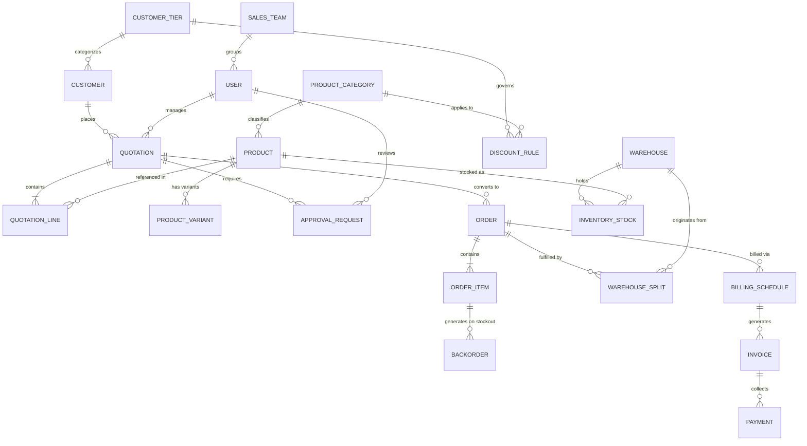
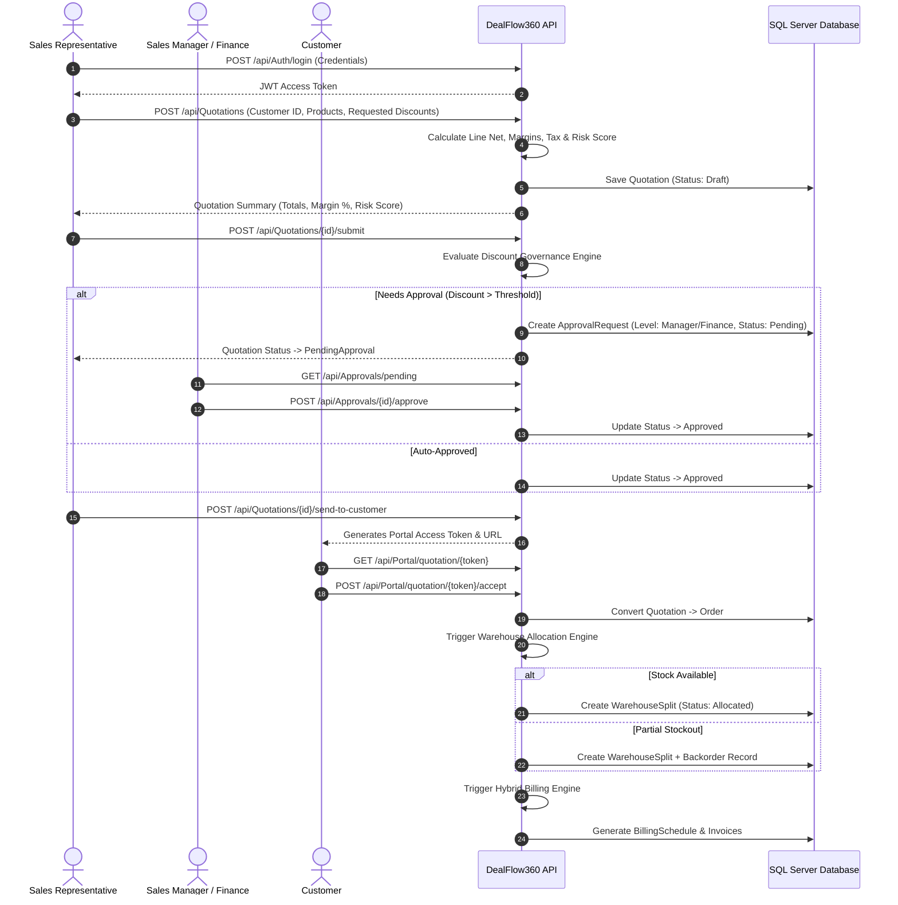

# DealFlow360 - Enterprise CPQ & Automated Deal Lifecycle Engine


**DealFlow360** is a state-of-the-art Enterprise Configure, Price, Quote (CPQ) and automated Deal Lifecycle Management Web API built on **ASP.NET Core**, **Entity Framework Core**, and **Microsoft SQL Server**. It automates complex enterprise B2B sales cycles—from multi-tier discount governance and multi-level approval routing to multi-warehouse inventory allocation, milestone billing, customer portal negotiations, and real-time deal health scoring.

---

## 📑 Table of Contents
- [Executive Overview](#-executive-overview)
- [Key Features](#-key-features)
- [System Architecture & 13 Domain Engines](#-system-architecture--13-domain-engines)
- [Database Architecture & Entity Relationships](#-database-architecture--entity-relationships)
- [Role-Based Access Control (RBAC) & Test Credentials](#-role-based-access-control-rbac--test-credentials)
- [End-to-End Business Workflow](#-end-to-end-business-workflow)
- [Complete API Sitemap](#-complete-api-sitemap)
- [Project Directory Structure](#-project-directory-structure)
- [Getting Started & Local Setup](#-getting-started--local-setup)
- [Scalar Interactive API UI](#-scalar-interactive-api-ui)

---

## 🚀 Executive Overview

Enterprise B2B dealmaking often suffers from unauthorized discounting, manual approval bottlenecks, inventory stockouts across multiple fulfillment centers, and complex billing reconciliation. **DealFlow360** solves these challenges by combining strict financial margin guardrails with automated workflow engines:

- **Guardrail Enforcement**: Prevents sales reps from offering unauthorized discounts that erode margins below target thresholds.
- **Automated Approvals**: Multi-level routing automatically escalates risky quotes to Sales Managers or Finance Operations.
- **Smart Logistics**: Splits shipments across multiple warehouses and manages backorders seamlessly.
- **Hybrid Monetization**: Supports one-time hardware sales, recurring subscriptions, usage-based billing, and milestone payments in a single quote.
- **Transparent Negotiation**: Provides a secure customer portal where buyers can accept, counter-offer, or request quote modifications.

---

## 🌟 Key Features

| Module | Description |
| :--- | :--- |
| **Multi-Tier Discount Governance** | Enforces tier-based discount ceilings (Gold, Silver, Bronze) and triggers manager/finance approval tiers automatically when thresholds are exceeded. |
| **Blended Discount Risk Engine** | Calculates weighted average discount across multi-line quotes and computes a dynamic **Risk Score (0-100)** based on margin erosion and deal volume. |
| **Multi-Level Approval Routing** | Dynamic sequential routing through Sales Manager (Level 1) and Finance Operations (Level 2) with audit trail timestamps and reason logging. |
| **Margin Calculation & Guardrails** | Computes real-time net amounts, cost totals, margin amounts, and margin percentages per line and quote. |
| **Warehouse Allocation & Backorders** | Multi-warehouse inventory split logic that reserves on-hand stock and automatically generates backorder records for stockout quantities. |
| **Hybrid Billing Engine** | Generates milestone billing schedules (Upfront, Delivery, Acceptance) alongside recurring subscription schedules. |
| **Customer Negotiation Portal** | Public token-authenticated portal allowing customers to view quotes, accept terms, or submit counter-offers without exposing internal cost/margin data. |
| **Upsell & Cross-Sell Engine** | Algorithmic product recommendation engine suggesting complementary products and upgrade paths during quote creation. |
| **360° Deal Health Dashboard** | Monitors quote conversion velocity, margin health, risk distribution, and team sales performance. |

---

## 🏗️ System Architecture & 13 Domain Engines

The core business logic of DealFlow360 is organized into **13 decoupled Domain Engines** located in `Services/Engines/`, ensuring clean separation of mathematical logic from controller data flow:

```
DealFlow360.API/
├── Services/
│   ├── Engines/
│   │   ├── DiscountGovernanceEngine.cs    --> Validates tier rules & determines approval necessity
│   │   ├── BlendedDiscountRiskEngine.cs   --> Computes blended discount % and 0-100 risk score
│   │   ├── ApprovalRoutingEngine.cs       --> Builds multi-level approval step chains
│   │   ├── MarginCalculationEngine.cs     --> Calculates margins, net amounts, and tax totals
│   │   ├── UpsellCrossSellEngine.cs       --> Evaluates upsell rules for recommended items
│   │   ├── WarehouseAllocationEngine.cs   --> Allocates stock from primary/secondary warehouses
│   │   ├── FulfillmentEngine.cs           --> Processes warehouse fulfillment split execution
│   │   ├── BackorderConsolidationEngine.cs--> Groups out-of-stock items into consolidated backorders
│   │   ├── HybridBillingEngine.cs         --> Builds milestone payment & subscription schedules
│   │   ├── SubscriptionEngine.cs          --> Manages recurring subscription lifecycles
│   │   ├── CustomerNegotiationEngine.cs   --> Handles counter-offers and portal state updates
│   │   ├── DealHealthEngine.cs            --> Calculates deal health scores & risk categorization
│   │   └── (Dashboard / Reporting Engine) --> Aggregates revenue pipeline & sales metrics
```

---

## 🗄️ Database Architecture & Entity Relationships

The system utilizes **Microsoft SQL Server 2022** with Entity Framework Core code-first migrations. The database comprises **35 tables** covering the entire quote-to-cash lifecycle:

### Entity Relationship Overview



### Table Categories

1. **Identity & Governance**: `Users`, `RefreshTokens`, `SalesTeams`, `CustomerTiers`, `ApprovalRules`, `DiscountRules`
2. **Catalog & Inventory**: `ProductCategories`, `Products`, `ProductVariants`, `PriceLists`, `PriceListItems`, `Warehouses`, `InventoryStocks`
3. **Quotation & Approvals**: `Quotations`, `QuotationLines`, `ApprovalRequests`, `CustomerNegotiations`, `DealHealthLogs`
4. **Fulfillment & Logistics**: `Orders`, `OrderItems`, `WarehouseSplits`, `Backorders`
5. **Billing & Subscriptions**: `BillingSchedules`, `Invoices`, `Payments`, `SubscriptionPlans`, `Subscriptions`
6. **System & Analytics**: `AuditLogs`, `SystemConfigs`, `UpsellRules`, `Notifications`

---

## 🔐 Role-Based Access Control (RBAC) & Test Credentials

DealFlow360 implements strict role-based access control with 5 distinct user roles. The database is pre-seeded with test accounts for instant evaluation:

| Role | Email | Password | Allowed System Permissions |
| :--- | :--- | :--- | :--- |
| **Admin** | `admin@dealflow360.io` | `Admin@123` | Full administrative control: User management, system configuration, master catalog, discount rules, executive analytics. |
| **Sales Rep** | `rep@dealflow360.io` | `Rep@123` | Own workspace: Create & edit quotes, add lines, apply discounts, submit for approval, track assigned customer deals. |
| **Sales Manager** | `manager@dealflow360.io` | `Manager@123` | Team workspace: Approve/reject Level 1 discount quotes, configure discount tier rules, monitor team health. |
| **Finance Operations** | `finance@dealflow360.io` | `Finance@123` | Operations workspace: Approve Level 2 high-risk quotes, warehouse fulfillment split approval, billing reconciliation. |
| **Customer** | `customer@dealflow360.io` | `Customer@123` | Self-service customer portal: View assigned quotation details, accept terms, submit counter-offer negotiations. |

---

## 🔄 End-to-End Business Workflow



---

## 📡 Complete API Sitemap

The API exposes **14 controller modules**:

### 1. Authentication & Security (`/api/Auth`)
- `POST /api/Auth/login` - Authenticate user & issue JWT + Refresh token.
- `POST /api/Auth/refresh-token` - Refresh expired JWT token.
- `POST /api/Auth/revoke-token` - Revoke active refresh token.

### 2. Admin Platform & Config (`/api/Admin`)
- `GET|POST|PUT /api/Admin/users` - User account administration.
- `GET|POST /api/Admin/customer-tiers` - Customer tier management (Gold, Silver, Bronze).
- `GET|POST /api/Admin/categories` - Product category configuration.
- `GET|POST|PUT /api/Admin/products` - Master product catalog control.
- `GET|POST /api/Admin/price-lists` - Master price list administration.
- `GET|POST /api/Admin/warehouses` - Warehouse facility configuration & stock adjustment.

### 3. Customer Management (`/api/Customers`)
- `GET /api/Customers` - List customers with tier & sales rep assignment.
- `GET /api/Customers/{id}` - Get customer detailed profile.
- `POST /api/Customers` - Register new customer account.
- `PUT /api/Customers/{id}` - Update customer information.

### 4. Product Catalog & Categories (`/api/Products`)
- `GET /api/Products` - Browse products with category filtering.
- `GET /api/Products/{id}` - Get product detail with variants.
- `POST /api/Products` - Create product record (*Manager/Admin*).
- `PUT /api/Products/{id}` - Update product attributes (*Manager/Admin*).
- `GET /api/Products/categories` - List active product categories.
- `POST /api/Products/categories` - Add product category (*Admin*).
- `POST /api/Products/{id}/variants` - Add variant options (*Manager/Admin*).

### 5. Discount Rules (`/api/DiscountRules`)
- `GET /api/DiscountRules` - List discount governance rules.
- `GET /api/DiscountRules/{id}` - Get specific rule details.
- `POST /api/DiscountRules` - Create discount rule (*Manager/Admin*).
- `PUT /api/DiscountRules/{id}` - Update discount rule (*Manager/Admin*).
- `DELETE /api/DiscountRules/{id}` - Deactivate discount rule (*Manager/Admin*).

### 6. Quotation Engine (`/api/Quotations`)
- `GET /api/Quotations` - List workspace quotations.
- `GET /api/Quotations/{id}` - Full quotation breakdown with lines & approval steps.
- `POST /api/Quotations` - Draft new quote with line items.
- `PUT /api/Quotations/{id}` - Edit draft quote attributes.
- `POST /api/Quotations/{id}/lines` - Add line item to draft quote.
- `PUT /api/Quotations/{id}/lines/{lineId}` - Update line quantity or discount.
- `DELETE /api/Quotations/{id}/lines/{lineId}` - Remove line item.
- `POST /api/Quotations/{id}/submit` - Submit quote for approval routing.
- `POST /api/Quotations/{id}/send-to-customer` - Publish quote to customer portal.
- `POST /api/Quotations/{id}/convert-to-order` - Convert approved quote to order.

### 7. Approvals Management (`/api/Approvals`)
- `GET /api/Approvals/pending` - Get pending approval queue for user role.
- `GET /api/Approvals/history` - View historic approval actions.
- `POST /api/Approvals/{id}/approve` - Approve pending request with reasoning.
- `POST /api/Approvals/{id}/reject` - Reject quotation request.
- `POST /api/Approvals/{id}/return` - Return quotation to rep for revision.

### 8. Sales Orders (`/api/Orders`)
- `GET /api/Orders` - List sales orders with status filters.
- `GET /api/Orders/{id}` - Get order details, item breakdown & fulfillment status.

### 9. Warehouse Logistics & Fulfillment (`/api/Fulfillment`)
- `GET /api/Fulfillment/allocations` - View warehouse stock allocation status.
- `POST /api/Fulfillment/orders/{orderId}/allocate` - Allocate inventory across warehouses.
- `POST /api/Fulfillment/splits/{splitId}/ship` - Process shipment dispatch.
- `GET /api/Fulfillment/backorders` - List pending backorder consolidations.

### 10. Billing Engine (`/api/Billing`)
- `GET /api/Billing/schedules` - View generated billing schedules.
- `POST /api/Billing/schedules/generate` - Generate milestone/subscription schedule.
- `GET /api/Billing/invoices` - List invoices.
- `POST /api/Billing/invoices/{id}/pay` - Process invoice payment.

### 11. Customer Portal (`/api/Portal`)
- `GET /api/Portal/quotation/{token}` - Public customer view of quotation.
- `POST /api/Portal/quotation/{token}/accept` - Customer accepts quotation terms.
- `POST /api/Portal/quotation/{token}/counter` - Customer submits counter-offer.

### 12. Deal Health & Analytics (`/api/DealHealth`)
- `GET /api/DealHealth/dashboard` - Deal health overview & risk breakdown.
- `GET /api/DealHealth/quote/{quoteId}` - Health score analysis for specific quote.

### 13. Executive Reports (`/api/Reports`)
- `GET /api/Reports/executive-dashboard` - High-level revenue, margin & conversion KPIs.
- `GET /api/Reports/sales-rep-performance` - Sales team performance breakdown.
- `GET /api/Reports/discount-leakage` - Discount erosion analysis report.

---

## 📁 Project Directory Structure

```
Odoo-Hecathon-Gandhinagar/
├── backend/
│   └── DealFlow360.API/
│       ├── DealFlow360.API.sln
│       └── DealFlow360.API/
│           ├── Controllers/
│           │   ├── AdminController.cs
│           │   ├── ApprovalsController.cs
│           │   ├── AuthController.cs
│           │   ├── BillingController.cs
│           │   ├── CustomersController.cs
│           │   ├── DealHealthController.cs
│           │   ├── DiscountRulesController.cs
│           │   ├── FulfillmentController.cs
│           │   ├── OrdersController.cs
│           │   ├── PortalController.cs
│           │   ├── ProductsController.cs
│           │   ├── QuotationsController.cs
│           │   └── ReportsController.cs
│           ├── Data/
│           │   ├── AppDbContext.cs
│           │   ├── AppDbContextFactory.cs
│           │   └── DbInitializer.cs
│           ├── DTOs/
│           │   ├── ApprovalRules/
│           │   ├── Categories/
│           │   ├── CustomerTiers/
│           │   ├── DiscountRules/
│           │   ├── Products/
│           │   ├── Quotations/
│           │   └── ...
│           ├── Middleware/
│           │   ├── ConcurrencyMiddleware.cs
│           │   └── ExceptionMiddleware.cs
│           ├── Models/
│           │   ├── Enums/
│           │   └── (35 Entity Domain Classes)
│           ├── Services/
│           │   ├── Engines/ (13 Math & Logic Domain Engines)
│           │   ├── AuthService.cs
│           │   ├── QuotationService.cs
│           │   ├── ProductService.cs
│           │   └── ...
│           ├── Migrations/
│           ├── Program.cs
│           └── appsettings.json
└── README.md
```

---

## 🛠️ Getting Started & Local Setup

### Prerequisites
- **.NET 9.0 SDK** or **.NET 10.0 SDK**
- **Microsoft SQL Server 2019/2022** (or SQL Server Express / LocalDB)
- **Git**

### Step-by-Step Installation

1. **Clone the Repository**:
   ```bash
   git clone https://github.com/aniruddh209/Odoo-Heckathon-Gandhinagar.git
   cd Odoo-Heckathon-Gandhinagar
   ```

2. **Configure Database Connection**:
   Open `backend/DealFlow360.API/DealFlow360.API/appsettings.json` and verify your local SQL Server connection string:
   ```json
   "ConnectionStrings": {
     "DefaultConnection": "Server=localhost,1433;Database=DealFlow;User Id=SA;Password=YourPassword123!;TrustServerCertificate=True;MultipleActiveResultSets=True;"
   }
   ```

3. **Restore Packages & Apply EF Core Migrations**:
   ```bash
   cd backend/DealFlow360.API/DealFlow360.API
   dotnet restore
   dotnet ef database update
   ```
   *This command creates the `DealFlow` database on your local SQL Server instance and generates all 35 tables with foreign keys and indexes.*

4. **Run the API Server**:
   ```bash
   dotnet run --urls=http://localhost:5000
   ```
   *On initial startup, `DbInitializer` automatically seeds default customer tiers, sales teams, demo products, warehouses, and 5 role test users.*

---

## 🌐 Scalar Interactive API UI

Once the application is running, open your web browser and navigate to:

👉 **[http://localhost:5000/scalar/v1](http://localhost:5000/scalar/v1)**

Scalar provides a visual, interactive API reference where you can explore endpoints, view JSON request/response schemas, execute test calls, and authorize requests using JWT Bearer tokens.

- **OpenAPI 3.1 Spec Document**: `http://localhost:5000/openapi/v1.json`

---

## 👨‍💻 Development & Author

- **Repository**: [aniruddh209 / Odoo-Heckathon-Gandhinagar](https://github.com/aniruddh209/Odoo-Heckathon-Gandhinagar)
- **Project**: DealFlow360 Enterprise CPQ Platform
- **License**: MIT License
