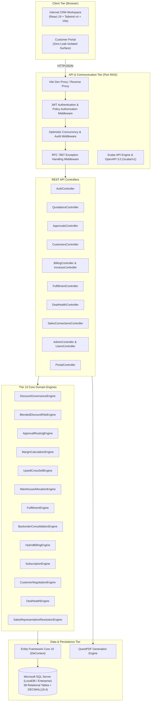

# DealFlow360 — Technical Architecture Specification

This document provides a detailed overview of the system architecture, component boundaries, domain services, security perimeters, and data flow across the **DealFlow360** platform.

---

## 1. High-Level Architecture Overview

DealFlow360 is built on a modern decoupled architecture: a high-performance **React 19 Single Page Application (SPA)** communicating via JSON REST APIs with an **ASP.NET Core Web API (.NET 10)** backend, persisted in **Microsoft SQL Server**.

---

## 2. Frontend Presentation Layer

- **Framework:** React 19 with Vite 8 development server and bundler.
- **Styling & Design System:** Tailwind CSS v4 (`@tailwindcss/vite`), custom Slate & Cobalt theme palette, Lucide React icons.
- **Routing:** React Router v7 (`react-router-dom`), supporting role-guarded routes (`ProtectedRoute.jsx`) and public magic-link access.
- **State Management:** Decoupled contextual state (`AuthContext.jsx`, `ToastContext.jsx`) paired with component-level reactive hooks.
- **API Client:** Centralized HTTP layer (`frontend/src/api/apiClient.js`):
  - Automatic JWT Bearer header injection from `localStorage`.
  - Global `401 Unauthorized` interception firing `dealflow:unauthorized` events.
  - RFC 7807 Problem Details normalization.
  - Binary `blob` download streaming for QuestPDF documents.
- **Surfaces:**
  1. **Internal CRM:** Navigation sidebar, KPI headers, quotation workflow canvas, discount governance indicators, interactive pipeline Kanban, multi-warehouse fulfillment, hybrid billing, and analytics reports.
  2. **Customer Portal (`/portal/my-account` & `/portal/quote/:token`):** Purpose-built client surface physically stripped of CRM chrome, margins, cost figures, and internal remarks.

---

## 3. API & Middleware Layer

### 3.1 Custom Middlewares
- **`ExceptionMiddleware`:** Catches all uncaught server exceptions, returns RFC 7807 compliant problem details, logs structured error details, and ensures no unformatted stack traces leak to the client.
- **`ConcurrencyMiddleware`:** Intercepts `DbUpdateConcurrencyException`, returning HTTP 409 Conflict with guidance to reload stale records.

### 3.2 Authentication & Authorization Policies
- **Authentication:** JWT Bearer tokens signed with HMAC-SHA256 (`Jwt__SecretKey`), validating issuer, audience, and expiration.
- **Policies:**
  - `RequireAdmin`: Requires role `Admin`.
  - `RequireSalesManager`: Requires role `SalesManager` or `Admin`.
  - `RequireSalesRep`: Requires role `SalesRep`, `SalesManager`, or `Admin`.
  - `RequireFinance`: Requires role `FinanceOperations` or `Admin`.
  - `RequireCustomer`: Requires role `Customer` or `Admin`.

### 3.3 Interactive API Documentation
- Powered by **Scalar** (`Scalar.AspNetCore` 2.17.1) and **Microsoft.AspNetCore.OpenApi**.
- Route: `GET http://localhost:5042/scalar/v1`
- OpenAPI JSON: `GET http://localhost:5042/openapi/v1.json`

---

## 4. The 13 Core Domain Engines

The application logic is encapsulated into 13 single-responsibility domain engines registered with the dependency injection container:

| # | Engine | Interface | Primary Responsibility |
| :--- | :--- | :--- | :--- |
| **1** | **Discount Governance** | `IDiscountGovernanceEngine` | Evaluates line-item discounts against customer tier ceilings (Bronze 5%, Silver 10%, Gold 15%) and product category thresholds. |
| **2** | **Blended Discount Risk** | `IBlendedDiscountRiskEngine` | Calculates a 0–100 composite risk score weighted across peak violation ($40\%$), volume-weighted margin loss ($35\%$), and gross margin deficit ($25\%$). |
| **3** | **Approval Routing** | `IApprovalRoutingEngine` | Implements sequential two-tier approval: Level 1 Sales Manager, escalating to Level 2 Finance Operations if risk $\ge 70$ or discount $> 15\%$. Prevents self-approval. |
| **4** | **Margin Calculation** | `IMarginCalculationEngine` | Computes line margins, gross margins, and net values with exact `decimal` calculations avoiding floating-point rounding errors. |
| **5** | **Upsell / Cross-Sell** | `IUpsellCrossSellEngine` | Evaluates co-purchase affinity rules, filters out items already in the quote, ensures target margin compliance, and ranks recommendations by revenue impact. |
| **6** | **Warehouse Allocation** | `IWarehouseAllocationEngine` | Greedy multi-warehouse allocation prioritizing primary warehouses, minimizing split shipments, and creating backorders when inventory is insufficient. |
| **7** | **Fulfillment** | `IFulfillmentEngine` | Generates shipment dispatch records, packages deliverables, assigns tracking numbers, and updates inventory stock levels. |
| **8** | **Backorder Consolidation** | `IBackorderConsolidationEngine` | Scans pending backorders on stock receipt, claims replenished quantities, and consolidates partial orders into active dispatches. |
| **9** | **Hybrid Billing** | `IHybridBillingEngine` | Segregates converted orders containing both physical hardware (immediate invoice) and SaaS subscriptions (recurring billing schedule). |
| **10** | **Subscription** | `ISubscriptionEngine` | Manages subscription billing cadences (Monthly, Quarterly, Annual), calculates day-accurate mid-cycle proration, and transitions states. |
| **11** | **Customer Negotiation** | `ICustomerNegotiationEngine` | Handles client counter-proposals submitted via portal, increments quotation version, evaluates whether the counter exceeds tier ceiling, and triggers re-approval if needed. |
| **12** | **Deal Health** | `IDealHealthEngine` | Analyzes deal velocity, detects stalled quotations (>5 days inactive), identifies discount anomalies ($>2\sigma$ from peer averages), and computes health scores. |
| **13** | **Representative Resolution** | `ISalesRepresentativeResolutionEngine` | Dynamically resolves which Sales Representative handles an incoming customer portal inquiry based on company assignments and category specializations. |

---

## 5. Persistence & Database Layer

- **ORM:** Entity Framework Core 10 (`Microsoft.EntityFrameworkCore.SqlServer`).
- **Database Engine:** Microsoft SQL Server (supports LocalDB, Express, and Enterprise).
- **Financial Precision:** All monetary amounts, prices, tax rates, and discount percentages use `DECIMAL(18, 4)`.
- **Concurrency Control:** Optimistic concurrency tokens on transactional entities (`Quotation`, `Order`, `Invoice`) preventing dirty writes.
- **Audit Logging:** Dedicated `AuditLogs` table logging entity changes, actors, timestamps, action types, and structured reasons.

---

## 6. Zero-Leak Customer Boundary Security

A critical security principle in DealFlow360 is **Zero Internal Data Leakage**:
1. **Public Magic Links:** Quotations can be shared via cryptographic tokens generated using HMAC-SHA256. Tokens are time-limited and validated without requiring internal staff credentials.
2. **DTO Shielding:** The client-facing DTO (`CustomerQuoteDto`) intentionally excludes:
   - `CostPrice`
   - `LineMargin`
   - `GrossMarginPercent`
   - `RiskScore`
   - Internal staff approval history & manager rejection remarks
3. **Role Segregation:** Customers cannot access internal endpoints (`/api/quotations`, `/api/approvals`, `/api/reports`, etc.). All customer actions are strictly scoped to `/api/portal/*` and `/api/customers/me/*`.
