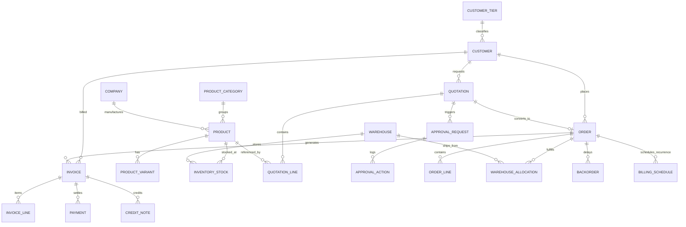

# DealFlow360 — Database Architecture & Schema Specification

This document details the relational database architecture, Entity Framework Core ORM design, entity relationships, indexing strategies, financial precision rules, and seed data lifecycle implemented in **DealFlow360**.

---

## 1. Relational Database Engine & Standards

- **Engine:** Microsoft SQL Server 2019+ (fully compatible with SQL Server LocalDB, Express, Standard, and Enterprise editions).
- **ORM:** Entity Framework Core 10 (`Microsoft.EntityFrameworkCore.SqlServer`).
- **Connection String:**
  ```text
  Server=(localdb)\mssqllocaldb;Database=DealFlow;Integrated Security=True;TrustServerCertificate=True;MultipleActiveResultSets=True;
  ```
- **Financial Precision Standard:** All monetary figures, costs, discounts, tax rates, margins, and currency balances are strictly stored as **`DECIMAL(18, 4)`** across all tables, eliminating binary floating-point rounding errors.
- **Audit Logging:** System-wide transactional operations write to a centralized `AuditLogs` table tracking actor, entity name, entity ID, action type, before/after JSON snapshots, and UTC timestamps.

---

## 2. Core Entity Domain Model



---

## 3. Entity Specification Catalogue

### 3.1 Customer & Governance Domain
- **`Customers`:** Enterprise buyer accounts (`Name`, `Email`, `Phone`, `TierId`, `CurrencyCode`, `IsActive`, `AssignedSalesRepId`).
- **`CustomerTiers`:** Commercial discount ceiling specifications:
  - **Bronze:** Default max 5.00% discount.
  - **Silver:** Default max 10.00% discount.
  - **Gold:** Default max 15.00% discount.
- **`Companies`:** Multi-company operating entities (`Name`, `Code`, `Description`, `Website`, `ContactEmail`). Primary operating company: **`DF360`** (*DealFlow360 Technologies Pvt. Ltd.*).

### 3.2 Product & Pricing Domain
- **`Products`:** Core hardware, service, support, and subscription deliverables:
  - Fields: `SKU`, `Name`, `Description`, `CategoryId`, `CompanyId`, `ProductType` (`OneTime` vs `Subscription`), `BasePrice`, `CostPrice`, `TaxRate`, `Unit`, `IsActive`.
- **`ProductCategories`:** Classifications: `Hardware`, `Accessories`, `Services`, `Support`, `Subscriptions`.
- **`ProductVariants`:** Additional product configurations with additive prices (`AdditionalPrice`).
- **`PriceLists` & `PriceListItems`:** Tiered pricing schedules and promotional pricing overrides.
- **`SubscriptionPlans`:** Recurring billing plans (`Name`, `Code`, `BillingFrequency`, `BaseFee`, `ProrationPolicy`).

### 3.3 Quotation & Approval Domain
- **`Quotations`:** Commercial proposal headers:
  - Fields: `QuotationNumber`, `CustomerId`, `SalesRepId`, `Status` (`Draft`, `PendingApproval`, `Approved`, `Sent`, `UnderNegotiation`, `Confirmed`, `ConvertedToOrder`, `Rejected`, `Cancelled`), `ApprovalStatus` (`None`, `Pending`, `ManagerApproved`, `Approved`, `Rejected`), `Version`, `BlendedRiskScore`, `SubTotal`, `DiscountTotal`, `TaxTotal`, `GrandTotal`, `TotalCost`, `GrossMarginPercent`, `PublicPortalToken`, `ValidUntilUtc`.
- **`QuotationLines`:** Line items on quotes:
  - Fields: `QuotationId`, `ProductId`, `VariantId`, `Quantity`, `UnitPrice`, `DiscountPercent`, `NetAmount`, `TaxAmount`, `LineCost`, `LineMargin`, `SubscriptionPlanId`, `IsNegotiatedLocked`.
- **`ApprovalRequests`:** Governance review tickets created when discounts exceed tier limits:
  - Fields: `QuotationId`, `Level` (`SalesManager`, `FinanceOperations`), `Status`, `RequestedById`, `AssignedRoleId`, `CreatedAtUtc`.
- **`ApprovalActions`:** Audit log of manager/finance review decisions (`Action`, `ActorId`, `Remarks`, `CreatedAtUtc`).
- **`QuotationChanges`:** Version history tracking customer counter-offers and rep revisions.

### 3.4 Multi-Warehouse Fulfillment Domain
- **`Warehouses`:** Physical storage and fulfillment hubs:
  - `WH-PUN-01` (Pune West Central Fulfillment Hub - Primary)
  - `WH-AHM-01` (Ahmedabad North Distribution Center - Secondary)
  - `WH-BLR-01` (Bengaluru Tech Logistics Hub - Regional)
- **`InventoryStocks`:** Quantity on hand and reserved stock per product and warehouse (`QuantityOnHand`, `QuantityReserved`, `ReorderLevel`).
- **`Orders` & `OrderLines`:** Confirmed fulfillment orders converted from accepted quotations.
- **`WarehouseAllocations`:** Greedy inventory allocation records mapping order lines to shipping warehouses (`AllocatedQuantity`, `Status`).
- **`Backorders`:** Track unfulfilled quantities due to inventory shortages for subsequent replenishment consolidation.

### 3.5 Billing, Invoicing & Payments Domain
- **`Invoices`:** Commercial billing records:
  - Fields: `InvoiceNumber`, `OrderId`, `CustomerId`, `InvoiceType` (`Standard`, `SubscriptionPeriodic`), `Status` (`Draft`, `Issued`, `Paid`, `PartiallyPaid`, `Overdue`, `Cancelled`), `Total`, `PaidAmount`, `OutstandingAmount`, `DueDateUtc`.
- **`InvoiceLines`:** Line items attached to an invoice.
- **`Payments`:** Payments collected against an invoice (`Amount`, `PaymentMethod`, `ReferenceNumber`, `ReceivedAtUtc`).
- **`CreditNotes`:** Balance adjustments and credit memos issued against an invoice.
- **`BillingSchedules`:** Automated recurring schedules for subscription lines (`Frequency`, `NextBillingDateUtc`, `Amount`, `Status`).

---

## 4. Database Seeding & Maintenance

### Automatic Startup Seeding (`DbInitializer.SeedAsync`)
On every startup, `DbInitializer` verifies schema existence and seeds:
1. **Operating Company:** DealFlow360 Technologies Pvt. Ltd. (`DF360`).
2. **Discount Tiers:** Bronze (5%), Silver (10%), Gold (15%).
3. **Controlled Customer Accounts (5):**
   - Delhi Business Automation Pvt. Ltd. (Bronze)
   - Ahmedabad Manufacturing Solutions Pvt. Ltd. (Silver)
   - Pune Enterprise Networks Pvt. Ltd. (Gold)
   - Bengaluru CloudWorks Pvt. Ltd. (Silver)
   - Sharma Technologies Pvt. Ltd. (Gold)
4. **Controlled Staff Accounts (12):** Covering all 5 system roles (`Admin`, `SalesManager`, `SalesRep`, `FinanceOperations`, `Customer`).
5. **Controlled Product Catalog (24):** Across Hardware, Accessories, Services, Support, and Subscriptions.
6. **Warehouses & Inventory:** Initial stock allocated across Pune, Ahmedabad, and Bengaluru facilities.

### Database Reset Command
To reset transaction data (quotations, orders, invoices) while preserving master reference data:
```powershell
npm run db:reset:qa
```
Or execute the standalone script:
```powershell
node scripts/db_reset_qa.js
```
