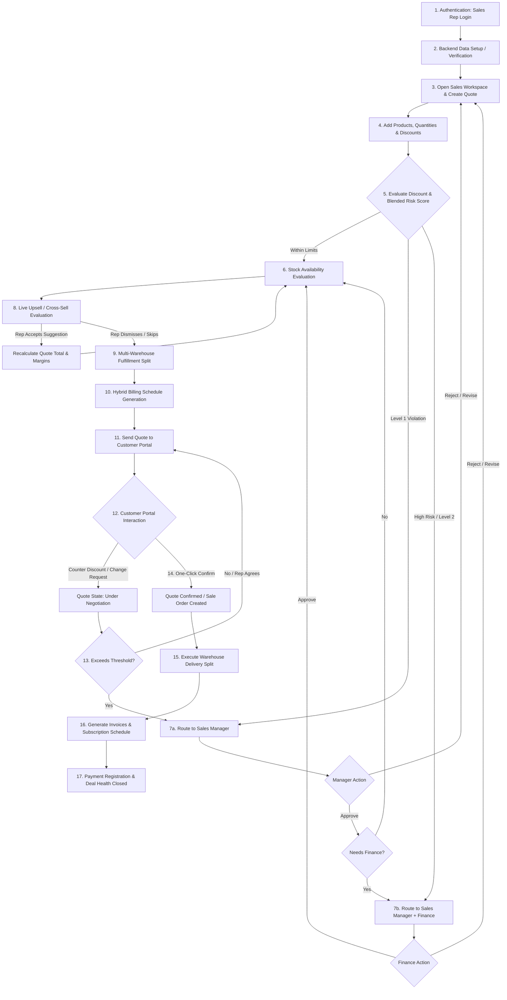
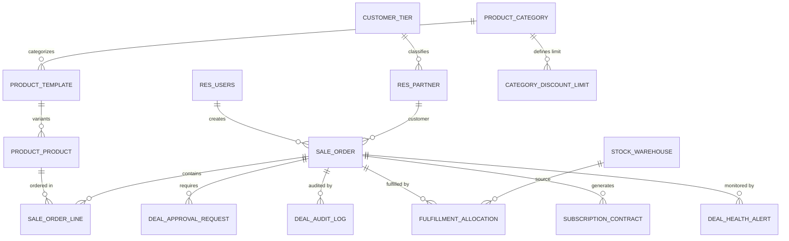
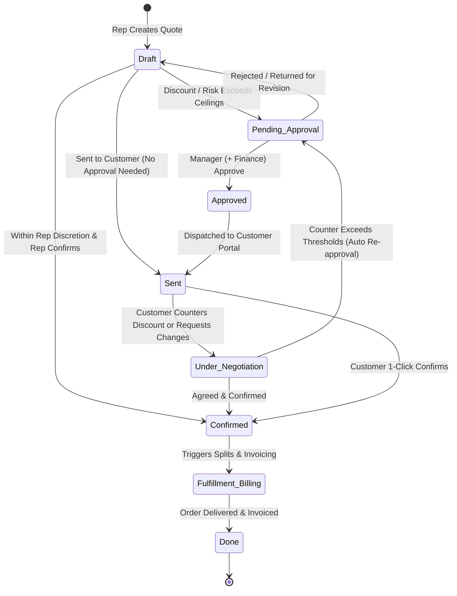

# DealFlow360: Master Product & Technical Requirements Document (PRD)

---

## A. Document Control

| Attribute | Value |
| :--- | :--- |
| **Project Name** | DealFlow360 |
| **Document Title** | Master Product + Technical Requirements Document (PRD) |
| **Document Version** | 1.0.0 |
| **Status** | Approved Master Specification / Single Source of Truth |
| **Source of Truth** | DealFlow360 Problem Statement Specification (`DealFlow360.pdf`, 13 Pages) |
| **Repository** | `https://github.com/aniruddh209/Odoo-Hecathon-Gandhinagar` (Branch: `frontend`) |
| **Author / Custodian** | Antigravity Autonomous Engineering Lead |
| **Last Updated** | 2026-09-05 |

### Scope Rules & Discipline
> [!IMPORTANT]
> **Core Scope Rule**: Phase 1 scope is strictly limited to the requirements present in the DealFlow360 problem-statement PDF. Any feature not required by the PDF must not be allowed to delay or replace completion of the PDF-defined scope.

This document adheres to strict source tagging throughout:
- `[PDF REQUIREMENT]`: Directly mandated by the authoritative problem statement (`DealFlow360.pdf`).
- `[REPOSITORY FACT]`: Grounded in verified repository structure, environment configuration, or codebase artifacts.
- `[IMPLEMENTATION DECISION]`: Architectural, data schema, or engineering decisions made to implement PDF requirements cleanly without adding extraneous features.

---

## B. Executive Summary

### Business Problem
`[PDF REQUIREMENT]` Most conventional sales tools handle basic, linear flows adequately: create a quote, confirm an order, and generate an invoice. However, real-world B2B sales teams operate in significantly messier, complex conditions:
1. **Multi-level discount approvals** where sales reps give away excessive margin without oversight.
2. **Fragmented stock across multiple warehouses**, necessitating split shipments, backorders, and shipping cost trade-offs.
3. **Hybrid commercial models** bundling one-time capital hardware with ongoing recurring SaaS subscriptions on a single customer agreement.
4. **Friction in negotiations**, forcing reps and customers into slow, asynchronous, unversioned email threads.
5. **Lack of deal visibility**, where sales managers discover stalled, high-risk deals only after momentum is permanently lost.

### What DealFlow360 Does
`[PDF REQUIREMENT]` DealFlow360 is an **Intelligent, Self-Governing Sales Operations Platform**. It transforms the standard quote-to-invoice pipeline into an active, self-governing deal engine that:
- Enforces pricing and margin discipline through multi-tier discount ceilings and an automated blended risk score approval engine.
- Recommends live, ranked upsell/cross-sell suggestions with instant margin impact calculations during quote construction.
- Coordinates multi-warehouse inventory in real time, intelligently splitting fulfillment to minimize shipping overhead while handling backorder consolidation.
- Unifies one-time goods and recurring subscriptions on a single order with correct proration, billing schedules, and automated credit note triggers.
- Provides customers with a secure, dedicated live negotiation portal for line-level inquiries, counter-proposals, and instant one-click confirmations.
- Empowers leadership with real-time deal health monitoring, proactive stalled deal alerts, discount anomaly tracking, and performance analytics.

---

## C. PDF Requirements Inventory

| Req ID | Description | Source PDF | Priority | Status |
| :--- | :--- | :--- | :--- | :--- |
| **REQ-OVR-01** | Multi-tier discount governance & automated approval routing | Page 1, 4, 11, 12 | P0 (Critical) | Specified |
| **REQ-OVR-02** | Live upsell & cross-sell recommendations with real-time margin impact | Page 1, 5, 6, 7 | P0 (Critical) | Specified |
| **REQ-OVR-03** | Multi-warehouse fulfillment splitting & backorder consolidation handling | Page 1, 4, 7, 11 | P0 (Critical) | Specified |
| **REQ-OVR-04** | Hybrid billing (mixed one-time products & recurring subscriptions on one order) | Page 1, 5, 7, 8, 11 | P0 (Critical) | Specified |
| **REQ-OVR-05** | Deal health monitoring, stalled quote alerts & discount anomaly tracking | Page 1, 8, 9 | P1 (Core) | Specified |
| **REQ-OVR-06** | Real, separate, restricted customer-facing negotiation portal | Page 1, 4, 8, 10, 11 | P0 (Critical) | Specified |
| **REQ-OVR-07** | Sales backend configuration & reporting dashboards with PDF/XLS export | Page 1, 4, 5, 9 | P1 (Core) | Specified |
| **REQ-AUTH-01** | Internal user sign-up and login with standard credentials | Page 3, 4 | P0 (Critical) | Specified |
| **REQ-AUTH-02** | Customer portal authentication via magic link or email & password | Page 4 | P0 (Critical) | Specified |
| **REQ-PROD-01** | Product management: Name, Category, Price, Unit, Tax, Description | Page 4 | P0 (Critical) | Specified |
| **REQ-PROD-02** | Product variants: Attributes (Size, Pack), Values, Extra prices | Page 4 | P1 (Core) | Specified |
| **REQ-PROD-03** | Price lists: Customer-tier pricing (Bronze/Silver/Gold) & currency rules | Page 4 | P0 (Critical) | Specified |
| **REQ-DISC-01** | Customer-tier discount ceilings (Bronze ≤5%, Silver ≤10%, Gold ≤15%) | Page 4, 12 | P0 (Critical) | Specified |
| **REQ-DISC-02** | Category-specific discount ceilings (Hardware ≤15%, Service ≤10%, etc.) | Page 4, 12 | P0 (Critical) | Specified |
| **REQ-DISC-03** | Multi-level approval chain: Sales Manager only vs. Sales Manager + Finance | Page 4, 6 | P0 (Critical) | Specified |
| **REQ-DISC-04** | Blended discount risk score calculation for mixed-category/line violations | Page 4, 6, 11, 12 | P0 (Critical) | Specified |
| **REQ-DISC-05** | Automated routing to highest required approval level upon submission | Page 4, 6, 9, 11 | P0 (Critical) | Specified |
| **REQ-DISC-06** | Full audit trail on approvals, rejections, revisions (user, timestamp, reason) | Page 4, 6 | P0 (Critical) | Specified |
| **REQ-WH-01** | Warehouse entity management (e.g., "Main Warehouse", "East Depot") | Page 4 | P0 (Critical) | Specified |
| **REQ-WH-02** | Warehouse stock tracking & replenishment rule definitions | Page 4 | P1 (Core) | Specified |
| **REQ-WH-03** | Shipping cost weighting in auto-split logic to minimize shipment count | Page 4, 7 | P0 (Critical) | Specified |
| **REQ-WH-04** | Manual override capability for warehouse stock allocation | Page 7 | P1 (Core) | Specified |
| **REQ-WH-05** | Automatic "Consolidate Remaining Backorder" prompt upon stock arrival | Page 7 | P1 (Core) | Specified |
| **REQ-SUB-01** | Recurring subscription plans (Monthly, Quarterly, Yearly) | Page 5 | P0 (Critical) | Specified |
| **REQ-SUB-02** | Proration calculation engine for mid-cycle quantity or plan adjustments | Page 5, 8 | P0 (Critical) | Specified |
| **REQ-SUB-03** | Subscription cancellation & partial refund / credit note generation | Page 5, 8 | P1 (Core) | Specified |
| **REQ-UP-01** | Co-purchase pair rule setup, promotion tagging & minimum margin filter | Page 5, 7 | P1 (Core) | Specified |
| **REQ-UP-02** | Real-time ranked upsell suggestions in quotation builder with margin delta | Page 6, 7, 11 | P0 (Critical) | Specified |
| **REQ-UP-03** | Immediate order total and live margin recalculation upon accepting upsell | Page 6, 7, 11 | P0 (Critical) | Specified |
| **REQ-PORT-01** | Dedicated customer portal view with status badges (Sent, Under Negotiation) | Page 8 | P0 (Critical) | Specified |
| **REQ-PORT-02** | Line-level commenting, change request tool & counter-discount input | Page 8, 11 | P0 (Critical) | Specified |
| **REQ-PORT-03** | Automatic re-approval trigger when customer negotiation exceeds limits | Page 8, 9, 11 | P0 (Critical) | Specified |
| **REQ-PORT-04** | One-click customer final quotation confirmation | Page 3, 8, 11 | P0 (Critical) | Specified |
| **REQ-HLTH-01** | Stalled deal detection (exceeding configured inactivity threshold) | Page 8, 9 | P1 (Core) | Specified |
| **REQ-HLTH-02** | Rep discount anomaly detection (comparison against historical rep average) | Page 8, 9 | P1 (Core) | Specified |
| **REQ-HLTH-03** | Delivery promise slippage risk indicator & direct quote navigation/nudge | Page 8, 9 | P1 (Core) | Specified |
| **REQ-REP-01** | Sales performance reporting with period, rep, status & category filters | Page 5, 9 | P1 (Core) | Specified |
| **REQ-REP-02** | Export reports to PDF and XLS | Page 5 | P1 (Core) | Specified |
| **REQ-TEST-01** | 8-Step Quick Test Flow validation (Login to Payment) | Page 10, 11 | P0 (Critical) | Specified |

---

## D. User Roles & Permissions

`[PDF REQUIREMENT]` The system defines five distinct user personas with strictly partitioned responsibilities and access barriers.

### 1. Role Definitions
1. **Sales Rep**:
   - Primary creator of quotations and customer proposals.
   - Selects products, configures quantities, applies line/order discounts.
   - Reviews live upsell recommendations and tracks margin health.
   - Monitors approval progression and warehouse fulfillment status.
   - Receives and responds to customer negotiation feedback.
2. **Sales Manager / Approver**:
   - First-level authority for discounts exceeding standard rep/tier thresholds.
   - Approves, rejects, or requests revisions on quotations with mandatory audit remarks.
   - Configures customer discount tiers, category limits, and approval chains.
   - Monitors Deal Health Dashboard to rescue stalled deals and review anomaly alerts.
3. **Finance / Operations User**:
   - Second-level authority for high-risk, deep-discount quotations.
   - Oversees warehouse allocation splits, logistics cost trade-offs, and backorders.
   - Reconciles hybrid billing schedules, recurring invoices, refunds, and credit notes.
4. **Customer (Portal User)**:
   - External party accessing an isolated, restricted quotation view.
   - Inspects quote details, terms, and line pricing.
   - Posts line-level inquiries/comments, requests alterations, and counters discount percentages.
   - Executes binding one-click confirmation of final quotations.
   - Strictly forbidden from viewing internal costs, margins, backend menus, or other clients' data.
5. **Admin**:
   - System administrator managing core master data: products, categories, variants, price lists, warehouses, recurring plans, and discount matrices.
   - Oversees platform-wide analytics, system health, and role assignments.

### 2. Role-Based Access Control (RBAC) Matrix

| Entity / Workspace | Sales Rep | Sales Manager | Finance / Ops | Customer Portal | Admin |
| :--- | :---: | :---: | :---: | :---: | :---: |
| **Sales Workspace & Quotation Builder** | Full | Full | View Only | No Access | Full |
| **Line Cost & Internal Margin Display** | View | View | View | **Hidden** | View |
| **Discount Application** | Rep Limit | Full Override | Full Override | Counter Field | Full |
| **Discount Approval Execution** | None | Level 1 | Level 2 (High Risk) | None | Level 1 & 2 |
| **Fulfillment Split / Warehouse Override** | View | View | Full | None | Full |
| **Subscription Proration / Credit Notes** | View | View | Full | View Invoices | Full |
| **Customer Negotiation Portal** | Read/Reply | Read/Intervene | Read Only | **Own Quote Only** | Full |
| **Deal Health & Anomaly Dashboard** | Own Deals | Team Wide | Operations Wide | No Access | Platform Wide |
| **Backend Configuration Setup** | No Access | Discount Rules | Billing/Warehouse | No Access | Full |
| **Export Reports (PDF / XLS)** | Limited | Full | Full | Own Quote PDF | Full |

---

## E. Complete Business Workflow



### Detailed Stage-by-Stage Specifications

#### Stage 1: Authentication & Workspace Access
- **Actor**: Internal User (Rep, Manager, Finance, Admin).
- **Trigger**: User navigates to application URL.
- **Inputs**: Email/Username, Password.
- **Business Logic**: System validates credentials against secure password hashes. Resolves assigned user roles and permission scopes.
- **Output**: Issues session/token; redirects Reps to Sales Workspace, Admins/Managers to Configuration/Dashboard.

#### Stage 2: Quotation Construction & Live Margin Calculation
- **Actor**: Sales Rep.
- **Inputs**: Customer selection (auto-loads Customer Tier: Bronze/Silver/Gold), Product Lines, Quantities, Unit Discounts (%).
- **Business Logic**:
  - Unit Price derived from active Price List.
  - Line Total = `Qty * UnitPrice * (1 - LineDiscount%)`.
  - Line Margin = `LineTotal - (Qty * UnitCost)`.
  - Order Total = `Sum(LineTotal)`.
  - Order Margin (%) = `(OrderTotal - Sum(Qty * UnitCost)) / OrderTotal * 100`.
- **Output**: Real-time reactive recalculation of line totals and total order gross margin percentage displayed in builder header.

#### Stage 3: Automated Discount Governance & Approval Routing
- **Actor**: System Governance Engine.
- **Trigger**: Rep clicks "Submit for Approval" or "Confirm Quote".
- **Inputs**: Customer Tier, Line Categories, Line Discounts, Order Total.
- **Business Logic**: Executes Blended Discount Risk Algorithm (detailed in Section J).
  - Evaluates individual line ceiling delta.
  - Computes order-wide blended margin loss score.
  - Determines required approval tier (`NONE`, `SALES_MANAGER`, `SALES_MANAGER_AND_FINANCE`).
- **Output**: If risk score > 0, quote transitions to `PENDING_APPROVAL` and appears on designated reviewer dashboards. Rep cannot bypass this step.

#### Stage 4: Live Upsell & Cross-Sell Recommendation
- **Actor**: Sales Rep alongside AI/Recommendation Engine.
- **Trigger**: Product added to quotation cart.
- **Business Logic**: Queries co-purchase rules and active promotions matching cart items. Filters suggestions where projected `ItemMargin < MinMarginThreshold`. Ranks suggestions by promotional priority and margin contribution.
- **Output**: Displays ranked suggestion cards showing product title, promotion badge, and exact `+Margin Delta %`.
- **Rep Action**:
  - `Add to Quote`: Instantly inserts product line; triggers immediate quote total, discount score, and margin recalculation.
  - `Dismiss`: Hides card from active session.

#### Stage 5: Multi-Warehouse Inventory Splitting & Backorder Handling
- **Actor**: Operations Engine / Finance User.
- **Trigger**: Quote approval or confirmation.
- **Inputs**: Required line quantities, live stock levels across Warehouses (e.g., Main Warehouse, East Depot), shipping distance/cost weightings.
- **Business Logic**:
  - Identifies single warehouse capable of fulfilling entire order to minimize shipments.
  - If no single warehouse has complete stock, executes greedy cost-weighted split algorithm: allocates maximum available stock from primary warehouse, balances remainder from secondary depot.
  - If aggregate stock < required quantity, flags deficit as `BACKORDER`.
- **Output**: Displays split breakdown: Warehouse name, allocated units, estimated shipment count, and logistics surcharge. Allows Operations user manual override.
- **Backorder Ingestion**: When new purchase receipt arrives, system issues automated "Consolidate Remaining Backorder" prompt.

#### Stage 6: Hybrid Billing & Subscription Proration
- **Actor**: Billing Engine.
- **Trigger**: Order confirmation.
- **Inputs**: Order lines tagged as `ONE_TIME` (Hardware, Services) vs. `RECURRING` (Software licenses, maintenance).
- **Business Logic**:
  - Generates immediate standard invoice for one-time goods.
  - Generates recurring subscription record with chosen cadence (Monthly, Quarterly, Yearly).
  - Calculates upcoming billing dates.
  - If quantity adjusts mid-cycle: `ProratedAmount = (OldQty - NewQty) * DailyRate * RemainingDaysInPeriod`.
  - If cancelled mid-cycle: triggers automated credit note creation or partial refund workflow.
- **Output**: Unified billing screen displaying one-time line invoice and synchronized recurring billing schedule.

#### Stage 7: Customer Portal Negotiation & One-Click Confirmation
- **Actor**: Customer (Portal User).
- **Trigger**: Customer clicks secure quotation magic link.
- **Security Check**: Enforces customer-specific tenant isolation; blocks internal margin/cost views.
- **Customer Actions**:
  - **Comment / Change Request**: Posts question on specific line item. Status updates to `UNDER_NEGOTIATION`.
  - **Counter Discount**: Proposes modified discount (e.g., counters 10% with 16%).
  - **Submit Request**: Sends counter-offer back to internal rep.
- **System Re-Approval Trigger**: If counter-offer pushes quote beyond approval thresholds, system automatically moves state back to `PENDING_APPROVAL` for Manager/Finance sign-off.
- **Customer Confirmation**: One-click "Confirm Quotation" binds agreement, moves quote to `CONFIRMED`, triggers warehouse delivery orders, and generates initial billing.

#### Stage 8: Deal Health Tracking & Automated Anomaly Detection
- **Actor**: System Background Monitor / Sales Manager.
- **Evaluation Criteria**:
  - **Stalled Deal**: Quote in `SENT` or `DRAFT` with no activity for `> N days` (configurable, default: 5 days).
  - **Discount Anomaly**: Quote discount exceeds rep's rolling historical average by `> 1.5 standard deviations` or `> 10 percentage points`.
  - **Delivery Slippage**: Warehouse stock shortage projecting fulfillment date past customer promised delivery date.
- **Actions**: Displays high-visibility alert badges on Manager Dashboard. Clicking alert directly opens quote; provides 1-click "Send Automated Nudge" to customer or "Escalate to VP".

---

## F. Backend & Admin Requirements

### A1) Authentication & User Management
`[PDF REQUIREMENT]`
- **Internal Authentication**: Email and password authentication with encrypted password hashing (bcrypt / pbkdf2_sha512). User profiles with role bindings (`Sales Rep`, `Sales Manager`, `Finance User`, `Admin`).
- **Customer Portal Authentication**: Magic-link authentication (secure, time-bound, HMAC-signed token) or email + password portal login.
- **Session Control**: Role-based redirection upon successful authentication (internal workspace vs. customer portal).

### A2) Product, Variants & Price List Configuration
`[PDF REQUIREMENT]`
- **Product Master Fields**: Name, Category (Hardware, Services, Subscriptions), List Price, Cost Price, Unit of Measure (Units, Hours, Months), Tax Rates, Rich Text Description.
- **Variant Engine**: Attribute definitions (e.g., "Size", "Pack", "Tier"), Attribute values (e.g., "Small", "Medium", "Large"), Surcharge pricing adjustments (Extra price per variant value).
- **Price Lists**:
  - Dynamic rules matching Customer Tiers (`Bronze`, `Silver`, `Gold`).
  - Base formula: `List Price * (1 - TierDefaultDiscount%)` or fixed overrides.
  - Multi-currency conversion rules (optional/bonus scope).

### A3) Discount Tier & Multi-Level Approval Chain Setup
`[PDF REQUIREMENT]`
- **Customer Tier Ceilings**:
  - Bronze: Max Rep Discretion = 5%.
  - Silver: Max Rep Discretion = 10%.
  - Gold: Max Rep Discretion = 15%.
- **Category Specific Ceilings**:
  - Hardware (Healthy margin): Allowable rep ceiling up to 15%.
  - Services (Thin margin): Allowable rep ceiling up to 10%.
  - Subscriptions: Configurable default (e.g., 10%).
- **Approval Chain Thresholds**:
  - Range 1 (Within Rep Discretion): Direct confirmation (`NO_APPROVAL`).
  - Range 2 (Minor Violation / Level 1): `SALES_MANAGER` approval required.
  - Range 3 (High Risk Violation / Level 2): Sequential approval required: `SALES_MANAGER` followed by `FINANCE`.
- **Mandatory Audit Logging**: Immutable ledger tracking every approval, rejection, comment, and revision with `User ID`, `Timestamp`, `Action`, `Previous Discount`, `New Discount`, and `Reason Text`.

### A4) Warehouse & Inventory Operations Setup
`[PDF REQUIREMENT]`
- **Warehouse Master**: Multi-warehouse registry (e.g., "Main Warehouse", "East Depot", "Regional Hub").
- **Stock Tracking**: On-hand inventory counts, reserved quantities, available-to-promise (ATP) per product per warehouse.
- **Replenishment Rules**: Minimum order quantity (MOQ) and reorder threshold per location.
- **Shipping Cost & Optimization Weights**: Warehouse distance/cost coefficients used by fulfillment optimization to favor single-shipment consolidations over split dispatches.

### A5) Subscription & Recurring Plan Configuration
`[PDF REQUIREMENT]`
- **Billing Intervals**: Monthly, Quarterly, Yearly recurring plans attached to service or subscription product lines.
- **Proration Engine**: Calendar-day proration calculations for mid-term upgrades, downgrades, or quantity scaling.
- **Lifecycle Controls**: Pause, Resume, and Cancel actions. Automated credit note generation or partial refund calculations for unused prepaid service days.

### A6) Upsell / Cross-Sell Rule Engine
`[PDF REQUIREMENT]`
- **Co-Purchase Rules**: Source Product ID -> Recommended Target Product ID with statistical confidence score based on historical purchase data.
- **Promotional Boost**: Boolean `is_promoted` flag giving priority weighting in recommendation ranking.
- **Margin Protection Gate**: Global or category `min_margin_threshold` (e.g., 25%); suggestions yielding margins below threshold are automatically suppressed.

### A7) Reporting & Dashboard Configuration
`[PDF REQUIREMENT]`
- **Metrics Aggregation**: Total Quotation Value, Win Rate, Average Deal Discount, Pending Approval Volume, Stalled Quote Count, Gross Margin Contribution.
- **Filter Dimensions**:
  - Period: Today, Current Week, Month, Custom Date Range.
  - Sales Team / Rep: Individual rep or team rollup.
  - Approval Status: Draft, Pending Manager, Pending Finance, Approved, Rejected.
  - Product / Category: Best-selling lines, highest discount frequency.
- **Export Engine**: Server-side generation of standardized PDF and XLS (Excel) reports.

---

## G. Frontend Requirements & Screen Specifications

### Screen 1: Top Navigation & Global Header (B1)
- **Allowed Roles**: Sales Rep, Sales Manager, Finance, Admin.
- **UI Elements**:
  - Logo: "DealFlow360".
  - Nav Links: `Quotations` (List/Table view), `Pipeline` (Kanban board), `Deal Health` (Alerts), `Configuration` (Admin/Manager only).
  - Action Buttons:
    - `Reload Data`: Re-queries live stock levels, price lists, and approval statuses without hard refresh.
    - `Go to Backend`: Opens administrative settings.
    - `Close Workspace`: Cleans session state and logs out.
  - Active User Profile badge with role indicator.

### Screen 2: Quotation List & Kanban Pipeline View (B2)
- **Allowed Roles**: Sales Rep, Sales Manager, Finance, Admin.
- **List View**: Paginated table showing Quote Number, Customer Name, Tier Badge, Total Amount, Blended Discount %, Stage Badge, Created Date.
- **Pipeline Kanban View**: Drag-and-drop / stage-grouped columns:
  1. `Draft`
  2. `Pending Approval`
  3. `Approved`
  4. `Sent to Customer`
  5. `Under Negotiation`
  6. `Confirmed / Order`
- **Interactivity**: Clicking any card immediately loads the Quotation Builder for that deal.

### Screen 3: Quotation Builder Screen (B3)
- **Allowed Roles**: Sales Rep, Sales Manager, Admin.
- **Layout**: 3-Pane Responsive Layout (Left: Customer & Metadata; Center: Line Items Table & Cart; Right: Live Upsell Panel & Summary).
- **Line Item Columns**: Product Selector (Hardware/Services/Subscriptions), Variant Dropdown, Available Stock Indicator, Quantity (+/- stepper), Unit Price, Discount Input (%), Net Line Total, Line Margin Indicator.
- **Live Summary Bar**: Total List Amount, Total Discount Given ($ and %), Total Net Amount, Projected Gross Margin % (Color-coded: Green >30%, Yellow 15-30%, Red <15%).
- **Primary CTA Buttons**:
  - `Save Draft`
  - `Submit for Approval` (Active if risk score > 0)
  - `Confirm & Move to Fulfillment` (Active only if within rep discretion or approved)

### Screen 4: Discount Approval Screen (B4)
- **Allowed Roles**: Sales Manager, Finance User, Admin.
- **Components**:
  - Header: Deal ID, Rep Name, Customer Name & Tier.
  - **Risk Score Breakdown Card**: Displays calculated Blended Risk Score, Worst-Offending Line, Total Margin Sacrificed ($).
  - **Approval Chain Progress Stepper**: Shows Step 1: Sales Manager (Status: Approved/Pending), Step 2: Finance (Status: Not Required / Pending / Approved).
  - Line-by-line violation audit table highlighting lines exceeding category/tier ceilings.
  - **Action Box**: Mandatory "Remarks / Reason" textarea.
  - Buttons: `Approve Deal`, `Return for Revision`, `Reject Deal`.
- **Audit Confirmation Modal**: Confirms action and appends event to immutable history log.

### Screen 5: Upsell & Cross-Sell Panel (B5)
- **Location**: Collapsible right drawer or dock within Quotation Builder.
- **Components**:
  - Ranked recommendation cards ordered by promotional priority and margin contribution.
  - Card Details: Product Name, Thumbnail, Association Reason (e.g., "Frequently paired with Laptop X"), Promotion Tag (e.g., "Special Bundle Promo"), Price, `Margin Delta %` (e.g., "+3.2% Overall Margin").
  - Actions per card:
    - `Add to Quote`: Immediately adds item as a line item to cart; recomputes order margin in real time.
    - `Dismiss`: Removes recommendation from current view.

### Screen 6: Warehouse & Fulfillment Split Screen (B6)
- **Allowed Roles**: Finance / Operations, Sales Manager, Admin.
- **Components**:
  - Order items fulfillment requirement table.
  - **Recommended Split Card**: Shows system-optimized distribution:
    - Warehouse Name (e.g., Main Warehouse: 8 units; East Depot: 2 units).
    - Estimated Shipment Count (e.g., 2 dispatches).
    - Estimated Freight Cost.
  - **Buttons**:
    - `Accept Suggested Split`
    - `Manual Override`: Opens allocation sliders allowing operators to manually adjust dispatch quantities per warehouse.
  - **Backorder Notification**: If total stock < order quantity, highlights backordered items in amber.
  - **Consolidation Prompt**: When pending stock arrives, renders a banner: *"Stock arrived for Backorder #BO-102. Consolidate shipment now?"* with `Consolidate Shipments` CTA.

### Screen 7: Subscription & Billing Screen (B7)
- **Allowed Roles**: Finance / Operations, Sales Rep, Admin.
- **Components**:
  - Split View:
    - Section A: **One-Time Deliverables** (Hardware items, installation fees) -> Immediate Invoice status.
    - Section B: **Recurring Subscriptions** (SaaS licenses, recurring maintenance) -> Plan details, billing cadence, next renewal date.
  - **Upcoming Billing Schedule Table**: Shows Date, Projected Billing Amount, Invoice Status.
  - **Mid-Cycle Modification Panel**: Handles quantity changes with real-time prorated charge calculation display.
  - **Cancellation & Credit Note Panel**: Calculates unused credit; generates credit note preview.

### Screen 8: Customer Portal Negotiation Screen (B8)
- **Allowed Roles**: Customer (Portal User) via authenticated link.
- **Security Constraint**: Clean, white-labeled client view. Internal costs, margins, approval chains, and internal chat are completely hidden.
- **Components**:
  - Company branding and quotation header (Quote #, Expiration Date, Assigned Rep).
  - Status Banner: `Sent`, `Under Negotiation`, or `Confirmed`.
  - Interactive Quote Table: Product, Description, Qty, Unit Price, Approved Discount, Total.
  - **Line-Level Negotiation Drawer**: Allows customer to click any line to write feedback (e.g., "Can we get 5 more units if discount is 18%?").
  - **Counter-Discount Field**: Customer inputs desired target discount.
  - **Action Buttons**:
    - `Submit Negotiation Request`: Sends comments and counter-proposal to rep; sets status to `Under Negotiation`.
    - `Confirm Quotation`: Binds one-click legal acceptance.

### Screen 9: Deal Health & Anomaly Dashboard (B9)
- **Allowed Roles**: Sales Manager, Finance, Admin.
- **Widgets**:
  - **Stalled Deals Feed**: Quotations inactive for > N days. Displays Days Idle, Current Stage, Deal Value, Assigned Rep.
  - **Discount Anomaly Monitor**: Highlights quotes where discount given deviates significantly from rep's historical baseline.
  - **Fulfillment Slippage Alerts**: Highlights confirmed deals with inventory bottlenecks threatening delivery deadlines.
  - **Interactive Actions**:
    - `Open Quotation`: Direct deep-link to deal.
    - `Send Rep Nudge`: Dispatches automated notification to rep to follow up.
    - `Escalate Deal`: Flags deal for executive intervention.

---

## H. Database & Data Model

`[IMPLEMENTATION DECISION]` Grounded in relational schema design compatible with PostgreSQL and Odoo ORM models.



### Entity Specifications

#### 1. `res_partner` (Customer Master & Tiering)
- `id`: Primary Key (UUID / Integer)
- `name`: String, Required
- `email`: String, Required, Indexed
- `customer_tier_id`: Many2one -> `dealflow_customer_tier`, Required (Bronze, Silver, Gold)
- `portal_token`: String, Unique (Magic-link token)
- `portal_token_expiry`: Datetime

#### 2. `dealflow_customer_tier`
- `id`: Primary Key
- `name`: String (`Bronze`, `Silver`, `Gold`)
- `max_discount_ceiling`: Float, Required (e.g., 5.0, 10.0, 15.0)
- `default_pricelist_id`: Many2one -> `product_pricelist`

#### 3. `product_template` & `product_product`
- `id`: Primary Key
- `name`: String, Required
- `category_id`: Many2one -> `product_category`, Required
- `product_type`: Selection: `one_time_hardware`, `service`, `recurring_subscription`
- `list_price`: Float, Required
- `standard_price` (Cost): Float, Required (Internal only)
- `uom`: String (Units, Hours, Months)
- `is_promoted`: Boolean, Default: False
- `min_margin_threshold`: Float, Default: 20.0

#### 4. `dealflow_category_discount_limit`
- `id`: Primary Key
- `category_id`: Many2one -> `product_category`, Required, Unique
- `max_rep_discount`: Float, Required (e.g., Hardware: 15.0, Services: 10.0)
- `manager_approval_threshold`: Float, Required (e.g., >15.0 up to 25.0)
- `finance_approval_threshold`: Float, Required (e.g., >25.0)

#### 5. `sale_order` (Quotation / Deal Master)
- `id`: Primary Key
- `name`: String, Required, Unique (e.g., `SO-2026-001`)
- `partner_id`: Many2one -> `res_partner`, Required
- `user_id` (Sales Rep): Many2one -> `res_users`, Required
- `state`: Selection: `draft`, `pending_approval`, `approved`, `sent`, `under_negotiation`, `confirmed`, `done`, `cancelled`
- `blended_risk_score`: Float, Default: 0.0
- `highest_approval_level_required`: Selection: `none`, `sales_manager`, `sales_manager_and_finance`
- `approval_state`: Selection: `not_required`, `pending_manager`, `pending_finance`, `approved`, `rejected`, `revision_requested`
- `amount_untaxed`: Float, Computed
- `amount_discount`: Float, Computed
- `amount_total`: Float, Computed
- `order_margin_amount`: Float, Computed (Internal only)
- `order_margin_percent`: Float, Computed (Internal only)
- `counter_discount_proposed`: Float (From customer portal)
- `customer_notes`: Text
- `last_activity_date`: Datetime, Indexed
- `promised_delivery_date`: Date

#### 6. `sale_order_line` (Quotation Line Items)
- `id`: Primary Key
- `order_id`: Many2one -> `sale_order`, Required, Cascade Delete
- `product_id`: Many2one -> `product_product`, Required
- `product_category_id`: Many2one -> `product_category`, Related
- `line_type`: Selection: `one_time`, `recurring`
- `product_uom_qty`: Float, Required
- `price_unit`: Float, Required
- `discount`: Float, Default: 0.0
- `discount_ceiling_applied`: Float (Resolved category/tier ceiling)
- `is_ceiling_violated`: Boolean, Computed
- `ceiling_violation_points`: Float, Computed (Discount - Ceiling)
- `price_subtotal`: Float, Computed
- `cost_price`: Float (Unit cost)
- `line_margin_amount`: Float, Computed
- `line_margin_percent`: Float, Computed
- `customer_comment`: Text (Portal line comment)

#### 7. `dealflow_approval_request` & `dealflow_audit_log`
- `id`: Primary Key
- `order_id`: Many2one -> `sale_order`, Required
- `reviewer_id`: Many2one -> `res_users`, Required
- `reviewer_role`: Selection: `sales_manager`, `finance_user`
- `action`: Selection: `approve`, `reject`, `request_revision`
- `reason`: Text, Required
- `risk_score_at_action`: Float
- `timestamp`: Datetime, Required, Default: Now

#### 8. `stock_warehouse` & `dealflow_fulfillment_allocation`
- `id`: Primary Key
- `order_id`: Many2one -> `sale_order`, Required
- `order_line_id`: Many2one -> `sale_order_line`, Required
- `warehouse_id`: Many2one -> `stock_warehouse`, Required
- `allocated_qty`: Float, Required
- `backorder_qty`: Float, Default: 0.0
- `status`: Selection: `suggested`, `accepted`, `overridden`, `dispatched`, `backordered`, `consolidated`
- `estimated_shipping_cost`: Float

#### 9. `dealflow_subscription_contract` & `billing_schedule`
- `id`: Primary Key
- `order_id`: Many2one -> `sale_order`, Required
- `partner_id`: Many2one -> `res_partner`, Required
- `plan_period`: Selection: `monthly`, `quarterly`, `yearly`
- `start_date`: Date, Required
- `next_billing_date`: Date, Required
- `recurring_amount`: Float, Required
- `status`: Selection: `active`, `paused`, `cancelled`
- `prorated_adjustment_pending`: Float, Default: 0.0

#### 10. `dealflow_health_alert`
- `id`: Primary Key
- `order_id`: Many2one -> `sale_order`, Required
- `alert_type`: Selection: `stalled_deal`, `discount_anomaly`, `delivery_slippage`
- `severity`: Selection: `info`, `warning`, `critical`
- `message`: String, Required
- `is_resolved`: Boolean, Default: False
- `created_at`: Datetime, Default: Now

---

## I. State Machines

### 1. Quotation Lifecycle State Machine


### 2. Approval Sub-State Machine
- `NOT_REQUIRED`: All line discounts ≤ allowable category and tier ceilings, and Blended Risk Score = 0.
- `PENDING_MANAGER`: Violation is within Level 1 threshold.
- `PENDING_FINANCE`: Violation is within Level 2 threshold (or Level 1 approved, awaiting Finance).
- `APPROVED`: Required sign-offs recorded in audit log.
- `REVISION_REQUESTED`: Reviewer returned deal with mandatory explanation; rep must adjust lines.
- `REJECTED`: Deal permanently halted or requiring complete recreation.

### 3. Fulfillment Sub-State Machine
- `PENDING_STOCK_CHECK`: Initial assessment upon deal confirmation.
- `SPLIT_RECOMMENDED`: Multi-warehouse split proposed by optimization logic.
- `SPLIT_ACCEPTED`: Rep or Ops accepts allocation.
- `PARTIAL_DISPATCH`: Stock dispatched from available location; remainder flagged as backorder.
- `BACKORDER_PENDING`: Awaiting replenishment.
- `CONSOLIDATED`: Inbound stock matched; consolidated shipment triggered.

### 4. Hybrid Billing Sub-State Machine
- **One-Time Line Items**: `TO_INVOICE` -> `INVOICED` -> `PAID`.
- **Recurring Lines**: `SUBSCRIPTION_CREATED` -> `SCHEDULE_ACTIVE` -> `CYCLE_BILLED` -> `CREDIT_NOTE_ISSUED` (on cancellation/proration).

---

## J. Discount Governance Engine & Blended Risk Score

`[PDF REQUIREMENT]` The discount governance engine is the central intelligence of DealFlow360. It enforces rigorous margin protection by evaluating discounts at both the line level and order-wide blended level.

### 1. The Multi-Tier Ceiling Hierarchy
1. **Tier 1 Ceiling: Customer Tier Base Limit ($C_{tier}$)**
   - Bronze = 5%
   - Silver = 10%
   - Gold = 15%
2. **Tier 2 Ceiling: Category Discretion Ceiling ($C_{cat}$)**
   - Hardware: 15% (Healthy gross margin allows up to 15%)
   - Services: 10% (Thin labor margin caps discount strictly at 10%)
   - Subscriptions: 10%
3. **Effective Line Limit ($L_i$)**:
   $$\text{Effective Limit } L_i = \min(C_{tier}, C_{cat(i)})$$
   *Rule: The stricter limit always governs.*

### 2. Line-Level Checking
For each quotation line item $i$:
$$\Delta_i = \text{Discount Given}_i - L_i$$
- If $\Delta_i \le 0$: Line is **Compliant**.
- If $\Delta_i > 0$: Line is in **Violation** by $\Delta_i$ percentage points.

#### Exact PDF Example Validation
- **Customer**: Gold ($C_{tier} = 15\%$)
- **Line 1: Laptop (Hardware)**
  - Category Limit: $15\%$
  - Effective Limit: $\min(15\%, 15\%) = 15\%$
  - Discount Given: $12\%$
  - $\Delta_1 = 12\% - 15\% = -3\%$ (**Within Limit - Compliant**)
- **Line 2: Setup Service (Service)**
  - Category Limit: $10\%$
  - Effective Limit: $\min(15\%, 10\%) = 10\%$
  - Discount Given: $18\%$
  - $\Delta_2 = 18\% - 10\% = +8\%$ (**Violates Limit by 8 percentage points**)
- **Outcome**: Even though the customer is Gold and 15% sounds acceptable on paper, the Service line violates its stricter 10% ceiling. The entire quotation is flagged for approval because of that single line.

### 3. The "Blended Risk Score" Formula
`[PDF REQUIREMENT]` What if no individual line has a massive violation, but many lines are each a little over (e.g., Line 1 is 2 pts over, Line 2 is 3 pts over, Line 3 is 2 pts over)? Added together, the rep has quietly eroded significant deal margin.

The **Blended Discount Risk Score ($R_{deal}$)** mathematically combines worst-line violations with weighted order-wide margin loss:

$$R_{deal} = w_1 \cdot \max_{i}(\max(0, \Delta_i)) + w_2 \cdot \sum_{i} \left( \frac{\text{Line Amount}_i}{\text{Total Amount}} \cdot \max(0, \Delta_i) \right) + w_3 \cdot \max(0, \text{Target Margin} - \text{Order Margin})$$

*Default Configured Weights:*
- $w_1 = 1.0$ (Peak line violation severity)
- $w_2 = 1.5$ (Weighted cumulative violation across order volume)
- $w_3 = 0.5$ (Overall order gross margin degradation penalty)

### 4. Approval Routing Matrix

| Blended Risk Score ($R_{deal}$) | Peak Line Violation ($\max \Delta_i$) | Required Approval Authority |
| :---: | :---: | :--- |
| $R_{deal} = 0$ | $\Delta_i \le 0$ on all lines | **None** (Rep can confirm directly) |
| $0 < R_{deal} \le 15.0$ | $0 < \Delta_i \le 10.0$ | **Sales Manager** (Level 1 Approval) |
| $R_{deal} > 15.0$ | $\Delta_i > 10.0$ OR Order Margin $< 15\%$ | **Sales Manager followed by Finance** (Level 2 Approval) |

---

## K. Upsell & Cross-Sell Engine

`[PDF REQUIREMENT]` Live, non-intrusive recommendation intelligence running concurrently with quote construction.

### 1. Recommendation Input Signals
- **Cart Contents**: Product IDs and Category IDs currently in cart.
- **Historical Co-Purchase Matrix**: Pre-calculated association pairs ($P_A \rightarrow P_B$) with frequency confidence.
- **Promotional Flags**: Products marked by Admin as actively promoted (`is_promoted = True`).
- **Margin Protection Barrier**: Configured `min_margin_threshold` (e.g., 25%). Products whose unit margin is below this floor are never suggested.

### 2. Ranking Algorithm
$$\text{Rank Score} = (\text{CoPurchaseConfidence} \times 0.5) + (\text{PromotionBoost} \times 0.3) + (\text{MarginContributionScore} \times 0.2)$$

### 3. Payload & Live UI Feedback
For each top-ranked candidate:
- Suggested Product Name & SKU.
- Promotion Tag (if applicable).
- Net Additive Cost.
- **Margin Delta**: Real-time display of projected impact on the deal's overall gross margin (e.g., `+2.8% Overall Margin`).
- **Action**: Clicking `Add to Quote` appends the item to cart lines and triggers immediate recalculation of cart totals and discount risk score. Clicking `Dismiss` hides the suggestion for the active session.

---

## L. Warehouse Fulfillment Engine

`[PDF REQUIREMENT]` Real-time inventory intelligence eliminating fulfillment bottlenecks and optimizing shipping overhead.

### 1. Live Inventory Resolution
- Upon quote finalization, system inspects real-time stock balances across all registered warehouses (e.g., `Main Warehouse`, `East Depot`).
- Prevents stock overselling by tracking Available-to-Promise (`ATP = OnHand - Reserved`).

### 2. Split Recommendation Logic
1. **Single-Source Preference**: If any single warehouse can fulfill 100% of all required items, that warehouse is selected automatically to ensure a single shipment (lowest cost).
2. **Greedy Cost-Weighted Split**: If no single warehouse has complete inventory:
   - Primary warehouse (highest available inventory + lowest shipping cost weighting) fulfills maximum available quantity.
   - Secondary warehouse(s) fulfill remaining balance.
   - Cost Function: Minimizes $\sum (\text{Shipment Fixed Cost} \times \text{Number of Shipments}) + (\text{Distance Weight} \times \text{Weight})$.
3. **Backorder Segregation**: If total company-wide stock is insufficient, fulfilled items are scheduled for immediate dispatch, while deficient lines are automatically split into a tracked `Backorder` record.

### 3. Manual Override & Backorder Consolidation
- **Manual Override**: Warehouse managers can override recommended splits via intuitive quantity reallocation inputs.
- **Automatic Consolidation Prompt**: When incoming stock is received into inventory matching an active backorder, the system triggers an immediate banner notification:
  > *"Stock replenished for Backorder #BO-102. Consolidate remaining items into unified dispatch?"*

---

## M. Hybrid Billing Engine

`[PDF REQUIREMENT]` Unified commercial billing supporting physical goods and continuous SaaS subscriptions on a single order.

### 1. Item Classification
- `ONE_TIME`: Hardware, physical accessories, one-off consulting/setup services.
- `RECURRING`: SaaS software subscriptions, ongoing maintenance retainers.

### 2. Execution Behavior
- **Invoice A (Immediate)**: All one-time deliverables aggregated into a standard commercial invoice upon order confirmation.
- **Schedule B (Subscription Contract)**: Recurring lines linked to an automated subscription schedule with selected frequency (Monthly, Quarterly, Yearly).

### 3. Mid-Cycle Proration & Lifecycle Governance
- **Quantity Increase**: If client adds 5 user licenses mid-billing cycle:
  $$\text{Prorated Invoice} = 5 \times \left( \frac{\text{Monthly Rate}}{\text{Days In Month}} \right) \times \text{Remaining Days}$$
- **Downgrade / Cancellation**: If client cancels or downsizes subscription:
  - System calculates unused prepaid value.
  - Automatically triggers an accounting **Credit Note** or registers a partial refund against customer account.

---

## N. Customer Portal Negotiation Engine

`[PDF REQUIREMENT]` A secure, dedicated, customer-facing negotiation interface replacing messy email negotiations with an interactive living document.

### 1. Architecture & Security Isolation
- **Authentication**: Accessible via secure magic-link token (`/portal/quote/<uuid>?token=<hmac>`) or authenticated customer login.
- **Strict Role Isolation**: Completely separate view. Customers cannot access internal sales views, backend configuration, internal margin calculations, product cost prices, or approval logs.

### 2. Portal Interaction Features
- **Live Deal State Viewer**: Displays current quote status (`Sent`, `Under Negotiation`, `Confirmed`).
- **Line-Level Comment & Change Request Tool**: Customers can post questions or change requests directly on specific lines (e.g., *"Can we swap 16GB RAM for 32GB?"*).
- **Counter-Discount Input**: Customer can propose a counter-offer discount percentage.
- **Action Buttons**:
  - `Submit Request`: Updates quote status to `Under Negotiation` and notifies assigned sales rep.
  - `Confirm Quotation`: Binds one-click legal acceptance.

### 3. Automatic Re-Approval Trigger
- If customer's counter-discount or updated terms push the quote beyond the allowable tier or category discount ceiling:
  - The quote **automatically re-enters the approval workflow** (Stage B4).
  - Status changes to `Pending Re-Approval`.
  - Customer receives visual indicator: *"Your updated proposal has been submitted to Sales Leadership for approval."*

---

## O. Deal Health & Anomaly System

`[PDF REQUIREMENT]` Continuous background monitoring to prevent deal slippage and identify risky sales practices.

### 1. Anomaly Detectors
1. **Stalled Deals Detector**:
   - Condition: Quotation remains in `Draft`, `Sent`, or `Under Negotiation` without activity for more than $N$ configured business days (default: 5 days).
   - Trigger: Generates `STALLED_DEAL` warning on Manager Dashboard.
2. **Rep Discount Anomaly Detector**:
   - Condition: Rep applies a discount exceeding their 90-day rolling historical average by $> 10$ percentage points or $> 1.5\sigma$.
   - Trigger: Generates `DISCOUNT_ANOMALY` alert flag highlighting potential unauthorized discounting behavior.
3. **Delivery Promise Slippage Indicator**:
   - Condition: Order has a promised delivery date, but warehouse backorders or logistics delays project fulfillment past that date.
   - Trigger: Generates `DELIVERY_SLIPPAGE` critical warning.

### 2. Proactive Actions
- **Direct Deal Navigation**: Clicking any alert card opens the relevant quotation directly in the workspace.
- **Automated Rep Nudge**: 1-click action to dispatch reminder notification to the assigned sales rep.
- **Manager Escalation**: 1-click action to reassign or escalate stalled opportunities to executive management.

---

## P. API & Controller Contract

`[IMPLEMENTATION DECISION]` RESTful JSON API specifications designed for decoupled frontend/backend operations while cleanly mapping to Odoo controllers or FastAPI/Node services.

### 1. Authentication Endpoints
- `POST /api/auth/login`: Internal user login (email, password) -> JWT token + user roles.
- `POST /api/auth/portal-auth`: Customer portal access via token -> Customer session.

### 2. Quotation Management
- `GET /api/quotations`: Query quotes with filters (stage, rep, customer, date).
- `POST /api/quotations`: Create draft quotation.
- `GET /api/quotations/{id}`: Retrieve detailed quotation with lines, margins (internal only), and risk score.
- `PUT /api/quotations/{id}/lines`: Update quotation lines, quantities, and discounts. Triggers live recalculation.
- `POST /api/quotations/{id}/submit-approval`: Submits quote to approval routing.
- `POST /api/quotations/{id}/action-approval`: Manager/Finance executes `approve`, `reject`, or `revise` with mandatory remarks.

### 3. Upsell & Fulfillment
- `GET /api/quotations/{id}/upsell-recommendations`: Returns ranked suggestions with margin delta.
- `POST /api/quotations/{id}/accept-upsell`: Appends upsell product to quote lines.
- `GET /api/quotations/{id}/fulfillment-split`: Calculates and returns optimal multi-warehouse allocation.
- `POST /api/quotations/{id}/override-fulfillment`: Submits manual warehouse allocation override.
- `POST /api/quotations/{id}/consolidate-backorder`: Consolidates replenished backorder into shipping queue.

### 4. Customer Portal Endpoints
- `GET /api/portal/quote/{token}`: Returns restricted customer-safe quote details.
- `POST /api/portal/quote/{token}/negotiate`: Submits line comments and counter-discount proposals.
- `POST /api/portal/quote/{token}/confirm`: Executes one-click confirmation.

### 5. Health & Reporting
- `GET /api/dashboard/deal-health`: Retrieves stalled deals, discount anomalies, and delivery slippage alerts.
- `GET /api/reports/sales-performance`: Returns aggregated sales metrics with period, rep, and category filters.
- `GET /api/reports/export?format={pdf|xls}`: Triggers binary download of formatted report.

---

## Q. Odoo Architecture Mapping

`[PDF REQUIREMENT]` / `[REPOSITORY FACT]` Complete architectural mapping between standard Odoo modules and DealFlow360 custom requirements.

| DealFlow360 Requirement | Standard Odoo Capability | Strategy | Implementation Details |
| :--- | :--- | :--- | :--- |
| **Product & Variants** | `product`, `product_variant` | **Reuse Odoo** | Standard `product.template`, `product.product`, `product.attribute`. |
| **Customer Tier Pricing** | `product.pricelist` | **Extend Odoo** | Add `customer_tier_id` to `res.partner`; link tiers to price lists. |
| **Discount Governance** | Odoo has basic manual limits | **Build Custom** | Custom model `dealflow.discount.rule`, automated blended risk engine on `sale.order`. |
| **Multi-Level Approval** | Studio / Approvals module | **Build Custom** | Automated two-tier approval state machine (`sale.order` extension) with audit logging. |
| **Live Upsell Panel** | Odoo Optional Products | **Build Custom** | Live reactive suggestion panel with margin delta calculations and co-purchase pairing. |
| **Warehouse Fulfillment** | `stock.warehouse`, routes | **Extend Odoo** | Custom optimization logic to split delivery orders across warehouses by shipping cost. |
| **Backorder Consolidation** | `stock.picking` backorders | **Extend Odoo** | Automated consolidation trigger when replenishment receipts are validated. |
| **Hybrid Billing** | `sale`, `account`, `subscription` | **Extend Odoo** | Distinguish line types; generate `account.move` for one-time + subscription schedule. |
| **Customer Portal Negotiation**| `portal`, `sale.portal_content` | **Build Custom** | Dedicated customer portal view with line comments, counter-discount, and auto re-approval. |
| **Deal Health & Alerts** | Basic chatter / activities | **Build Custom** | Background cron evaluating stalled days, discount standard deviation, and promise dates. |
| **Reporting & Export** | `sale.report` graph/pivot | **Extend Odoo** | Custom dashboard view + QWeb PDF and XlsxWriter export endpoints. |

---

## R. Security & Permissions Architecture

1. **Authentication Integrity**:
   - Secure hash storage for credentials.
   - Cryptographically random, time-limited tokens for customer portal magic links.
2. **Multi-Tenant & Customer Data Isolation**:
   - Record-level access rules ensuring customers access ONLY their designated quotation.
   - Sales reps access team deals; managers access department deals; finance accesses approved/financial deals.
3. **Internal Cost & Margin Shielding**:
   - Field-level security removing `standard_price`, `order_margin_amount`, `order_margin_percent`, and internal notes from portal API serializations.
4. **Server-Side Enforcement**:
   - All discount ceiling calculations, blended risk scores, and approval state gates are strictly executed on the server. Client-side UI controls are treated as non-authoritative.
5. **Immutable Audit Ledger**:
   - Database rules prevent deletion or retroactive modification of `dealflow_audit_log` records.

---

## S. Validation & Error Handling

| Scenario | Validation Rule | User Message | Backend Action |
| :--- | :--- | :--- | :--- |
| **Negative / Extreme Discount** | Discount must be between 0.0% and 100.0% | "Discount percentage must be between 0% and 100%." | Reject update, log validation failure. |
| **Unauthorized Confirmation** | Quote with $R_{deal} > 0$ cannot be confirmed by Rep | "Quotation exceeds discount ceiling and requires approval." | Block state transition, route to Manager. |
| **Zero / Negative Quantity** | Quantity must be $> 0$ | "Product quantity must be greater than zero." | Prevent line creation. |
| **Stock Outage** | Warehouse stock insufficient for full split | "Insufficient stock in selected warehouse; backorder generated." | Split line into available allocation + backorder. |
| **Invalid Portal Counter** | Customer counter-discount $< 0\%$ or $> 100\%$ | "Please propose a valid discount percentage." | Reject portal submission. |
| **Missing Approval Reason** | Rejection or revision without remarks | "A written reason is required to reject or request revision." | Form validation error; halt submission. |

---

## T. Audit & Traceability

`[PDF REQUIREMENT]` Every critical lifecycle event must be permanently recorded with:
1. `User ID` (or `Customer Portal Session`)
2. `Timestamp` (UTC ISO 8601)
3. `Event Type` (`QUOTE_CREATED`, `DISCOUNT_APPLIED`, `APPROVAL_REQUESTED`, `MANAGER_APPROVED`, `FINANCE_APPROVED`, `REVISION_REQUESTED`, `CUSTOMER_COMMENTED`, `CUSTOMER_COUNTERED`, `ORDER_CONFIRMED`, `FULFILLMENT_SPLIT_OVERRIDDEN`)
4. `Before State` vs. `After State`
5. `Delta / Values Changed`
6. `Reason / Remarks Text`

Audit records are rendered in a chronological timeline widget accessible to Managers, Finance, and Admins.

---

## U. Reporting & Analytics Specifications

1. **Required Performance Metrics**:
   - Gross Deal Value ($).
   - Realized Gross Margin ($ and %).
   - Total Discount Leakage (Discount given above base price list).
   - Approval Velocity (Average turnaround time in hours for Level 1 and Level 2 approvals).
   - Win Rate (%) across Customer Tiers.
2. **Multi-Dimensional Filters**:
   - Date range: Today, Current Week, Month to Date, Custom Range.
   - Sales Rep / Team selector.
   - Approval status filter.
   - Product category selector.
3. **Export Engine**:
   - **PDF Export**: Formatted executive report with summary KPI cards, top discounted deals table, and margin breakdown.
   - **XLS Export**: Raw tabular transaction data suitable for financial auditing.

---

## V. Seed & Demo Data Specifications

`[PDF REQUIREMENT]` Realistic seed data designed to demonstrate the complete end-to-end flow and Quick Test Flow without mocks or hardcoded values.

### 1. User Accounts
- `rep@dealflow360.com` / `Password123!` (Sales Rep: Sarah Jenkins)
- `manager@dealflow360.com` / `Password123!` (Sales Manager: Marcus Vance)
- `finance@dealflow360.com` / `Password123!` (Finance Director: Elena Rostova)
- `admin@dealflow360.com` / `Password123!` (System Admin)

### 2. Customer Accounts & Tiers
- **Acme Industrial Corp** -> `Gold Tier` (Ceiling: 15%)
- **Beta Dynamics Ltd** -> `Silver Tier` (Ceiling: 10%)
- **Gamma Enterprises** -> `Bronze Tier` (Ceiling: 5%)

### 3. Product Catalog
- **Laptops & Hardware** (Category Ceiling: 15%):
  - `Enterprise Laptop Pro 15` (List: $1,200.00 | Cost: $800.00 | Margin: 33.3%)
  - `UltraDock Station 4K` (List: $250.00 | Cost: $120.00 | Margin: 52.0%) [Promoted Upsell Item]
- **Services** (Category Ceiling: 10%):
  - `Enterprise Setup & Migration Service` (List: $500.00 | Cost: $450.00 | Margin: 10.0%)
- **Subscriptions** (Category Ceiling: 10%):
  - `DealFlow Cloud SaaS License - Annual` (List: $1,200.00/yr | Cost: $200.00/yr)
  - `24/7 Premium Support Retainer - Monthly` (List: $150.00/mo | Cost: $50.00/mo)

### 4. Warehouses & Live Stock
- **Main Warehouse**:
  - `Enterprise Laptop Pro 15`: 5 units on hand.
  - `UltraDock Station 4K`: 20 units on hand.
- **East Depot**:
  - `Enterprise Laptop Pro 15`: 10 units on hand.
  - `UltraDock Station 4K`: 0 units on hand.

---

## W. Testing Strategy & Validation Framework

### 1. Test Levels
- **Unit Tests**: Blended Risk Score mathematical accuracy, line ceiling resolution, proration formula precision, shipping cost weighting.
- **Integration Tests**: State transitions across approval workflows, multi-warehouse split generation, hybrid invoice/subscription synchronization.
- **Security Tests**: Customer portal privilege escalation prevention, internal margin leakage verification.
- **End-to-End Tests**: Full quotation-to-payment execution.

### 2. The 8-Step Quick Test Flow Suite
`[PDF REQUIREMENT]` The PRD mandates automated and manual test scripts matching the authoritative 8-step Quick Test Flow:

```text
Step 1: Sign up / log in -> Configure discount tier (Gold: 15%), Warehouse (Main, East), Subscription Plan (Annual Cloud).
Step 2: Create quotation -> Add Enterprise Laptop with excessive discount (e.g., 22% vs. 15% allowed).
Step 3: Submit quote -> Verify quotation AUTOMATICALLY routes to Manager approval without manual trigger.
Step 4: Building quote -> Accept UltraDock upsell suggestion -> Verify order total and gross margin update immediately.
Step 5: Manager approves -> Verify system allocates stock across Main Warehouse (5 units) and East Depot (remaining units).
Step 6: Confirm order -> Verify one-time hardware generates invoice and recurring subscription generates billing schedule separately.
Step 7: Customer portal -> Customer counters with higher discount -> Verify quote automatically re-enters approval workflow.
Step 8: Final approval & confirmation -> Record payment -> Verify invoice and subscription status update to Paid / Active.
```

---

## X. Measurable Acceptance Criteria (Given-When-Then)

### AC-01: Automated Approval Routing
```gherkin
Given a customer in Gold Tier with a 15% discount ceiling
And a product in Service category with a 10% category ceiling
When a sales rep creates a quote line with an 18% discount
Then the system flags the line as violating the 10% ceiling by 8 percentage points
And the quotation status is set to PENDING_APPROVAL
And the approval authority is assigned to Sales Manager.
```

### AC-02: Live Upsell Margin Feedback
```gherkin
Given a quotation with an Enterprise Laptop in the cart yielding a 33.3% gross margin
When the sales rep views the Upsell Panel
Then the system displays the UltraDock Station with "+3.2% Margin Impact"
When the rep clicks "Add to Quote"
Then the UltraDock is added to the quote lines
And the total deal margin immediately recalculates and increases.
```

### AC-03: Multi-Warehouse Auto-Split
```gherkin
Given an approved order requiring 8 units of Enterprise Laptop Pro
And Main Warehouse has 5 units available
And East Depot has 10 units available
When the fulfillment split is evaluated
Then the system recommends allocating 5 units from Main Warehouse and 3 units from East Depot
And calculates estimated shipment count as 2 dispatches.
```

### AC-04: Hybrid Order Segregation
```gherkin
Given a confirmed order containing 1 Enterprise Laptop ($1,200 one-time) and 1 SaaS License ($100/mo recurring)
When the billing engine processes the order
Then Invoice #1 is generated immediately for $1,200
And a Subscription Contract is created with an automated monthly billing schedule of $100/mo.
```

### AC-05: Customer Portal Isolation & Re-Approval
```gherkin
Given a quotation sent to a customer portal user
When the customer views the portal
Then internal product costs and gross margin percentages are completely hidden
When the customer submits a counter-discount exceeding allowable thresholds
Then the quotation status automatically transitions back to PENDING_APPROVAL.
```

---

## Y. Requirement Traceability Matrix

| PDF Req ID | Document Section | Primary Data Model | Backend Business Logic | Frontend Screen | Test Case ID |
| :--- | :--- | :--- | :--- | :--- | :--- |
| **REQ-OVR-01** | Section J | `sale_order`, `dealflow_discount_rule` | `compute_blended_risk_score()` | Screen 3, 4 | `TC-DISC-01` |
| **REQ-OVR-02** | Section K | `product_product`, `dealflow_copurchase`| `get_ranked_upsell_suggestions()` | Screen 3, 5 | `TC-UP-01` |
| **REQ-OVR-03** | Section L | `stock_warehouse`, `fulfillment_split` | `calculate_optimal_warehouse_split()`| Screen 6 | `TC-WH-01` |
| **REQ-OVR-04** | Section M | `sale_order_line`, `subscription` | `process_hybrid_billing_schedule()` | Screen 7 | `TC-SUB-01` |
| **REQ-OVR-05** | Section O | `dealflow_health_alert` | `cron_evaluate_deal_health()` | Screen 9 | `TC-HLTH-01` |
| **REQ-OVR-06** | Section N | `res_partner`, `sale_order` | `portal_customer_negotiation()` | Screen 8 | `TC-PORT-01` |
| **REQ-OVR-07** | Section U | `sale_report` | `generate_sales_performance_report()` | Screen 1, Admin | `TC-REP-01` |
| **REQ-TEST-01** | Section W | Complete Data Model | End-to-End Execution | All Screens | `TC-QTF-01..08` |

---

## Z. Implementation Phasing & Roadmap

- **Phase 0: Environment & Foundation Setup**
  - Project scaffolding, database schema migrations, base entity models, seed data scripts.
- **Phase 1: Backend Master Data Configuration**
  - Customer tiers, product catalog, categories, price lists, warehouses, recurring plans.
- **Phase 2: Quotation Builder & Live Calculation Engine**
  - Cart UI, live pricing engine, line margin computations, product pickers.
- **Phase 3: Discount Governance & Multi-Tier Approval Engine**
  - Blended risk score calculation, approval state machine, manager/finance review screens, audit logs.
- **Phase 4: Live Upsell / Cross-Sell Intelligence**
  - Co-purchase rule lookup, margin impact calculation, suggestion panel UI.
- **Phase 5: Multi-Warehouse Fulfillment & Backorders**
  - Stock allocation engine, shipping cost optimization, split fulfillment UI, backorder consolidation.
- **Phase 6: Hybrid Billing & Subscription Proration**
  - One-time invoice generation, recurring billing schedule generator, mid-cycle proration, credit note triggers.
- **Phase 7: Customer Negotiation Portal**
  - Dedicated isolated customer interface, line comments, counter-discount submission, auto re-approval triggers.
- **Phase 8: Deal Health & Anomaly Dashboard**
  - Stalled deal monitor, discount anomaly calculator, delivery slippage tracker, manager alert UI.
- **Phase 9: Reporting & Export**
  - Aggregated performance dashboard, PDF and XLS export endpoints.
- **Phase 10: End-to-End Validation & Verification**
  - Execution of 8-Step Quick Test Flow, regression verification, live demo readiness.

---

## AA. Out-of-Scope / Future Enhancements

`[PDF REQUIREMENT]` To preserve total focus on the core hackathon deliverables, the following items are explicitly categorized as **Out-of-Scope (Phase 2 / Bonus)**:
1. **Multi-Currency Dynamic Forex Hedging**: `[PDF Page 10]` Explicitly identified as a bonus, not a core requirement.
2. **Multi-Company Entity Consolidation**: `[PDF Page 10]` Bonus capability.
3. **Advanced Machine Learning / External AI Model Training**: Recommendations in Phase 1 rely on statistical co-purchase frequency and business rules as defined in the PDF.
4. **Third-Party Logistics (3PL) Real-Time Carrier API Sync**: Shipping optimization relies on configured warehouse weighting coefficients.
5. **Payment Gateway Merchant Integration (Stripe/Razorpay API Live Calling)**: Mocked/Recorded payment confirmation within application logic satisfies the requirement.

---

## AB. Final PDF Completeness Checklist

- [x] **Project Overview & Philosophy**: Enforcing deal discipline, living negotiable document (PDF Page 1).
- [x] **User Roles Specified**: Sales Rep, Sales Manager, Finance/Ops, Customer Portal, Admin (PDF Page 2-3).
- [x] **Backend Authentication**: Internal credentials & customer magic-link/portal login (PDF Page 3-4).
- [x] **Product & Price Lists**: Master fields, variants, customer-tier price lists (PDF Page 4).
- [x] **Discount Ceilings & Approval Chains**: Tier ceilings, category ceilings, Manager + Finance escalation (PDF Page 4, 11-12).
- [x] **Blended Risk Score**: Line-level checking, order-level pattern leakage formula (PDF Page 4, 11-12).
- [x] **Audit Logging**: Mandatory user, timestamp, reason on approvals/edits (PDF Page 4, 6).
- [x] **Multi-Warehouse Fulfillment**: Stock allocation, shipping cost weighting, split screen, manual override, backorder consolidation (PDF Page 4, 7, 11).
- [x] **Subscription & Hybrid Billing**: Monthly/Quarterly/Yearly plans, proration, cancellation, credit notes (PDF Page 5, 7-8, 11).
- [x] **Live Upsell/Cross-Sell**: Co-purchase pairing, promotions, minimum margin filter, live margin delta (PDF Page 5, 6-7, 11).
- [x] **Customer Portal**: Dedicated restricted view, line comments, counter-discount, 1-click confirm, auto re-approval (PDF Page 8, 10, 11).
- [x] **Deal Health & Anomaly**: Stalled deals, rep discount anomalies, delivery slippage, manager nudges (PDF Page 8-9).
- [x] **Sales Reporting**: Filters by Period, Rep, Approval Status, Category; PDF/XLS export (PDF Page 5).
- [x] **8-Step Quick Test Flow**: Completely specified with verifiable steps (PDF Page 10-11).
- [x] **Technical Guidelines & Deliverables**: Production-like business logic, architecture diagram, seed data (PDF Page 10).
