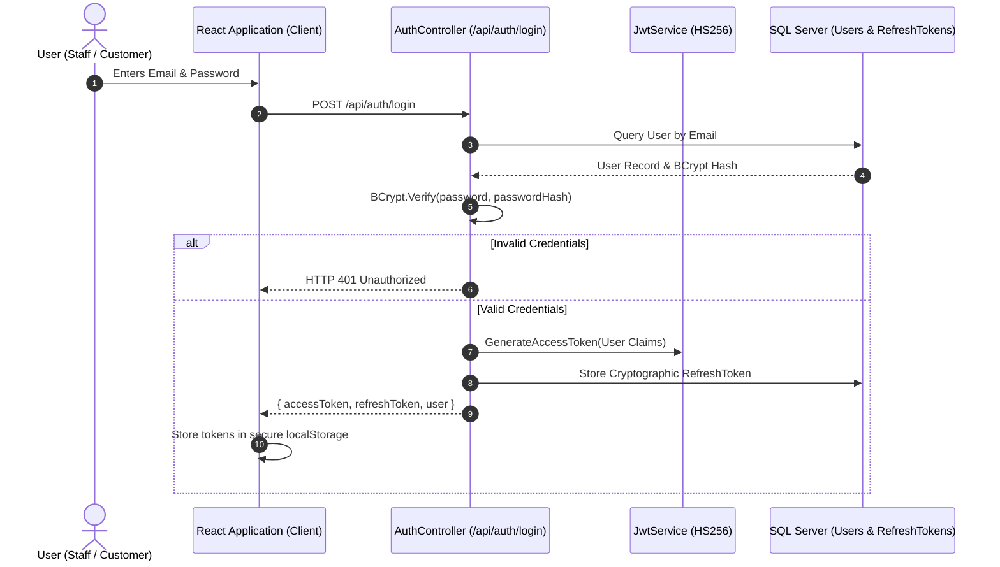

# DealFlow360 — Security Architecture & Data Governance

This document details the security model, cryptographic controls, authentication lifecycle, role-based authorization policies, zero-leak boundary protections, and audit logging standards implemented in **DealFlow360**.

---

## 1. Authentication Architecture

DealFlow360 enforces a stateless, cryptographically signed authentication model:



### 1.1 Password Hashing Standard
User passwords are never stored in plaintext. Passwords are salted and hashed using **BCrypt** (`BCrypt.Net-Next` 4.0.3) with a default work factor of 11, protecting against offline dictionary and rainbow table attacks.

### 1.2 JWT Access Token Claims
Generated access tokens are signed using HMAC-SHA256 (`HS256`) and embed the following standardized claims:
- `sub` / `ClaimTypes.NameIdentifier`: Unique integer User ID (`User.Id`).
- `email` / `ClaimTypes.Email`: Normalized user email address.
- `role` / `ClaimTypes.Role`: Primary operational role (`Admin`, `SalesManager`, `SalesRep`, `FinanceOperations`, `Customer`).
- `CustomerId`: Associated customer organization ID (present only for `Customer` accounts; `null` for internal staff).
- `iss` & `aud`: Validated against `Jwt__Issuer` and `Jwt__Audience`.
- `exp`: Timestamp bounding token lifetime (default: 480 minutes in dev, 120 minutes in prod).

---

## 2. Authorization & Policy Enforcement

Access control is enforced at two distinct layers:

### Layer 1: ASP.NET Core Policy Attributes
Controllers and individual action methods are decorated with declarative `[Authorize(Roles = "...")]` and `[Authorize(Policy = "...")]` attributes:

```csharp
[HttpPost("products")]
[Authorize(Roles = "Admin")]
public async Task<IActionResult> CreateProduct([FromBody] CreateProductRequest request) => ...

[HttpGet("summary")]
[Authorize(Roles = "SalesManager,Admin")]
public async Task<IActionResult> GetDealHealthSummary() => ...
```

### Layer 2: Domain-Level Contextual Validation
Fine-grained authorization rules that cannot be resolved by static roles alone are enforced in the domain service layer:
1. **Zero Self-Approval Enforcement:**
   ```csharp
   if (quotation.SalesRepId == currentUserId && currentUserRole != Role.Admin)
   {
       throw new UnauthorizedAccessException("Sales Representatives cannot approve their own discount requests.");
   }
   ```
2. **Customer Organizational Ownership:**
   ```csharp
   if (quotation.CustomerId != authenticatedCustomerId)
   {
       throw new UnauthorizedAccessException("Access denied. You can only access proposals issued to your organization.");
   }
   ```
3. **Mandatory Rejection Remarks:**
   Managers or finance officers cannot dismiss an approval request with an empty reason. Rejection remarks must contain at least 10 characters:
   ```csharp
   if (string.IsNullOrWhiteSpace(request.Remarks) || request.Remarks.Trim().Length < 10)
   {
       throw new ArgumentException("A substantive rejection reason (at least 10 characters) is required.");
   }
   ```

---

## 3. Strict Zero-Leak Customer Boundary

During commercial negotiations, exposing internal margins, target profitability, unit costs, or internal staff remarks destroys negotiating leverage and breaches internal compliance.

DealFlow360 implements a physical, architectural separation:

```mermaid
flowchart LR
    subgraph Internal["Internal CRM Entity (Quotation)"]
        A1[QuotationNumber]
        A2[GrandTotal]
        A3[TotalCost]
        A4[GrossMarginPercent]
        A5[BlendedRiskScore]
        A6[ManagerRemarks]
    end

    subgraph Filter["Zero-Leak Projection Layer"]
        FILTER["CustomerService / PortalService Mapper"]
    end

    subgraph External["Client-Facing DTO (CustomerQuoteDto)"]
        B1[QuotationNumber]
        B2[GrandTotal]
        B3["Cost / Margin: STRIPPED"]
        B4["Risk Score: STRIPPED"]
        B5["Staff Remarks: STRIPPED"]
    end

    Internal --> FILTER
    FILTER --> External
```



### Physical Exclusions in `CustomerQuoteDto`:
- ❌ `CostPrice` & `LineCost` (Physically absent from DTO)
- ❌ `LineMargin` & `GrossMarginPercent` (Physically absent from DTO)
- ❌ `BlendedRiskScore` (Physically absent from DTO)
- ❌ `ApprovalActions` & `StaffNotes` (Physically absent from DTO)

---

## 4. Cryptographic Magic Links

For external buyers who do not have portal credentials, the platform issues time-limited, cryptographically signed magic links:
- **Algorithm:** HMAC-SHA256 computed over `QuotationId + CustomerId + ExpiryTimestamp`.
- **URL Pattern:** `https://app.dealflow360.com/portal/quote/{token}`
- **Security Attributes:**
  - Read/negotiation access is strictly limited to that single quotation.
  - The token does not grant access to the customer's historical orders, other quotations, or billing statements.
  - Expired tokens are rejected with HTTP 401 Unauthorized.

---

## 5. Audit Trail & Compliance Logging

All high-impact state transitions, approvals, rejections, line modifications, payment collections, and user status toggles write immutable records to the `AuditLogs` table:

| Column | Type | Purpose |
| :--- | :--- | :--- |
| `Id` | `BIGINT IDENTITY` | Unique sequential log sequence |
| `ActorUserId` | `INT NULL` | User ID of the staff or customer taking action |
| `EntityName` | `NVARCHAR(100)` | Affected domain entity (`Quotation`, `Order`, `Invoice`, `Product`) |
| `EntityId` | `INT` | Primary key of the modified record |
| `Action` | `NVARCHAR(100)` | Standardized event key (`CustomerConfirmedQuotation`, `ManagerApproved`) |
| `OldValuesJson`| `NVARCHAR(MAX)` | Before-state JSON serialization for state diffing |
| `NewValuesJson`| `NVARCHAR(MAX)` | After-state JSON serialization |
| `Reason` | `NVARCHAR(500)` | Business justification or descriptive event summary |
| `CreatedAtUtc` | `DATETIME2` | Immutable UTC timestamp |
