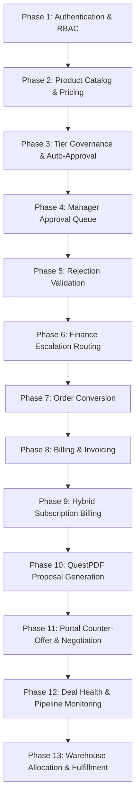

# DealFlow360 — Testing Strategy & E2E Test Suite Execution

This document details the quality assurance methodology, automated test suites, execution commands, and reproduction guides for the **DealFlow360** platform.

---

## 1. Testing Philosophy & Quality Standards

In DealFlow360, a feature is only considered complete when:
$$\text{UI} + \text{API} + \text{Domain Engine} + \text{Database} + \text{Authorization} + \text{State Transition} + \text{Persistence} + \text{Error Handling} = \text{Verified}$$

Mocked approval success, hardcoded quote totals, faked margin figures, or synthetic warehouse allocations are strictly prohibited. Every automated test executes real HTTP calls against the running ASP.NET Core API backed by Microsoft SQL Server.

---

## 2. Automated Test Suite Directory

The primary automated test suites are located in the `scripts/` directory:

| Script Name | Scope | Verification Points | Command |
| :--- | :--- | :--- | :--- |
| **`test_qa_dataset_e2e.js`** | QA Reference Master Data Verification | Verifies 5 Customer Tiers, 12 User Accounts, 24 Catalog Products, 3 Warehouses, and Initial Stock. | `node scripts/test_qa_dataset_e2e.js` |
| **`test_sales_rep_negotiation_e2e.js`** | Negotiation & Governance Re-approval | Verifies counter-offer submission, quotation versioning ($v1 \rightarrow v2$), tier boundary re-approval trigger, and rep counter acceptance. | `node scripts/test_sales_rep_negotiation_e2e.js` |
| **`test_quotation_pdf_generation_e2e.js`** | QuestPDF Commercial Proposal Generation | Verifies binary streaming, token-authenticated portal PDF download, staff PDF download, and PDF header/trailer byte validation. | `node scripts/test_quotation_pdf_generation_e2e.js` |
| **`db_reset_qa.js`** | Transaction Data Reset Utility | Purges transactional quotes, orders, and invoices while preserving all reference catalogs and demo accounts. | `npm run db:reset:qa` |

---

## 3. The 13-Phase Master E2E Audit Flow

The platform was subjected to a comprehensive 49-assertion End-to-End audit validating all functional boundaries:



### Phase Summaries:
1. **Phase 1 (Authentication & RBAC):** Verifies token issuance for Admin, Sales Manager, Sales Rep, Finance Operations, and Customer. Confirms that unauthenticated requests receive HTTP 401.
2. **Phase 2 (Product Catalog):** Validates all 24 purpose-built products, categories (Hardware, Accessories, Services, Support, Subscriptions), and company mapping.
3. **Phase 3 (Automatic Tier Governance):** Confirms that a discount within the customer's tier limit (e.g. 5% on Silver with 10% ceiling) transitions automatically to `QuoteStatus.Approved` and `ApprovalStatus.Approved` without requiring manual manager intervention.
4. **Phase 4 (Manager Approval Queue):** Confirms that exceeding the customer tier ceiling (e.g. 12% on Silver) automatically routes the proposal to `QuoteStatus.PendingApproval` and appears in the Manager's `/api/approvals` queue.
5. **Phase 5 (Rejection Validation):** Verifies that a manager rejecting without substantive remarks (< 10 characters) is rejected with HTTP 400 Bad Request. Validates rejection with proper remarks transitions quote to `QuoteStatus.Rejected`.
6. **Phase 6 (Finance Escalation):** Verifies two-tier approval: when requested discount is $> 15\%$ or risk score $\ge 70$, Sales Manager approval transitions the quotation to `ApprovalStatus.ManagerApproved` and automatically dispatches a Level 2 approval request to `FinanceOperations`.
7. **Phase 7 (Order Conversion):** Validates that an approved quote converts cleanly into an active order with status `Confirmed` and formatted order number (`ORD-YYYYMMDD-XXXXXX`).
8. **Phase 8 (Billing & Invoicing):** Verifies that one-time hardware lines trigger immediate commercial invoice generation with correct totals, taxes, and outstanding balance.
9. **Phase 9 (Hybrid Subscription Billing):** Verifies that recurring subscription lines generate active `BillingSchedule` records with appropriate monthly/annual cadences.
10. **Phase 10 (PDF Proposal Generation):** Verifies that QuestPDF renders a professional multi-page document streaming valid `%PDF-` binary bytes across all 3 entry points (CRM rep view, CRM manager view, and customer portal).
11. **Phase 11 (Customer Portal & Counter-Offers):** Validates Zero-Leak DTO shielding, client counter-offer submission, version incrementing, and automatic approval clearing upon agreed terms.
12. **Phase 12 (Deal Health & Velocity):** Verifies that stalled deals and discount variance anomalies ($>2\sigma$) are correctly aggregated on the Deal Health dashboard.
13. **Phase 13 (Multi-Warehouse Allocation):** Verifies greedy stock matching across Pune, Ahmedabad, and Bengaluru warehouses, backorder reservation, and dispatch shipment tracking.

---

## 4. Running the Tests

Ensure the backend server is running on `http://localhost:5042` before running the test scripts:

```powershell
# In PowerShell / Command Prompt at repository root:

# 1. Verify Master QA Dataset
node scripts/test_qa_dataset_e2e.js

# 2. Verify Negotiation & Re-Approval Cycle
node scripts/test_sales_rep_negotiation_e2e.js

# 3. Verify PDF Proposal Generation Engine
node scripts/test_quotation_pdf_generation_e2e.js
```

### Expected Output Example (`test_sales_rep_negotiation_e2e.js`):
```text
[STEP 1] Authenticating Staff & Customer Users...
  -> Admin Login: OK
  -> Sales Rep Login: OK
  -> Sales Manager Login: OK
  -> Customer Login: OK

[STEP 2] Creating Proposal with Discount Exceeding Tier...
  -> Created Quote Q-20260906-0001 with 12% discount on Silver (10% ceiling)
  -> Status: PendingApproval (Routing Engine OK)

[STEP 3] Manager Approves Proposal...
  -> Status: Approved

[STEP 4] Customer Submits Counter-Offer via Portal...
  -> Version incremented to 2
  -> Status: PendingApproval (Re-approval Engine triggered)

[STEP 5] Rep Submits Compromise (10% Agreed Terms)...
  -> Customer accepts terms
  -> Status: Approved (Approval request cleared)
```
