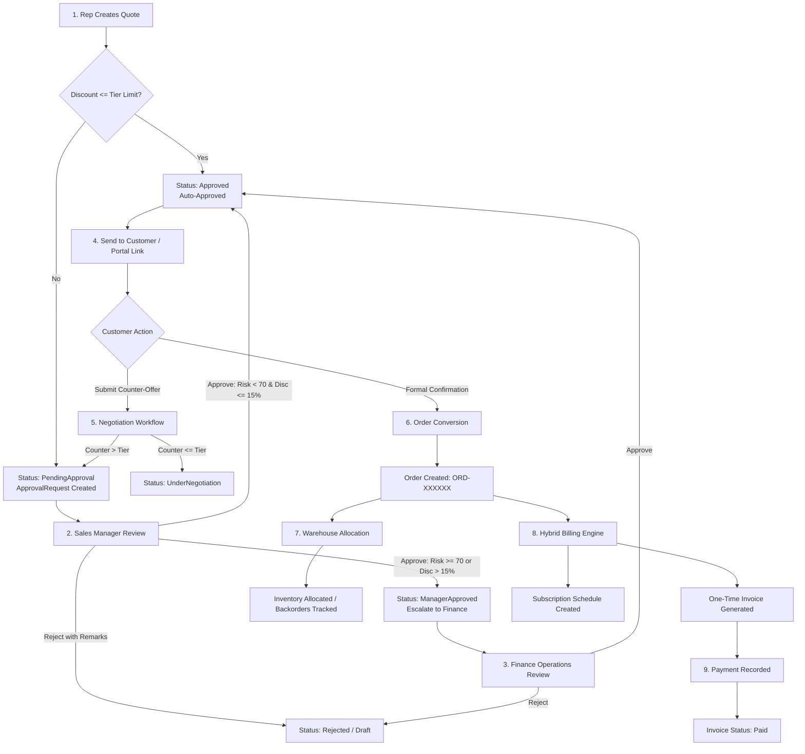
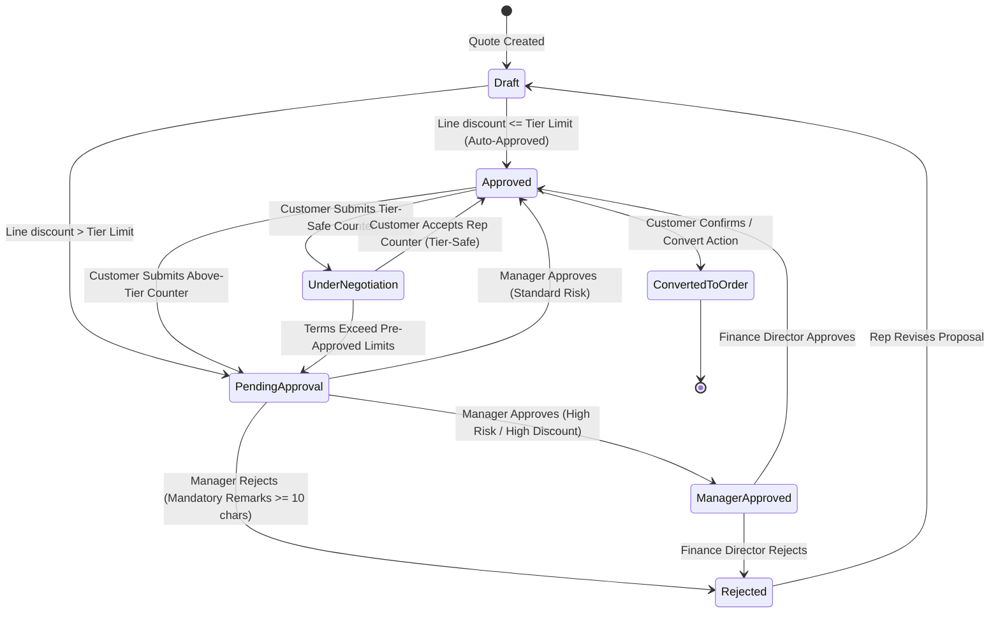

# DealFlow360 — End-to-End System Workflows

This document details the operational business workflows, lifecycle state machines, governance rules, and interaction sequences implemented in **DealFlow360**.

---

## 1. Complete Commercial Sales Lifecycle

---

## 2. Detailed Workflow Breakdown

### 2.1 Quotation Creation & Live Governance
1. **Initiation:** The Sales Representative navigates to `/workspace/quotations/new`, selects a customer organization, and sets the commercial validity period.
2. **Catalog Selection:** Line items are added from the verified product catalog.
3. **Real-Time Discount Governance:**
   - On each line item modification, the system queries the customer's pre-approved tier ceiling:
     - **Bronze Tier:** Maximum 5.0% discount ceiling.
     - **Silver Tier:** Maximum 10.0% discount ceiling.
     - **Gold Tier:** Maximum 15.0% discount ceiling.
   - The UI displays live badges (`≤ 10% Tier Safe` or `Exceeds Tier Limit`).
4. **Blended Risk & Margin Scoring:**
   - The backend `BlendedDiscountRiskEngine` computes a real-time risk score ($0–100$) based on peak violation, margin deficit, and volume weighting.

---

### 2.2 Approval Routing & Multi-Tier Governance State Machine

#### Key Rules:
- **Zero Self-Approval:** A Sales Representative attempting to approve their own quotation receives an immediate HTTP 403 Forbidden with message: *"Sales Representatives cannot approve their own discount requests."*
- **Mandatory Rejection Remarks:** Rejecting an approval request requires a substantive remark of at least 10 characters. Shorter reasons return HTTP 400 Bad Request.
- **Finance Escalation Trigger:** If a quotation has an aggregate risk score $\ge 70$ or any line item discount $> 15\%$, Manager approval transitions the status to `ManagerApproved` and automatically creates a Level 2 `FinanceOperations` approval request.

---

### 2.3 Upsell & Cross-Sell Recommendation Flow
1. While inspecting a quotation (`/workspace/quotations/:id`), the backend `UpsellCrossSellEngine` analyzes the current line items against affinity rules.
2. Rules matching already-included products are automatically filtered out.
3. Each recommendation displays:
   - Recommended Product & SKU
   - Base Price & Estimated Net Total
   - Expected Margin Delta percentage
   - Rationale (e.g., *"Commonly paired with DealFlow ProBook 14"*)
4. Clicking **"Accept Upsell"** immediately appends the product as a new line item on the quotation and refreshes financial totals.

---

### 2.4 Customer Portal & Secure Negotiation

1. **Link Generation:** The Sales Rep clicks **"Generate Portal Link"**, creating a signed HMAC-SHA256 URL (`/portal/quote/:token`). Alternatively, registered customer users log into `/portal/my-account`.
2. **Zero-Leak Protection:** The portal view strips out all internal cost prices, margin percentages, risk scores, and staff remarks.
3. **Customer Counter-Offer:**
   - The customer can propose a requested discount percentage on any line item with a justified reason.
   - The quotation version increments (e.g., v1 $\rightarrow$ v2).
   - If the requested discount is within their tier ceiling, status becomes `UnderNegotiation`.
   - If the requested discount exceeds their tier ceiling (e.g., 12% on Silver with a 10% limit), status automatically transitions to `PendingApproval` and re-enters the Manager's approval queue.
4. **Rep Counter-Offer Acceptance:**
   - When a Sales Rep submits a negotiated compromise back to the customer, the Customer Portal renders a prominent counter-offer banner.
   - When the customer clicks **"Accept Agreed Terms"**, if the agreed discount is within the customer's tier ceiling, the quotation is marked `Approved` and internal manager approval requests are cleared.

---

### 2.5 Order Conversion & Multi-Warehouse Fulfillment

1. **Conversion:** Once a quotation is `Approved`, clicking **"Convert to Order"** creates an active `Order` record with a unique identifier (`ORD-YYYYMMDD-XXXXXX`).
2. **Warehouse Allocation Algorithm:**
   - The `WarehouseAllocationEngine` evaluates inventory availability across active warehouses.
   - Items are allocated prioritizing warehouses with full stock to minimize split shipments.
   - If insufficient stock exists across all warehouses, an `InventoryBackorder` record is created to track the shortage.
3. **Dispatch:** The warehouse operator marks packages as `Shipped`, assigning carrier names and tracking numbers.

---

### 2.6 Hybrid Billing & Payment Processing

1. **Automated Billing Generation:** Upon order conversion, `GenerateBillingForOrderAsync` automatically executes:
   - **One-Time Products (Physical/Hardware):** Generates an immediate commercial `Invoice` with status `Issued` or `Draft`.
   - **Subscription Products (SaaS/Cloud):** Generates a `BillingSchedule` with monthly, quarterly, or annual recurrence dates.
2. **Payment Collection:**
   - In `/workspace/billing`, finance operators view outstanding invoices.
   - Clicking **"Record Payment"** opens the payment modal accepting payment method (WireTransfer, CreditCard, UPI, Cheque), reference number, and amount.
   - When cumulative payments equal or exceed the invoice total, the invoice status automatically updates to `Paid`.
3. **Credit Notes:** Finance operators can issue credit memos for reconciliation or returns, immediately deducting from the outstanding balance.
