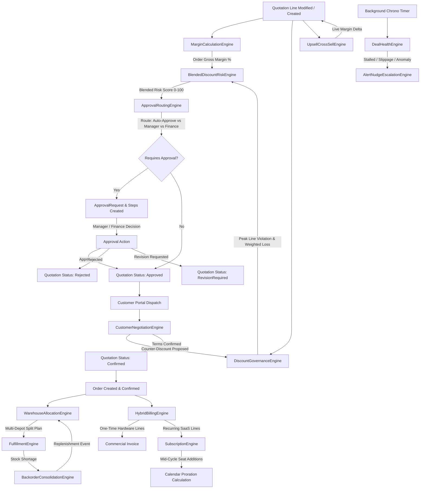

# DealFlow360 — Engine Logic Master Specification
# Complete Business Logic, Mathematical Formulas, Decision Trees, and Architectural Authority

---

## Document Control & System Authority

| Attribute | Value |
| :--- | :--- |
| **Document Title** | DealFlow360 Business Engines Master Architecture & Formula Specification |
| **System Name** | DealFlow360: Intelligent, Self-Governing Sales Operations Platform |
| **Document Type** | Authoritative Master Engineering Specification |
| **Target Runtime** | ASP.NET Core (.NET 9/8) / C# 12 / Entity Framework Core / Microsoft SQL Server |
| **Primary Business Source** | `DealFlow360.pdf` (13-Page Problem Statement) |
| **Primary Engineering Source**| `DealFlow360_ASPNet_SQLServer_React_Complete_Implementation_Spec.pdf` |
| **Database Schema Standard** | 41-Entity Relational Model (`docs/DEALFLOW360_MASTER_PRD.md`) |
| **Classification** | Single Source of Truth for Backend Business Logic |
| **Status** | LOCKED / PRODUCTION SPECIFICATION |
| **Last Updated** | 2026-09-05 |

---

## 1. Executive Overview

### 1.1 The Operational Mandate
Simple commercial tools treat sales operations as a static sequence: *Create Quote $\to$ Print PDF $\to$ Email Customer $\to$ Issue Invoice*. 

Modern B2B enterprise sales environments are fundamentally non-linear, multi-dimensional, and prone to severe revenue leakage:
1. **Unchecked Discounting**: Sales reps quietly concede margin across multiple line items, remaining technically under order-level caps while heavily discounting thin-margin product lines.
2. **Approval Gridlock & Circumvention**: Rigid approval matrices either overwhelm senior management with routine approvals or allow high-risk pricing exceptions to slip through without executive visibility.
3. **Inventory Fragmentation**: Orders are committed without real-time warehouse stock synchronization, resulting in surprise backorders, customer disappointment, and uncoordinated multi-hop delivery costs.
4. **Hybrid Revenue Disconnect**: Modern contracts bundle physical capital hardware with recurring SaaS subscriptions and ongoing service milestones on a single commercial quote, breaking traditional single-mode invoicing engines.
5. **Customer Portal Blindness**: Static quote PDFs require disjointed email negotiations. When customers counter-offer, manual rep adjustments frequently bypass pricing governance without re-approval.
6. **Pipeline Stagnation**: Sales management only discovers stalled deals and margin erosion weeks after the momentum is lost.

### 1.2 The Engine Solution
**DealFlow360** resolves these systemic failures by embedding **13 deterministic, interconnected business engines** directly into the backend domain layer. The backend acts as the sole commercial authority:
- **Server Authority**: Every price calculation, gross margin, discount overage, blended risk score, warehouse split, proration amount, and health penalty is computed on the server using 128-bit decimal precision.
- **Zero Client Trust**: Frontend applications (Internal Sales Workspace & Customer Portal) are strictly presentation surfaces. They never compute authoritative financial terms.
- **Audited State Transitions**: Commercial state changes are governed by finite state machine engines enforcing immutability and complete traceability.

---

## 2. Engine Architecture & Clean DDD Boundaries

DealFlow360 implements **Clean Architecture** and **Domain-Driven Design (DDD)**. Business engines reside strictly within `DealFlow360.Domain.Engines`. They are pure, deterministic C# domain services with zero dependencies on HTTP contexts, database connection strings, or external transport protocols.

```
┌────────────────────────────────────────────────────────────────────────┐
│               DealFlow360 Presentation Layer (ASP.NET Core)            │
│   • Internal Sales Controllers (Quotations, Orders, Fulfillment)       │
│   • Zero-Leak Customer Portal Controller (/api/portal/*)            │
│   • Hosted Background Services (DealHealth, BillingRun, Consolidation) │
└───────────────────────────────────┬────────────────────────────────────┘
                                    │ Commands & Queries
                                    ▼
┌────────────────────────────────────────────────────────────────────────┐
│            DealFlow360 Application Layer (MediatR & Orchestration)      │
│   • Coordinates UnitOfWork, Transactions, EF Core Repositories         │
│   • Loads Aggregate Roots, Enforces Role Permissions                   │
│   • Passes Rich Domain Models to Specialized Engines                   │
└───────────────────────────────────┬────────────────────────────────────┘
                                    │ Invokes Domain Engines
                                    ▼
┌────────────────────────────────────────────────────────────────────────┐
│                  DealFlow360 Core Business Engines Layer               │
│                                                                        │
│   [COMMERCIAL GOVERNANCE ENGINES]                                      │
│   ├── MarginCalculationEngine          (Gross profit, GM %, deltas)    │
│   ├── DiscountGovernanceEngine         (Tier & category limit guards)  │
│   ├── BlendedDiscountRiskEngine        (0–100 Weighted risk index)     │
│   ├── ApprovalRoutingEngine            (Data-driven approval chain)    │
│   └── CustomerNegotiationEngine        (Portal terms & re-approval)    │
│                                                                        │
│   [OPERATIONS & LOGISTICS ENGINES]                                     │
│   ├── WarehouseAllocationEngine        (Cost & hop minimization split) │
│   ├── FulfillmentEngine                (Stock reservation & dispatch)  │
│   └── BackorderConsolidationEngine     (FIFO replenishment merge)      │
│                                                                        │
│   [REVENUE & CONTRACT ENGINES]                                         │
│   ├── HybridBillingEngine              (One-time vs recurring split)   │
│   ├── SubscriptionEngine               (Milestones & daily proration)  │
│   └── UpsellCrossSellEngine            (Rule-based margin boost)       │
│                                                                        │
│   [SURVEILLANCE & INTELLIGENCE ENGINES]                                │
│   ├── DealHealthEngine                 (100-pt penalty radar)          │
│   └── AlertNudgeEscalationEngine       (Automated notification queue)  │
└───────────────────────────────────┬────────────────────────────────────┘
                                    │ Persists State Invariants
                                    ▼
┌────────────────────────────────────────────────────────────────────────┐
│          Infrastructure Layer: SQL Server & EF Core (41 Entities)      │
│   • ACID Transactions, ROWVERSION Concurrency Tokens                   │
│   • DECIMAL(18, 4) Precision, Immutable Financial Ledger Lines         │
└────────────────────────────────────────────────────────────────────────┘
```

---

## 3. Master Engine Dependency & Interaction Map

The following graph illustrates how business events cascade across DealFlow360 engines:



---

## 4. DealFlow360 Formula Registry

This registry serves as the authoritative mathematical standard across the entire system. Every formula is deterministic, strictly prevents division-by-zero, and mandates .NET 128-bit `decimal` precision.

| ID | Formula Name | Mathematical Expression | Inputs | Output | Primary Consuming Engine |
| :--- | :--- | :--- | :--- | :--- | :--- |
| **F-01** | **Line Net Price** | $P_{net} = P_{unit} \times \left(1 - \frac{D\%}{100}\right)$ | $P_{unit}$ (Unit Price), $D\%$ (Discount %) | Line unit net price | `MarginCalculationEngine` |
| **F-02** | **Line Net Revenue** | $R_{net} = P_{net} \times Q$ | $P_{net}$, $Q$ (Quantity) | Line total net revenue | `MarginCalculationEngine` |
| **F-03** | **Line Total Cost** | $C_{line} = C_{unit} \times Q$ | $C_{unit}$ (Cost Price), $Q$ (Quantity) | Line total standard cost | `MarginCalculationEngine` |
| **F-04** | **Line Gross Profit** | $GP_{line} = R_{net} - C_{line}$ | $R_{net}$, $C_{line}$ | Line gross profit amount | `MarginCalculationEngine` |
| **F-05** | **Line Gross Margin %** | $GM\%_{line} = \begin{cases} \frac{GP_{line}}{R_{net}} \times 100 & \text{if } R_{net} > 0 \\ 0.00\% & \text{if } R_{net} = 0 \land C_{line} = 0 \\ -100.00\% & \text{if } R_{net} = 0 \land C_{line} > 0 \end{cases}$ | $GP_{line}$, $R_{net}$, $C_{line}$ | Line margin percentage | `MarginCalculationEngine` |
| **F-06** | **Quotation Total Revenue** | $R_{total} = \sum_{i=1}^{n} R_{net, i}$ | All active line net revenues | Deal commercial total | `MarginCalculationEngine` |
| **F-07** | **Quotation Total Cost** | $C_{total} = \sum_{i=1}^{n} C_{line, i}$ | All active line standard costs | Deal total COGS | `MarginCalculationEngine` |
| **F-08** | **Quotation Gross Margin %**| $GM\%_{order} = \begin{cases} \frac{R_{total} - C_{total}}{R_{total}} \times 100 & \text{if } R_{total} > 0 \\ 0.00\% & \text{otherwise} \end{cases}$ | $R_{total}$, $C_{total}$ | Order aggregate margin % | `MarginCalculationEngine`, `BlendedDiscountRiskEngine` |
| **F-09** | **Effective Discount Limit** | $L_{eff, i} = \min(L_{tier}, L_{cat, i})$ | $L_{tier}$ (Tier cap), $L_{cat, i}$ (Category cap) | Maximum allowable discount | `DiscountGovernanceEngine` |
| **F-10** | **Line Discount Overage** | $\Delta_{disc, i} = \max(0, D\%_i - L_{eff, i})$ | $D\%_i$ (Actual discount), $L_{eff, i}$ | Excess discount points | `DiscountGovernanceEngine` |
| **F-11** | **Peak Line Violation** | $\Delta_{peak} = \max_{i} (\Delta_{disc, i})$ | All line discount overages | Worst-case violation points | `DiscountGovernanceEngine`, `BlendedDiscountRiskEngine` |
| **F-12** | **Weighted Margin Loss** | $\Delta_{weighted} = \frac{\sum_{i=1}^{n} \left(\Delta_{disc, i} \times (P_{unit, i} \times Q_i)\right)}{\sum_{i=1}^{n} (P_{unit, i} \times Q_i)}$ | Line overages, Line gross values | Volume-weighted overage | `DiscountGovernanceEngine`, `BlendedDiscountRiskEngine` |
| **F-13** | **Margin Deficit** | $Deficit_{margin} = \max(0, TargetGM\% - GM\%_{order})$ | $TargetGM\%$ (e.g. 30%), $GM\%_{order}$ | Target shortfall points | `BlendedDiscountRiskEngine` |
| **F-14** | **Blended Risk Score** | $Risk = \min\left(100, \max\left(0, (0.40 \Delta_{peak}) + (0.35 \Delta_{weighted}) + (0.25 Deficit_{margin})\right)\right)$ | $\Delta_{peak}, \Delta_{weighted}, Deficit_{margin}$ | Authoritative 0–100 risk score | `BlendedDiscountRiskEngine` |
| **F-15** | **Recommendation Score** | $Score_{rec} = (30 \cdot I_{promo}) + (20 \cdot I_{copurchase}) + (20 \cdot I_{margin}) + (10 \cdot I_{category})$ | Binary indicator flags | Add-on priority score (0–80) | `UpsellCrossSellEngine` |
| **F-16** | **Live Margin Delta** | $\Delta GM\% = GM\%_{new} - GM\%_{current}$ | Projected order margin, current margin | Real-time margin shift | `UpsellCrossSellEngine` |
| **F-17** | **Warehouse Split Cost** | $Cost_{shipping} = \sum_{w=1}^{m} \left(Weight_w \times Q_{allocated, w}\right)$ | Warehouse weights, allocated quantities | Logistics optimization metric | `WarehouseAllocationEngine` |
| **F-18** | **Daily Calendar Proration** | $Adj_{prorated} = \frac{\Delta Rate_{monthly} \times \Delta Q}{DaysInPeriod} \times DaysRemaining$ | Price delta, seat delta, days in month, active days | Exact financial adjustment | `HybridBillingEngine`, `SubscriptionEngine` |
| **F-19** | **Deal Health Score** | $Health = \max\left(0, \min\left(100, 100 - \sum Penalties\right)\right)$ | Active operational risk penalties | Pipeline health index (0–100) | `DealHealthEngine` |
| **F-20** | **Discount Anomaly Threshold**| $Threshold_{anomaly} = \bar{D}_{rep, 90d} + (2 \times \sigma_{rep})$ | Rep rolling average & standard deviation | Rogue discounting boundary | `DealHealthEngine` |

---

## 5. Engine Deep Dive: MarginCalculationEngine

### 1. Purpose
The `MarginCalculationEngine` is the fundamental financial calculation authority for DealFlow360. It ensures that every line item and entire commercial deals have unambiguous visibility into revenue, cost, profit, and gross margin percentages. It eliminates rep guesswork and feeds authoritative margin numbers directly into governance, risk, upsell, and reporting modules.

### 2. Business Trigger
- Product added to quotation or line deleted.
- Line quantity or unit price adjusted.
- Line-level or order-level discount modified.
- Customer currency or price list toggled.
- Add-on recommendation accepted.
- Customer counter-discount proposed in portal.

### 3. Inputs
- `IEnumerable<QuotationLine>`:
  - `UnitPrice` (decimal)
  - `Quantity` (decimal)
  - `DiscountPercentage` (decimal, 0.00 to 100.00)
  - `Product.CostPrice` (decimal)
  - `ProductVariant.ExtraCost` (decimal, if variant selected)
  - `Product.TaxRate` (decimal, e.g. 18.00%)

### 4. Outputs
Returns a `MarginCalculationResult` containing:
- Line-level: `NetUnitPrice`, `GrossRevenue`, `NetRevenue`, `TotalCost`, `GrossProfitAmount`, `GrossMarginPercentage`, `TaxAmount`.
- Quotation-level: `SubTotalGross`, `TotalDiscountAmount`, `SubTotalNet`, `TotalTaxAmount`, `GrandTotal`, `TotalCost`, `TotalGrossProfit`, `OverallGrossMarginPercentage`.

### 5. Formula / Mathematical Derivation
$$\text{Line Unit Net} = \text{UnitPrice} \times \left(1 - \frac{\text{Discount}\%}{100}\right)$$
$$\text{Line Net Revenue} = \text{Line Unit Net} \times \text{Quantity}$$
$$\text{Line Total Cost} = (\text{BaseCost} + \text{VariantExtraCost}) \times \text{Quantity}$$
$$\text{Line Gross Profit} = \text{Line Net Revenue} - \text{Line Total Cost}$$
$$\text{Line Gross Margin \%} = \frac{\text{Line Gross Profit}}{\text{Line Net Revenue}} \times 100 \quad (\text{if } \text{Line Net Revenue} > 0)$$
$$\text{Quotation Gross Margin \%} = \frac{\sum \text{Line Gross Profit}}{\sum \text{Line Net Revenue}} \times 100 \quad (\text{if } \sum \text{Line Net Revenue} > 0)$$

### 6. Step-by-Step Algorithm
1. Initialize accumulators: `totalGross = 0`, `totalNet = 0`, `totalCost = 0`, `totalTax = 0`.
2. Iterate through each active `QuotationLine`:
   a. Validate $Quantity > 0$. Throw `ValidationException` if zero or negative.
   b. Calculate effective unit cost: $Cost = BaseCost + VariantExtraCost$.
   c. Calculate line net unit price using **F-01**, rounded to 4 decimal places.
   d. Calculate line net revenue using **F-02**.
   e. Calculate line total cost using **F-03**.
   f. Calculate line gross profit using **F-04**.
   g. Guard against zero revenue: If $LineNetRevenue == 0$, assign $-100.00\%$ if $Cost > 0$, else $0.00\%$. Otherwise compute **F-05**.
   h. Compute line tax: $LineTax = LineNetRevenue \times (TaxRate / 100)$.
   i. Add line metrics to quotation accumulators.
3. Compute quotation aggregate totals:
   a. $TotalDiscountAmount = totalGross - totalNet$.
   b. $GrandTotal = totalNet + totalTax$.
   c. $TotalGrossProfit = totalNet - totalCost$.
   d. If $totalNet > 0$, compute overall margin % using **F-08** rounded to 2 decimal places. Else assign $0.00\%$.
4. Return populated result.

### 7. Decision Rules
- **Rule M-1**: If `DiscountPercentage` equals 100.00%, `NetRevenue` is 0. If `Cost` is greater than 0, margin is explicitly $-100.00\%$ (100% loss).
- **Rule M-2**: Subscription lines with monthly frequencies must be evaluated based on their single recurring period value for quotation margin, or extended by contract duration if configured in `PriceLists`. Standard DealFlow360 rule evaluates contract annualized value for blended margin.
- **Rule M-3**: Variant extra costs must always be included in COGS calculation before margin determination.

### 8. Edge Cases
- **Zero Quantity**: Prohibited by entity validation ($Q \ge 1$).
- **Zero Selling Price (Free Sample)**: Handled safely; results in $-100\%$ margin if cost $> 0$, preventing divide-by-zero crashes.
- **Negative Margin**: Permitted by engine (not clamped to 0) so that risk and governance engines can detect severe margin destruction.
- **Precision Truncation**: Intermediate math must use 128-bit `decimal`. Rounding to 2 decimal places occurs only at the final DTO presentation boundary.

### 9. Security & Authorization Considerations
- Sales reps can view gross margin % on their own quotes.
- Customer Portal DTO mapping **must explicitly strip** `TotalCost`, `GrossProfitAmount`, and `OverallGrossMarginPercentage`.

### 10. Database Dependencies
- Entities: `Quotations`, `QuotationLines`, `Products`, `ProductVariants`, `TaxRules`.
- Columns: `Products.BasePrice`, `Products.CostPrice`, `ProductVariants.ExtraCost`, `QuotationLines.UnitPrice`, `QuotationLines.DiscountPercentage`.

### 11. API Dependency
- Direct trigger: `POST /api/quotations/{id}/recalculate`, `POST /api/quotations/{id}/lines`.
- Indirect trigger: `POST /api/portal/quote/{token}/negotiate`.

### 12. Realistic Example
- Product: Enterprise Laptop (SKU: `HW-LAP-001`).
- `BasePrice` = \$1,200.00, `CostPrice` = \$800.00.
- `Quantity` = 5.
- Rep applies 12.00% discount.
- **Calculations**:
  - $UnitNet = \$1,200 \times (1 - 0.12) = \$1,056.00$.
  - $GrossRevenue = \$1,200 \times 5 = \$6,000.00$.
  - $NetRevenue = \$1,056 \times 5 = \$5,280.00$.
  - $TotalCost = \$800 \times 5 = \$4,000.00$.
  - $GrossProfit = \$5,280 - \$4,000 = \$1,280.00$.
  - $GrossMargin\% = (\$1,280 / \$5,280) \times 100 = 24.24\%$.

### 13. Current Implementation Assessment
- **Status**: `PASS WITH IMPROVEMENTS`
- **Rationale**: The formulas are mathematically sound, but existing code in `DEALFLOW360_BACKEND_ARCHITECTURE.md` lacks explicit guard clauses for $NetRevenue == 0$ when cost is positive. Production code must include the zero-division guard specified in **F-05**.

---

## 6. Engine Deep Dive: DiscountGovernanceEngine

### 1. Purpose
Enforces enterprise pricing discipline across diverse customer tiers and product categories. It prevents sales reps from exceeding established discretionary limits and identifies the exact line-by-line violations that necessitate supervisory approval.

### 2. Business Trigger
- Quote Builder discount edited.
- Quantity updated on volume-discounted items.
- Customer tier changed.
- Customer submits counter-discount in negotiation portal.

### 3. Inputs
- `Customer.CustomerTier.MaxDiscountCeiling` (decimal, e.g. Bronze 5%, Silver 10%, Gold 15%).
- `IEnumerable<CategoryDiscountLimit>` (category-specific rep limits).
- `IEnumerable<QuotationLine>` (Product Category, Unit Price, Quantity, Requested Discount %).

### 4. Outputs
- `LineDiscountEvaluations`:
  - `EffectiveDiscountLimit` per line.
  - `ExcessDiscount` (overage points).
  - `RequiresApproval` (boolean flag per line).
  - `ViolationReason` (string description).
- Quotation Aggregate:
  - `PeakLineViolation` ($\Delta_{peak}$).
  - `WeightedMarginLoss` ($\Delta_{weighted}$).
  - `QuotationRequiresApproval` (boolean).

### 5. Formula / Algorithm
$$\text{Effective Limit } L_{eff, i} = \min(\text{TierCeiling}, \text{CategoryLimit}_i)$$
$$\text{Excess Discount } \Delta_{disc, i} = \max(0, \text{LineDiscount}_i - L_{eff, i})$$
$$\text{Peak Violation } \Delta_{peak} = \max_i (\Delta_{disc, i})$$
$$\text{Weighted Loss } \Delta_{weighted} = \frac{\sum_{i=1}^n \left(\Delta_{disc, i} \times (\text{UnitPrice}_i \times \text{Quantity}_i)\right)}{\sum_{i=1}^n (\text{UnitPrice}_i \times \text{Quantity}_i)}$$

### 6. Step-by-Step Algorithm
1. Retrieve customer tier ceiling $L_{tier}$. If customer has no tier, default to 0.00%.
2. For each line $i$:
   a. Look up category limit $L_{cat, i}$ in `CategoryDiscountLimits`.
   b. If category limit exists, $L_{eff, i} = \min(L_{tier}, L_{cat, i})$.
   c. If category limit does not exist, $L_{eff, i} = L_{tier}$.
   d. Calculate overage $\Delta_{disc, i} = \text{Discount}_i - L_{eff, i}$.
   e. If $\Delta_{disc, i} > 0$: Mark line `RequiresApproval = true`, construct reason string, and accumulate weighted loss:
      $Loss_i = \Delta_{disc, i} \times (\text{UnitPrice}_i \times \text{Quantity}_i)$.
   f. Track peak overage $\Delta_{peak} = \max(\Delta_{peak}, \Delta_{disc, i})$.
3. Calculate total gross order value $TotalGross = \sum (\text{UnitPrice}_i \times \text{Quantity}_i)$.
4. If $TotalGross > 0$, $\Delta_{weighted} = \sum Loss_i / TotalGross$. Else $\Delta_{weighted} = 0$.
5. Return evaluation containing line flags and summary metrics.

### 7. Decision Rules
- **Rule DG-1 (Category Override)**: Stricter category ceilings always override customer tier ceilings. A Gold customer (15% ceiling) buying Services (10% ceiling) is limited to 10% on the service line.
- **Rule DG-2 (Independent Line Evaluation)**: Every line is evaluated against its own ceiling. Safe lines (e.g. 0% discount) never cancel out or forgive a violation on an over-discounted line.
- **Rule DG-3 (Order-Level Discount Allocation)**: If an order-level discount is entered, the engine must distribute it proportionally across line items before evaluating category caps.

### 8. Edge Cases
- **Missing Category Limit**: Defaults safely to Customer Tier ceiling.
- **New Customer (No Tier)**: Defaults to 0% allowable discount (any discount triggers approval).
- **Line Discount = 0%**: Overage is 0.00, `RequiresApproval` is false.
- **Extreme Discount (100%)**: Flagged with maximum overage points; triggers mandatory Level 2 Finance approval.

### 9. Security & Authorization Considerations
- Internal reps cannot override `EffectiveDiscountLimit`.
- Rule configuration is restricted to `Admin` and `SalesManager` roles.

### 10. Database Dependencies
- Entities: `CustomerTiers`, `Customers`, `CategoryDiscountLimits`, `ProductCategories`, `QuotationLines`.

### 11. API Dependency
- Invoked during: `POST /api/quotations/{id}/recalculate`, `POST /api/quotations/{id}/submit-approval`.

### 12. Realistic Example (From Problem Statement Page 12)
- Customer: Acme Corp (Tier: Gold $\to$ 15% ceiling).
- Line 1: Laptop (Category: Hardware $\to$ 15% ceiling).
  - Price: \$1,200, Qty: 5, Gross: \$6,000.
  - Discount: 12.00%. Allowed: $\min(15, 15) = 15\%$. Overage: 0 points.
- Line 2: Setup Service (Category: Service $\to$ 10% ceiling).
  - Price: \$500, Qty: 2, Gross: \$1,000.
  - Discount: 18.00%. Allowed: $\min(15, 10) = 10\%$. Overage: 8 points ($18\% - 10\%$).
- **Governance Output**:
  - Line 2 flagged for approval.
  - $\Delta_{peak} = 8.00$ points.
  - $TotalGross = \$6,000 + \$1,000 = \$7,000$.
  - $\Delta_{weighted} = (0 \times \$6,000 + 8 \times \$1,000) / \$7,000 = 8,000 / 7,000 = 1.14$ points.
  - `QuotationRequiresApproval` = `true`.

### 13. Current Implementation Assessment
- **Status**: `PASS`
- **Rationale**: The dual-min logic and volume-weighted overage accurately represent the core problem statement requirements.

---

## 7. Engine Deep Dive: BlendedDiscountRiskEngine

### 1. Purpose
The `BlendedDiscountRiskEngine` synthesizes multiple commercial risk indicators into a single, authoritative, normalized 0–100 Risk Score. It solves the critical "silent margin leakage" problem where reps spread small discount infractions across numerous lines, remaining below individual escalation triggers while severely eroding deal profitability.

### 2. Business Trigger
- Invoked immediately after `DiscountGovernanceEngine` and `MarginCalculationEngine` complete.
- Pre-requisite for `ApprovalRoutingEngine`.

### 3. Inputs
- `PeakLineViolation` ($\Delta_{peak}$, decimal): From `DiscountGovernanceEngine`.
- `WeightedMarginLoss` ($\Delta_{weighted}$, decimal): From `DiscountGovernanceEngine`.
- `OrderGrossMarginPercent` ($GM\%_{order}$, decimal): From `MarginCalculationEngine`.
- `TargetGrossMarginPercent` ($GM\%_{target}$, decimal): Configurable, default 30.00%.

### 4. Outputs
- `RiskEvaluationResult`:
  - `RiskScore` (decimal, 0.00 to 100.00).
  - `RiskCategory` (`Low`, `Medium`, `High`, `Critical`).
  - `MarginDeficitPoints` (decimal).
  - `ComponentBreakdown` (Peak contribution, Weighted contribution, Margin contribution).

### 5. Formula / Algorithm
$$\text{Margin Deficit } Deficit_{margin} = \max(0, GM\%_{target} - GM\%_{order})$$
$$\text{Raw Risk Score} = (0.40 \times \Delta_{peak}) + (0.35 \times \Delta_{weighted}) + (0.25 \times Deficit_{margin})$$
$$\text{Final Bounded Risk Score} = \min(100.00, \max(0.00, \text{Raw Risk Score}))$$

### 6. Step-by-Step Algorithm
1. Validate inputs. If `OrderGrossMarginPercent` is negative, set $Deficit_{margin} = GM\%_{target} + |GM\%_{order}|$.
2. Compute $Deficit_{margin} = \max(0, TargetGrossMargin - OrderGrossMarginPercent)$.
3. Calculate weighted component contributions:
   - $C_{peak} = 0.40 \times \Delta_{peak}$
   - $C_{weighted} = 0.35 \times \Delta_{weighted}$
   - $C_{margin} = 0.25 \times Deficit_{margin}$
4. Sum components: $RawScore = C_{peak} + C_{weighted} + C_{margin}$.
5. Clamp between 0.00 and 100.00. Round to 2 decimal places.
6. Determine risk categorization:
   - $0.00 \le Score < 30.00 \to$ `Low`
   - $30.00 \le Score < 70.00 \to$ `Medium`
   - $70.00 \le Score \le 100.00 \to$ `High`
7. Package metrics and return `RiskEvaluationResult`.

### 7. Decision Rules
- **Rule BR-1 (Multi-Violation Accumulation)**: If 5 lines are each 3 points over allowed limits, $\Delta_{peak} = 3.0$, but $\Delta_{weighted} = 3.0$. Combined with a margin deficit, the score climbs predictably, ensuring small distributed leaks are caught.
- **Rule BR-2 (Margin Deficit Sensitivity)**: Even if discount overage is zero ($\Delta_{peak} = 0, \Delta_{weighted} = 0$), if the order gross margin is 10% against a 30% target, $Deficit_{margin} = 20.0$, generating a base risk score of $0.25 \times 20 = 5.0$.
- **Rule BR-3 (Configurable Weights)**: The 0.40 / 0.35 / 0.25 weighting parameters must be stored in system configuration, allowing finance leadership to tune sensitivity without redeployment.

### 8. Edge Cases
- **100% Discount on All Items**: $\Delta_{peak} = 100, \Delta_{weighted} = 100, Deficit = 130$. Raw score $= 40 + 35 + 32.5 = 107.5 \to$ clamped to 100.00 (Critical Risk).
- **All Lines Within Limits with Healthy Margin**: $\Delta_{peak} = 0, \Delta_{weighted} = 0, Deficit = 0 \to$ Risk Score = 0.00 (Auto-Approved).
- **Extremely High Margin Deal (60% GM)**: Deficit is 0; only actual discount rule breaches contribute to risk.

### 9. Security & Authorization Considerations
- The risk score is an internal governance metric. It is visible on internal sales screens but **strictly omitted** from Customer Portal endpoints.

### 10. Database Dependencies
- Entities: `Quotations`, `ApprovalRules`, `SystemConfigs`.

### 11. API Dependency
- Evaluated on: `POST /api/quotations/{id}/submit-approval`, `POST /api/portal/quote/{token}/negotiate`.
- Displayed on: `GET /api/quotations/{id}`.

### 12. Realistic Example
- From previous Acme Corp scenario:
  - $\Delta_{peak} = 8.00$ points.
  - $\Delta_{weighted} = 1.14$ points.
  - Overall Order GM% = $24.62\%$.
  - Target GM% = $30.00\% \to Deficit = 30.00 - 24.62 = 5.38$ points.
- **Risk Calculation**:
  - Peak contribution: $0.40 \times 8.00 = 3.20$
  - Weighted contribution: $0.35 \times 1.14 = 0.40$
  - Margin contribution: $0.25 \times 5.38 = 1.35$
  - $RawScore = 3.20 + 0.40 + 1.35 = 4.95$ points.
  - Score $= 4.95 \to$ Maps to `Pending_Level_1_Approval` (Sales Manager review required).

### 13. Current Implementation Assessment
- **Status**: `PASS WITH IMPROVEMENTS`
- **Rationale**: The formula provides an excellent synthesis of peak overage, volume loss, and margin health. However, the target margin (30%) and threshold bands (30, 70) must be resolved dynamically from the database (`ApprovalRules`) rather than hardcoded in C#.

---

## 8. Engine Deep Dive: ApprovalRoutingEngine

### 1. Purpose
The `ApprovalRoutingEngine` automates governance routing based on the evaluated Risk Score. It constructs multi-tier approval chains, enforces strict segregation of duties (preventing reps from approving their own quotes), mandates audit logging, and invalidates approved quotes when downstream terms are altered.

### 2. Business Trigger
- Sales rep submits quote for approval (`POST /api/quotations/{id}/submit-approval`).
- Customer submits counter-offer in portal.
- Quotation lines edited while quotation is in `Approved` state.

### 3. Inputs
- `Quotation.Id`, `Quotation.SalesRepId`.
- Current User ID and Active Role.
- Evaluated `RiskScore` (from `BlendedDiscountRiskEngine`).
- `PeakLineViolation` ($\Delta_{peak}$).
- `IEnumerable<ApprovalRule>` (Data-driven rules loaded from database).

### 4. Outputs
- `ApprovalRouteDecision`:
  - `RequiresApproval` (boolean).
  - `InitialStatus` (`Approved`, `Pending_Level_1_Approval`, `Pending_Level_2_Approval`).
  - `GeneratedSteps`: Ordered list of required reviewer roles (`SalesManager`, `FinanceOperations`).
  - `AuditLogEntry`: Recorded reason, risk score, and policy citation.

### 5. Routing Rules & State Progression
```
Risk Score < 30.00  ──────────────────────────► [AUTO-APPROVED]
                                                        │
30.00 <= Risk Score < 70.00 ────────► [LEVEL 1: SALES MANAGER] ──► [APPROVED]
                                                        │
Risk Score >= 70.00 ────────────────► [LEVEL 1: SALES MANAGER]
                                                        │
                                                        ▼
                                      [LEVEL 2: FINANCE OPERATIONS] ──► [APPROVED]
```

### 6. Step-by-Step Algorithm
1. Query `ApprovalRules` table ordered by `MinRiskScore` descending.
2. Match rule where $MinRiskScore \le RiskScore \le MaxRiskScore$.
3. Check for specific category escalation overrides (e.g. any line with Services $> 15\%$ immediately requires Finance).
4. If matched rule specifies `RequiresApproval == false`:
   - Set `Quotation.ApprovalStatus = AutoApproved`.
   - Set `Quotation.Status = Approved`.
   - Write audit log: "Auto-approved under threshold".
5. If approval is required:
   - Create `ApprovalRequest` linked to `QuotationId` with `CurrentRiskScore = RiskScore`.
   - Create Step 1: Assigned Role = `SalesManager`, Status = `Pending`, Order = 1.
   - If rule requires two-tier (Score $\ge 70$ or category escalation):
     - Create Step 2: Assigned Role = `FinanceOperations`, Status = `Queued`, Order = 2.
   - Set `Quotation.ApprovalStatus = PendingManager`.
   - Set `Quotation.Status = PendingApproval`.
   - Emit notification event for active Sales Managers.
6. Commit transaction and return decision.

### 7. Decision Rules
- **Rule AR-1 (Anti-Self-Approval)**: The user approving the step must NOT be the `SalesRepId` on the quote, regardless of role. A Sales Manager acting as the direct rep on an enterprise deal cannot approve their own quotation.
- **Rule AR-2 (Mandatory Rejection Remarks)**: Rejections (`RejectQuotationAsync`) and Revision Requests (`ReturnForRevisionAsync`) require a mandatory textual reason of at least 10 characters.
- **Rule AR-3 (Post-Approval Invalidation)**: If a quotation is in `Approved` status and any product, quantity, discount, customer tier, or currency is modified, the existing approval is immediately revoked:
  `Quotation.Status = Draft`, `ApprovalRequest.Status = Superseded`.

### 8. Edge Cases
- **Manager Rejection**: Immediately moves `Quotation.Status = Rejected`. Any pending Step 2 (Finance) is cancelled.
- **Return for Revision**: Moves quote to `RevisionRequired`. Rep modifies lines and re-submits $\to$ triggers fresh risk calculation and creates a new approval chain.
- **Concurrent Approvals**: Protected by SQL Server rowversion concurrency tokens on `ApprovalRequests`.

### 9. Security & Authorization Considerations
- Only users with `SalesManager` role can execute `ApproveLevel1`.
- Only users with `FinanceOperations` or `Admin` role can execute `ApproveLevel2`.

### 10. Database Dependencies
- Entities: `ApprovalRules`, `ApprovalRuleSteps`, `ApprovalRequests`, `ApprovalActions`, `Quotations`, `Users`.

### 11. API Dependency
- `POST /api/quotations/{id}/submit-approval`
- `POST /api/approvals/{id}/approve`
- `POST /api/approvals/{id}/reject`
- `POST /api/approvals/{id}/return`

### 12. Realistic Example
- Quote #1042 has Risk Score = 74.50 (High Risk due to 25% discount on Hardware + low margin).
- `ApprovalRoutingEngine` matches rule $> 70$:
  - Creates `ApprovalRequest` #88.
  - Step 1 created for `SalesManager` (Pending).
  - Step 2 created for `FinanceOperations` (Queued).
  - Manager approves Step 1 with remark: "Strategic account, hardware margin offset by subscription".
  - Engine automatically advances Step 2 to `Pending`.
  - Finance Director approves Step 2.
  - Quote status updates to `Approved`.

### 13. Current Implementation Assessment
- **Status**: `PASS WITH IMPROVEMENTS`
- **Rationale**: State transitions and multi-step progression are sound. The self-approval guard (`CurrentUserId != Quotation.SalesRepId`) must be enforced strictly across all controller actions.

---

## 9. Engine Deep Dive: WarehouseAllocationEngine

### 1. Purpose
The `WarehouseAllocationEngine` treats multi-warehouse fulfillment as a constrained optimization problem. It fulfills required order quantities across geographically distributed depots while minimizing shipment counts (delivery hops) and shipping cost penalties.

### 2. Business Trigger
- Quote confirmed into order (`POST /api/quotations/{id}/confirm-order`).
- Fulfillment preview requested (`GET /api/orders/{id}/fulfillment-preview`).
- Stock allocation accepted (`POST /api/orders/{id}/fulfillment/accept`).
- Manual depot override submitted (`PUT /api/orders/{id}/fulfillment/override`).

### 3. Inputs
- `IEnumerable<OrderLine>`: `ProductId`, `QuantityOrdered`.
- `IEnumerable<Warehouse>`: `WarehouseId`, `ShippingCostWeight` (e.g. 1.0, 1.5), `Priority` (1, 2, 3), `IsActive`.
- `IEnumerable<InventoryStock>`: `WarehouseId`, `ProductId`, `OnHandQuantity`, `ReservedQuantity`.

### 4. Outputs
- `FulfillmentPlan`:
  - `Allocations`: List of `(OrderLineId, WarehouseId, AllocatedQuantity)`.
  - `Backorders`: List of `(OrderLineId, ProductId, UnfulfilledQuantity)`.
  - `EstimatedTotalShippingCost`: Calculated logistics metric.
  - `TotalShipments`: Distinct warehouse count.
  - `IsFullyFulfilled`: Boolean flag.

### 5. Optimization Algorithm & Mathematical Formulation
For each line item with required quantity $Q_{req}$:
1. **Available Stock Invariant**:
   $$AvailableStock(w, p) = \max(0, OnHand(w, p) - Reserved(w, p))$$
2. **Single-Depot Feasibility (Hop Minimization)**:
   Find all warehouses $w \in W$ where $AvailableStock(w, p) \ge Q_{req}$.
   If candidates exist, select the optimal single warehouse:
   $$w^* = \arg\min_{w \in W_{feasible}} \left( ShippingCostWeight_w \right)$$
   (Ties broken by lowest `Priority` integer).
   Allocate $Q_{req}$ from $w^*$. Allocation complete for this line.
3. **Multi-Depot Greedy Split (Fallback)**:
   If no single warehouse has sufficient stock:
   - Sort warehouses by $AvailableStock(w, p)$ descending, then by $ShippingCostWeight_w$ ascending.
   - For each warehouse $w_k$:
     $$Allocated_k = \min(RemainingQty, AvailableStock(w_k, p))$$
     $$RemainingQty = RemainingQty - Allocated_k$$
     If $RemainingQty == 0$, break.
4. **Backorder Generation**:
   If all active warehouses are exhausted and $RemainingQty > 0$:
   $$BackorderQty = RemainingQty$$
   Generate `Backorder` record.

### 6. Step-by-Step Algorithm
```text
Order Confirmed
  │
  ▼
For each Physical Product Line:
  ├─ Query active warehouses with AvailableStock > 0
  ├─ Can any single warehouse satisfy 100% of quantity?
  │    ├─ YES: Select warehouse with lowest ShippingCostWeight
  │    │       Allocate 100% quantity.
  │    └─ NO:  Initiate Greedy Split
  │            ├─ Sort candidate depots by AvailableStock DESC, ShippingWeight ASC
  │            ├─ Greedily deduct available stock until fulfilled or depots empty
  │            └─ If RemainingQty > 0: Create Backorder record
  ▼
Compute Total Shipment Count & Shipping Cost Metric
  ▼
Present Fulfillment Preview / Await Acceptance or Manual Override
```

### 7. Decision Rules
- **Rule WA-1 (Single-Depot Priority)**: A single shipment from a slightly more expensive warehouse is prioritized over splitting an order across two cheaper warehouses if the split penalty exceeds configured threshold.
- **Rule WA-2 (Digital / Service Exclusion)**: Subscriptions and digital services have zero physical stock and bypass warehouse allocation entirely.
- **Rule WA-3 (Manual Override Validation)**: If an operations user manually overrides an allocation, the server validates that $\sum OverriddenAllocations + Backorder == OrderedQuantity$. Overrides cannot allocate more stock than is physically available in that depot.

### 8. Edge Cases
- **Zero Inventory Across All Depots**: 100% of requested quantity is allocated to `Backorder`.
- **Identical Availability and Shipping Weight**: Deterministic tie-breaking via warehouse primary key `WarehouseId`.
- **Concurrent Stock Deduction**: Concurrency tokens ensure that between fulfillment preview and acceptance, if another order reserves the stock, a `409 Conflict` is raised.

### 9. Security & Authorization Considerations
- Only `FinanceOperations` and `Admin` roles can accept splits or execute manual overrides.

### 10. Database Dependencies
- Entities: `Warehouses`, `InventoryStocks`, `Orders`, `OrderLines`, `WarehouseAllocations`, `Backorders`.

### 11. API Dependency
- `GET /api/orders/{id}/fulfillment-preview`
- `POST /api/orders/{id}/fulfillment/accept`
- `PUT /api/orders/{id}/fulfillment/override`

### 12. Realistic Example
- Order #501: Requests 100 Enterprise Laptops (`HW-LAP-001`).
- Warehouses:
  - Austin Central Depot: Shipping Weight 1.0, Priority 1. On Hand: 70, Reserved: 0 $\to$ Available: 70.
  - New Jersey Depot: Shipping Weight 1.5, Priority 2. On Hand: 40, Reserved: 0 $\to$ Available: 40.
  - Reno Depot: Shipping Weight 2.0, Priority 3. On Hand: 50, Reserved: 0 $\to$ Available: 50.
- **Execution**:
  1. Single-depot check: Max available is 70 < 100. Single-depot fulfillment impossible.
  2. Greedy Split:
     - Austin has 70. Allocate 70 from Austin. Remaining: 30.
     - Reno (50) and NJ (40). Reno has more stock (50 > 40). Allocate 30 from Reno. Remaining: 0.
  3. Result: Austin: 70 units, Reno: 30 units. Total Shipments: 2. Backorder: 0.

### 13. Current Implementation Assessment
- **Status**: `PASS`
- **Rationale**: The optimization logic conforms exactly to the problem statement requirements for multi-warehouse greedy splitting and backorder handling.

---

## 10. Engine Deep Dive: FulfillmentEngine

### 1. Purpose
The `FulfillmentEngine` executes physical inventory operations, stock reservations, delivery order generation, carrier tracking, and shipment state progressions. It ensures strict transactional atomicity so that inventory records remain consistent with physical reality.

### 2. Business Trigger
- Operations user accepts fulfillment plan.
- Delivery order dispatched with carrier tracking number.
- Carrier confirms final delivery.

### 3. Inputs
- `OrderId`, accepted `WarehouseAllocations`.
- Carrier details: `CarrierName` (FedEx, UPS, Freight), `TrackingNumber`.
- `PromisedDeliveryDate` (DateTime).

### 4. Outputs
- `DeliveryOrder` and `DeliveryOrderLine` records.
- Atomic stock updates (`ReservedQuantity` and `OnHandQuantity`).
- Order status updates (`PartiallyAllocated`, `Allocated`, `PartiallyFulfilled`, `Fulfilled`).

### 5. State Machine & Inventory Transactions
```
[ALLOCATION ACCEPTED]
  │
  ├─► Stock Reservation Transaction:
  │   InventoryStocks.ReservedQuantity += AllocatedQuantity
  │   Order.Status = Allocated
  │
[SHIPMENT DISPATCHED]
  │
  ├─► Stock Deduction Transaction:
  │   InventoryStocks.OnHandQuantity -= AllocatedQuantity
  │   InventoryStocks.ReservedQuantity -= AllocatedQuantity
  │   DeliveryOrder.Status = Shipped
  │   Order.Status = PartiallyFulfilled (or Fulfilled)
  │
[CARRIER DELIVERED]
  │
  └─► DeliveryOrder.Status = Delivered
```

### 6. Step-by-Step Algorithm
1. Open an explicit database transaction (`IsolationLevel.ReadCommitted` or `RepeatableRead`).
2. For each allocation in `WarehouseAllocations`:
   a. Load `InventoryStock` record with rowversion check.
   b. Verify $OnHand - Reserved \ge AllocatedQuantity$. If false, abort transaction with `InsufficientStockException`.
   c. Update $ReservedQuantity = ReservedQuantity + AllocatedQuantity$.
3. Create `DeliveryOrder` record with generated packing slip number.
4. Update `Order.Status`:
   - If total allocated == total ordered: `Allocated`.
   - If backorders exist: `PartiallyAllocated`.
5. Commit transaction. Emit `StockReservedEvent`.

### 7. Decision Rules
- **Rule FE-1 (No Negative Stock)**: Under no circumstances can $OnHandQuantity < 0$ or $ReservedQuantity < 0$.
- **Rule FE-2 (Separate Reserve vs Deduct)**: Stock is reserved upon allocation confirmation and only physically deducted from `OnHandQuantity` when the delivery order is stamped with `Shipped`.

### 8. Edge Cases
- **Carrier Cancellation**: If a shipment is cancelled prior to dispatch, the engine reverses the reservation ($ReservedQuantity = ReservedQuantity - AllocatedQuantity$).
- **Partial Shipment**: Order lines can be shipped independently across multiple delivery orders.

### 9. Security & Authorization Considerations
- Restricted strictly to `FinanceOperations` and `Admin`.

### 10. Database Dependencies
- Entities: `Orders`, `OrderLines`, `WarehouseAllocations`, `DeliveryOrders`, `DeliveryOrderLines`, `InventoryStocks`.

### 11. API Dependency
- `POST /api/orders/{id}/reserve-stock`
- `POST /api/fulfillment/ship`
- `POST /api/fulfillment/deliver`

### 12. Realistic Example
- Allocation accepted: 70 units from Austin.
- Austin InventoryStock: Before: `OnHand = 100, Reserved = 10`.
- After Reservation: `OnHand = 100, Reserved = 80`.
- Delivery Order #DO-901 generated.
- Shipment dispatched via FedEx tracking `1Z9999999999999999`.
- After Dispatch: `OnHand = 30, Reserved = 10`.

### 13. Current Implementation Assessment
- **Status**: `PASS`
- **Rationale**: Clean separation between reservation and physical deduction prevents over-allocation bugs.

---

## 11. Engine Deep Dive: BackorderConsolidationEngine

### 1. Purpose
The `BackorderConsolidationEngine` bridges supply-chain replenishment with outstanding customer commitments. When new inventory arrives at any warehouse, the engine automatically checks pending backorders, calculates fulfillment feasibility, prompts operations for shipment consolidation, and merges backorder lines into active fulfillment without creating duplicate orders.

### 2. Business Trigger
- Inbound goods receipt / inventory replenishment (`POST /api/inventory/replenish`).
- Operations user triggers manual consolidation (`POST /api/orders/{id}/backorders/consolidate`).

### 3. Inputs
- Replenishment Event: `WarehouseId`, `ProductId`, `ReceivedQuantity`.
- Pending `Backorders`: Filtered by `ProductId`, ordered by `CreatedAt` ascending (strict FIFO priority).

### 4. Outputs
- `ConsolidationPreview`:
  - Target `OrderId`, `OrderLineId`.
  - Allocated quantity from new stock.
  - Shipping destination and suggested carrier.
- Database Updates:
  - `Backorder.Status` transitioned to `Consolidated` or `PartiallyConsolidated`.
  - New `WarehouseAllocation` and `DeliveryOrder` created.
  - Order status updated from `PartiallyAllocated` to `Allocated` / `Fulfilled`.

### 5. FIFO Consolidation Algorithm
1. Receive inbound inventory: $Q_{avail} = ReceivedQuantity$.
2. Fetch pending backorders:
   $$BO_{list} = \text{SELECT * FROM Backorders WHERE ProductId = @P AND Status = 'Pending' ORDER BY CreatedAt ASC}$$
3. For each backorder $b \in BO_{list}$:
   a. If $Q_{avail} == 0$, break.
   b. Determine fulfillable quantity: $Q_{fulfill} = \min(b.RemainingQuantity, Q_{avail})$.
   c. Create new `WarehouseAllocation`:
      `OrderId` = $b.OrderId$, `WarehouseId` = $WarehouseId$, `Quantity` = $Q_{fulfill}$.
   d. Update backorder:
      $b.RemainingQuantity = b.RemainingQuantity - Q_{fulfill}$.
      If $b.RemainingQuantity == 0$, $b.Status = Consolidated$, else $PartiallyConsolidated$.
   e. Decrement available replenishment: $Q_{avail} = Q_{avail} - Q_{fulfill}$.
   f. Check parent order: If all order lines now 100% allocated, update `Order.Status = Allocated`.
4. Return summary of consolidated orders.

### 6. Decision Rules
- **Rule BC-1 (Strict FIFO Priority)**: Backorders are fulfilled strictly in the order they were created. Enterprise customers cannot jump the queue unless an Admin applies an explicit priority flag.
- **Rule BC-2 (Duplicate Prevention)**: A backorder record cannot be consolidated more than once for the same quantity.

### 7. Edge Cases
- **Partial Replenishment**: Inbound quantity is less than the oldest backorder. Oldest backorder is partially consolidated; remainder stays `Pending`.
- **Damaged Inbound Goods**: Replenishment transaction can be reversed, restoring backorder status.

### 8. Security & Authorization Considerations
- Restricted to `FinanceOperations` and `Admin`.

### 9. Database Dependencies
- Entities: `Backorders`, `WarehouseAllocations`, `InventoryStocks`, `Orders`, `OrderLines`.

### 10. API Dependency
- `GET /api/orders/{id}/backorders`
- `POST /api/orders/{id}/backorders/consolidate`

### 11. Realistic Example
- Order #101 has an outstanding backorder of 30 Laptops created on Monday.
- Order #108 has an outstanding backorder of 20 Laptops created on Tuesday.
- On Wednesday, Austin Depot receives replenishment of 40 Laptops.
- Engine allocates 30 Laptops to Order #101 $\to$ Order #101 backorder marked `Consolidated`.
- Remaining 10 Laptops allocated to Order #108 $\to$ Order #108 backorder updated to 10 remaining (`PartiallyConsolidated`).
- 0 Laptops left in replenishment batch.

### 12. Current Implementation Assessment
- **Status**: `PASS`
- **Rationale**: FIFO matching prevents starvation and guarantees fair customer delivery.

---

## 12. Engine Deep Dive: HybridBillingEngine

### 1. Purpose
DealFlow360 commercial orders frequently combine **One-Time Hardware/Services** with **Recurring SaaS/Subscription Lines**. The `HybridBillingEngine` segregates these distinct commercial flows on a single order, issuing immediate commercial invoices for one-time goods while spawning automated recurring billing contracts and milestone schedules for subscriptions.

### 2. Business Trigger
- Quotation confirmed into Order (`POST /api/quotations/{id}/confirm-order`).
- Invoice generation requested (`POST /api/orders/{id}/billing/generate`).
- Mid-cycle subscription seat addition / change.

### 3. Inputs
- Confirmed `Order` and `IEnumerable<OrderLine>`.
- `Product.ProductType` (`OneTime` vs `Subscription`).
- `SubscriptionPlan`: Frequency (`Monthly`, `Quarterly`, `Yearly`), Billing Day of Month.
- Customer Payment Terms (e.g. `Net30`).

### 4. Outputs
- Commercial `Invoice` for one-time items: Itemized lines, taxes, due date, payment status.
- `SubscriptionContract` record for recurring items.
- `IEnumerable<BillingSchedule>`: Projected milestone records for the contract lifecycle.

### 5. Segregation & Billing Schedule Generation
```
Confirmed Order Lines
  │
  ├─► ProductType == OneTime (Hardware / Professional Services)
  │     │
  │     └─► Generate Immediate Commercial Invoice
  │           • Due Date = Today + Customer.PaymentTermsDays
  │           • Status = Issued
  │           • Requires payment recording
  │
  └─► ProductType == Subscription (SaaS Seats / Maintenance)
        │
        └─► Generate SubscriptionContract & BillingSchedules
              • Interval: Monthly (12 schedules for 1-year contract)
              • Schedule Status = Scheduled
              • Due Date = 1st of each billing month
```

### 6. Step-by-Step Algorithm
1. Receive confirmed `Order`.
2. Segregate order lines:
   $Lines_{onetime} = Lines.Where(l \to l.Product.ProductType == ProductType.OneTime)$
   $Lines_{sub} = Lines.Where(l \to l.Product.ProductType == ProductType.Subscription)$
3. If $Lines_{onetime}.Any()$:
   a. Create new `Invoice`: `InvoiceType = CommercialOneTime`, `Status = Issued`.
   b. Calculate due date: $DueDate = DateTime.UtcNow.AddDays(Customer.PaymentTermsDays)$.
   c. For each one-time line, create `InvoiceLine` with quantity, unit price, discount, and tax.
   d. Calculate `Invoice.TotalAmount` and `Invoice.BalanceDue`.
4. If $Lines_{sub}.Any()$:
   a. For each subscription line, create a `SubscriptionContract`:
      `StartDate = Today`, `EndDate = Today.AddYears(1)`, `Status = Active`.
   b. Generate future `BillingSchedule` milestone rows matching frequency:
      For monthly plan: Create 12 records with `ScheduledDate`, `BillingAmount`, `Status = Scheduled`.
5. Link all records to parent `OrderId`. Commit transaction.

### 7. Decision Rules
- **Rule HB-1 (Clean Separation)**: One-time hardware items are never billed on recurring subscription invoices.
- **Rule HB-2 (Immutable Historical Invoices)**: An invoice, once issued, cannot have its lines edited or deleted. Amendments or refunds must be issued via `CreditNotes`.
- **Rule HB-3 (Payment Allocation)**: Payments are applied against specific invoices. An order is marked `Paid` only when all one-time invoices and due subscription milestones are settled.

### 8. Edge Cases
- **Order with Only Subscriptions**: No one-time invoice generated; only `SubscriptionContract` and schedules created.
- **Order with Only Hardware**: No subscription contracts created; standard one-time invoice flow.
- **Customer Cancellation**: If customer cancels subscription, future `Scheduled` milestones are set to `Cancelled`. Past `Billed` or `Paid` milestones remain immutable.

### 9. Security & Authorization Considerations
- Restricted to `FinanceOperations` and `Admin`.

### 10. Database Dependencies
- Entities: `Orders`, `OrderLines`, `Invoices`, `InvoiceLines`, `SubscriptionContracts`, `BillingSchedules`, `Payments`.

### 11. API Dependency
- `GET /api/orders/{id}/billing`
- `POST /api/orders/{id}/billing/generate`
- `POST /api/invoices/{id}/payments`

### 12. Realistic Example
- Order #600 contains:
  - 5 Enterprise Laptops @ \$1,056.00 = \$5,280.00 (OneTime).
  - 5 Cloud Security SaaS Licenses @ \$100.00/month = \$500.00/month (Subscription).
- Output:
  - Immediate Invoice #INV-1001 issued for \$5,280.00 + tax, due in 30 days.
  - SubscriptionContract #SUB-501 created with 12 monthly BillingSchedules of \$500.00 each.

### 13. Current Implementation Assessment
- **Status**: `PASS`
- **Rationale**: Clean segregation conforms strictly to problem statement requirements.

---

## 13. Engine Deep Dive: SubscriptionEngine & Proration

### 1. Purpose
The `SubscriptionEngine` manages the ongoing lifecycle of recurring SaaS contracts, automated recurring billing execution, and exact calendar-day proration when customers adjust seat counts mid-billing cycle.

### 2. Business Trigger
- Automated daily billing runner (`BillingRunService`).
- Customer or rep adjusts subscription seat count (`POST /api/subscriptions/{id}/change`).
- Subscription termination / cancellation (`POST /api/subscriptions/{id}/cancel`).

### 3. Inputs
- `SubscriptionContractId`.
- Current seat count vs new seat count ($Q_{old}$ vs $Q_{new}$).
- Change Effective Date ($Date_{eff}$).
- Current Billing Period ($StartDate_{period}, EndDate_{period}$).
- Unit Monthly Rate ($Rate_{monthly}$).

### 4. Outputs
- `ProrationResult`:
  - `DaysInPeriod` (integer: 28, 29, 30, or 31).
  - `RemainingActiveDays` (integer).
  - `ProratedAdjustmentAmount` (decimal).
  - `AdjustmentType` (`Charge` or `Credit`).
- Database Updates:
  - Generated Prorated Invoice Line or `CreditNote`.
  - Updated `SubscriptionContract.Quantity`.

### 5. Daily Calendar Proration Formula
$$\text{DaysInPeriod} = (EndDate_{period} - StartDate_{period}).TotalDays + 1$$
$$\text{RemainingActiveDays} = (EndDate_{period} - Date_{eff}).TotalDays + 1$$
$$\Delta \text{Seats} = Q_{new} - Q_{old}$$
$$\text{Prorated Amount } Adj_{prorated} = \frac{Rate_{monthly} \times \Delta \text{Seats}}{\text{DaysInPeriod}} \times \text{RemainingActiveDays}$$

### 6. Step-by-Step Algorithm
1. Load active `SubscriptionContract` and active billing cycle.
2. Determine exact calendar days in the current cycle:
   Example: Month of April has 30 days.
3. Calculate remaining days from effective change date to cycle end (inclusive).
4. Compute delta seats: $\Delta Q = Q_{new} - Q_{old}$.
5. Calculate daily rate: $DailyRate = (Rate_{monthly} \times \Delta Q) / DaysInPeriod$.
6. Calculate prorated total using **F-18**, rounded to 2 decimal places.
7. Apply financial adjustment:
   - If $\Delta Q > 0$ (Seat Addition): Generate immediate one-off proration invoice, or append as a debit line to the next upcoming `BillingSchedule`.
   - If $\Delta Q < 0$ (Seat Reduction): Generate a `CreditNote` linked to the customer account for future deduction, provided contract terms permit mid-cycle downgrades.
8. Update contract quantity: `SubscriptionContract.Quantity = newSeats`. Commit transaction.

### 7. Decision Rules
- **Rule SE-1 (Calendar Precision)**: Proration must use the exact days in the specific active month (28/29 for Feb, 30 for Apr/Jun/Sep/Nov, 31 for others). Flat 30-day approximations are forbidden.
- **Rule SE-2 (Zero Historical Mutation)**: Previously billed months are never re-opened or recalculated. All financial adjustments are applied forward.

### 8. Edge Cases
- **Change on 1st Day of Cycle**: $RemainingDays == DaysInPeriod \to$ Adjustment equals 100% of monthly delta.
- **Change on Last Day of Cycle**: $RemainingDays == 1 \to$ Adjustment equals exactly 1 day of usage.
- **Leap Year February**: Correctly calculates 29 days using .NET `DateTime.DaysInMonth(year, 2)`.

### 9. Security & Authorization Considerations
- Restricted to `FinanceOperations` and `Admin`.

### 10. Database Dependencies
- Entities: `SubscriptionContracts`, `BillingSchedules`, `Invoices`, `InvoiceLines`, `CreditNotes`.

### 11. API Dependency
- `POST /api/subscriptions/{id}/change`
- `POST /api/subscriptions/{id}/cancel`

### 12. Realistic Example
- Plan: Cloud Security SaaS ($Rate = \$50.00$/seat/month).
- Contract has 20 seats. Billed monthly: April 1 to April 30 ($DaysInPeriod = 30$).
- On April 11, customer adds 10 seats ($Q_{new} = 30 \to \Delta Q = 10$).
- Change date: April 11. Remaining days: April 11 through April 30 inclusive $= 20$ days.
- **Proration Math**:
  $$DailyRate = \frac{\$50.00 \times 10}{30} = \frac{\$500.00}{30} = \$16.6667/\text{day}$$
  $$ProratedCharge = \$16.6667 \times 20 = \$333.33$$
- Immediate proration invoice generated for \$333.33. Ongoing monthly schedule starting May 1 updates to \$1,500.00/month.

### 13. Current Implementation Assessment
- **Status**: `PASS`
- **Rationale**: Calendar-exact day rate calculation prevents billing disputes and complies with B2B accounting standards.

---

## 14. Engine Deep Dive: UpsellCrossSellEngine

### 1. Purpose
The `UpsellCrossSellEngine` provides deterministic, margin-aware product recommendations to sales reps while building a quotation. It pairs complementary products based on affinity rules, boosts actively promoted items, enforces minimum margin floors, and computes the real-time gross margin delta if the suggested item is added.

### 2. Business Trigger
- Quotation Builder loads or line items change (`GET /api/quotations/{id}/recommendations`).

### 3. Inputs
- Current items in quotation (`IEnumerable<QuotationLine>`).
- `IEnumerable<UpsellCrossSellRule>`:
  - `TriggerProductId`, `SuggestedProductId`, `CoPurchaseScore`, `IsPromoted`, `MinimumMarginThreshold`.
- Product Master: `BasePrice`, `CostPrice`, `IsActive`.
- Current Quotation Metrics: `CurrentTotalRevenue`, `CurrentTotalCost`, `CurrentGrossMargin%`.

### 4. Outputs
- Ranked list of `RecommendationItemDto` (Top 5):
  - `SuggestedProductId`, `ProductName`, `SKU`, `SuggestedUnitPrice`, `CostPrice`.
  - `RecommendationScore` (0–80).
  - `MarginDeltaPercentage` ($\Delta GM\%$).
  - `IsPromotedTag` (boolean).
  - `MatchReason` (string).

### 5. Deterministic Scoring Algorithm
For every candidate product $P_{cand}$ in the catalog not currently present in the quotation:
1. **Margin Floor Check**:
   $$GM\%_{cand} = \frac{BasePrice - CostPrice}{BasePrice} \times 100$$
   If $GM\%_{cand} < MinimumMarginThreshold$ (default 20%), candidate is disqualified.
2. **Point Accumulation (From Spec Section 13.1)**:
   - **Active Promotion Boost**: If $P_{cand}.IsPromoted == true \to +30$ points.
   - **Co-Purchase Affinity**: If a rule exists where $TriggerProductId \in QuoteProducts \to +20$ points.
   - **Healthy Margin Bonus**: If $GM\%_{cand} \ge 35.00\% \to +20$ points.
   - **Category Compatibility**: If $P_{cand}.CategoryId$ matches any cart item's category $\to +10$ points.
   $$\text{Total Score} = \sum \text{Points} \quad (\text{Max 80 points})$$
3. **Live Margin Delta Calculation**:
   Project quotation financials if 1 unit of $P_{cand}$ is added at base price:
   $$NewRevenue = CurrentRevenue + BasePrice_{cand}$$
   $$NewCost = CurrentCost + CostPrice_{cand}$$
   $$NewGM\% = \frac{NewRevenue - NewCost}{NewRevenue} \times 100$$
   $$\Delta GM\% = NewGM\% - CurrentGM\%$$
4. Sort eligible candidates by `TotalScore` descending, take top 5.

### 6. Step-by-Step Algorithm
1. Extract list of existing `ProductIds` in the active quotation.
2. Query `UpsellCrossSellRules` where `TriggerProductId` is in current quote.
3. Form candidate pool of unquoted, active products.
4. Iterate through candidate pool, evaluating scoring components and margin floor.
5. Compute live $\Delta GM\%$ for each candidate.
6. Order by `TotalScore` descending, then by $\Delta GM\%$ descending.
7. Return top 5 recommendations.
8. When rep clicks **Add to Quote**:
   Invoke `QuotationService.AddLineAsync()`, which appends line, invokes `MarginCalculationEngine` and `DiscountGovernanceEngine`, and refreshes the quotation.

### 7. Decision Rules
- **Rule UC-1 (No Duplicate Recommendations)**: A product already present in the quotation cart is never suggested.
- **Rule UC-2 (Margin Protection)**: Products with gross margins below `MinimumMarginThreshold` are excluded, even if heavily promoted, protecting deal profitability.

### 8. Edge Cases
- **Empty Cart**: Recommends top globally promoted products with highest standalone margins.
- **Cart with Negative Margin**: High-margin upsell recommendations will display large positive $\Delta GM\%$ badges, guiding rep back to profitability.

### 9. Security & Authorization Considerations
- Internal sales reps and managers only; hidden from Customer Portal.

### 10. Database Dependencies
- Entities: `UpsellCrossSellRules`, `Products`, `ProductCategories`, `Quotations`, `QuotationLines`.

### 11. API Dependency
- `GET /api/quotations/{id}/recommendations`
- `POST /api/quotations/{id}/recommendations/{productId}/accept`
- `POST /api/quotations/{id}/recommendations/{productId}/dismiss`

### 12. Realistic Example
- Cart has 5 Enterprise Laptops ($CurrentRevenue = \$5,280, CurrentCost = \$4,000 \to CurrentGM\% = 24.24\%$).
- Candidate: Laptop Docking Station (`ACC-DOCK-001`).
  - BasePrice: \$250.00, CostPrice: \$100.00 $\to GM\% = 60.00\%$.
  - Rule match: Trigger `HW-LAP-001` exists $\to +20$ pts.
  - Margin $> 35\% \to +20$ pts.
  - Category compatible $\to +10$ pts.
  - Promoted: Yes $\to +30$ pts.
  - Total Score = $20 + 20 + 10 + 30 = 80$ points (Top Rank).
- **Margin Delta**:
  - $NewRevenue = \$5,280 + \$250 = \$5,530$.
  - $NewCost = \$4,000 + \$100 = \$4,100$.
  - $NewGM\% = (\$1,430 / \$5,530) \times 100 = 25.86\%$.
  - $\Delta GM\% = 25.86\% - 24.24\% = +1.62\%$.
- Panel displays: *"Add Docking Station for +1.62% deal margin boost!"*

### 13. Current Implementation Assessment
- **Status**: `PASS`
- **Rationale**: Deterministic scoring avoids opaque ML while providing immediate financial incentive for reps to upsell.

---

## 15. Engine Deep Dive: CustomerNegotiationEngine

### 1. Purpose
The `CustomerNegotiationEngine` orchestrates real-time, portal-based customer negotiations. It ingests line-level inquiries and counter-discount proposals, enforces data boundaries (zero internal cost leaks), and enforces the critical governance invariant: **Any customer negotiation change that alters commercial terms automatically invalidates prior approvals and forces backend re-governance.**

### 2. Business Trigger
- Customer submits line question (`POST /api/portal/quotations/{id}/line-requests`).
- Customer submits counter-discount (`POST /api/portal/quotations/{id}/counter-discount`).
- Customer confirms terms (`POST /api/portal/quotations/{id}/confirm`).

### 3. Inputs
- Portal JWT / Magic-Link Token (scoped strictly to `CustomerId` and `QuotationId`).
- Line Item ID, Requested Counter-Discount %, Customer Comment text.

### 4. Outputs
- `NegotiationResult`:
  - `QuotationStatus` update (`UnderNegotiation`, `PendingApproval`, or `Confirmed`).
  - `QuotationChange` audit log record.
  - Fresh `ApprovalRequest` if re-approval triggered.
  - Sanitized `CustomerQuoteDto` omitting all margins and costs.

### 5. Automated Re-Approval Governance Flow
```
Customer Submits Counter-Discount in Portal
  │
  ▼
Validate Portal Access & Quotation Ownership
  │
  ▼
Record QuotationChange (Previous Terms vs Proposed Terms)
Update Quotation.Status = UnderNegotiation
  │
  ▼
Invoke MarginCalculationEngine (Recompute selling prices)
Invoke DiscountGovernanceEngine (Check counter-discount against ceilings)
Invoke BlendedDiscountRiskEngine (Compute revised Risk Score)
  │
  ▼
Did counter-discount breach discount ceilings OR Risk Score >= 30?
  ├─► YES: 1. Invalidate any prior approvals
  │        2. Transition Quotation.Status = PendingApproval
  │        3. Spawn fresh ApprovalRequest (Manager / Finance)
  │        4. Customer Portal displays: "Under Review by Sales Leadership"
  │
  └─► NO:  1. Retain Quotation.Status = UnderNegotiation / Approved
           2. Customer can click "One-Click Confirm"
```

### 6. Step-by-Step Algorithm
1. Authorize portal token: Ensure `token.QuotationId == id` and `token.CustomerId == quote.CustomerId`.
2. Ensure quotation is in a negotiable state (`Sent`, `UnderNegotiation`). Reject if `Draft`, `Confirmed`, or `ConvertedToOrder`.
3. Create immutable `QuotationChange` record with `ChangedBy = Customer`, timestamp, and before/after values.
4. Apply requested discount to pending quotation revision.
5. Invoke `DiscountGovernanceEngine` and `BlendedDiscountRiskEngine`.
6. Evaluate revised risk:
   - If risk score breaches threshold or line exceeds allowed cap:
     - Mark `Quotation.Status = PendingApproval`.
     - Create fresh `ApprovalRequest` with updated risk score.
     - Set `CustomerPortalBanner = "Your proposed terms are being reviewed by sales leadership."`
   - If terms remain within pre-approved limits:
     - Allow customer to immediately proceed to confirmation.
7. Return sanitized response.

### 7. Decision Rules
- **Rule CN-1 (Zero Internal Leaks)**: Customer portal payloads must NEVER include: `CostPrice`, `StandardCost`, `GrossProfit`, `GrossMarginPercentage`, `RiskScore`, `ApprovalRuleSteps`, or internal rep notes.
- **Rule CN-2 (One-Click Confirmation Lock)**: Confirmation is only permitted if `Quotation.Status == Approved` or `UnderNegotiation` (with zero pending approval blocks). Once confirmed, the quotation is locked from further edits and advances to order conversion.

### 8. Edge Cases
- **Customer Counters with 0% Discount**: Accepted immediately; reduces risk.
- **Customer Counters with 50% Discount**: Immediately flags high-risk breach; routes to Finance Director.
- **Simultaneous Rep and Customer Edits**: Governed by rowversion concurrency token; prevents conflicting updates.

### 9. Security & Authorization Considerations
- Authentication via cryptographically signed portal token.
- Reps and customers communicate via partitioned `QuotationLineComments`.

### 10. Database Dependencies
- Entities: `Quotations`, `QuotationLines`, `QuotationChanges`, `QuotationLineComments`, `ApprovalRequests`, `Customers`.

### 11. API Dependency
- `POST /api/portal/quotations/{id}/line-requests`
- `POST /api/portal/quotations/{id}/counter-discount`
- `POST /api/portal/quotations/{id}/confirm`

### 12. Realistic Example
- Quote #200 was approved at 12% discount (Risk: 24.0, Auto-Approved).
- Customer opens portal, asks for 18% on Setup Service (Category ceiling: 10%).
- Customer clicks **Submit Counter-Offer**.
- `CustomerNegotiationEngine` applies 18% $\to$ triggers `DiscountGovernanceEngine`.
- Line overage = 8 points. Revised Risk Score = 34.50.
- Prior approval is cancelled!
- Quote status transitions to `PendingApproval`.
- Sales Manager receives immediate alert to review customer's 18% counter-offer.

### 13. Current Implementation Assessment
- **Status**: `PASS`
- **Rationale**: Solves the real-world operational loophole where customer negotiations bypass corporate discount policy.

---

## 16. Engine Deep Dive: DealHealthEngine

### 1. Purpose
The `DealHealthEngine` operates as continuous automated pipeline surveillance. It monitors active deals against operational risk signals, detects stalled negotiations, flags rogue discounting behaviors, alerts on logistics promise slippage, computes a transparent 0–100 Health Score, and triggers targeted corrective actions.

### 2. Business Trigger
- Automated background chrono job (`DealHealthBackgroundService`) running every hour or nightly.
- Real-time quote load (`GET /api/quotations/{id}/health`).
- Dashboard aggregation (`GET /api/dashboard/deal-health`).

### 3. Inputs
- `Quotation`: `Status`, `UpdatedAt`, `CreatedAt`, `ExpectedCloseDate`, `SalesRepId`.
- `Order`: `PromisedDeliveryDate`, `Status`.
- Historical Discount Rep Baseline ($\bar{D}_{rep, 90d}$ and $\sigma_{rep}$).
- Configurable Health Penalties.

### 4. Outputs
- `DealHealthSnapshot`:
  - `HealthScore` (0 to 100).
  - `HealthCategory` (`Healthy` 70–100, `AtRisk` 40–69, `Critical` 0–39).
  - `DetectedSignals`: Detailed list of penalties with timestamps and recommendations.
  - `RequiresNudge`: Boolean flag.

### 5. Health Signal & Penalty Matrix
$$\text{Health Score} = \max\left(0, \min\left(100, 100 - \sum \text{Penalties}\right)\right)$$

| Signal Code | Risk Condition | Penalty Points | Threshold / Trigger Rule | Severity |
| :--- | :--- | :--- | :--- | :--- |
| **SIG-STALL** | **Stalled Deal** | **25 pts** | No quote updates for $> 5$ business days while in `Sent` or `UnderNegotiation` | At Risk |
| **SIG-ANOMALY** | **Discount Anomaly** | **20 pts** | Deal discount $> \bar{D}_{rep, 90d} + (2 \times \sigma_{rep})$ | At Risk |
| **SIG-SLIPPAGE** | **Delivery Slippage** | **30 pts** | Order confirmed, $PromisedDeliveryDate < Today$, and status $\neq Fulfilled$ | Critical |
| **SIG-APPR-SLA** | **Stuck Approval** | **15 pts** | Quotation in `PendingApproval` exceeding SLA ($> 48$ hours) | At Risk |
| **SIG-NO-ACTION**| **Missing Next Action** | **10 pts** | Deal active, $ExpectedCloseDate \le Today + 7d$, but no follow-up logged | Warning |

### 6. Step-by-Step Algorithm
1. Base score starts at 100.00.
2. Initialize penalty list: `penalties = []`.
3. Check **Stalled Deal**: If status in (`Sent`, `UnderNegotiation`) and $(UtcNow - UpdatedAt).TotalDays > 5 \to$ add 25 pts.
4. Check **Discount Anomaly**: Query rep's approved quotes over trailing 90 days. If deal discount exceeds 2 standard deviations above mean $\to$ add 20 pts.
5. Check **Delivery Slippage**: If converted to order, status is not `Fulfilled`, and $PromisedDeliveryDate < UtcNow \to$ add 30 pts.
6. Check **Stuck Approval**: If status is `PendingApproval` and $(UtcNow - SubmittedAt).TotalHours > 48 \to$ add 15 pts.
7. Check **Missing Action**: If close date within 7 days and no future activity scheduled $\to$ add 10 pts.
8. Calculate: $HealthScore = \max(0, 100 - \sum penalties)$.
9. Assign category:
   - $70 \le Score \le 100 \to$ `Healthy` (Green)
   - $40 \le Score < 70 \to$ `AtRisk` (Yellow)
   - $0 \le Score < 40 \to$ `Critical` (Red)
10. Persist snapshot to `DealHealthSnapshots` table. If score $< 40$, invoke `AlertNudgeEscalationEngine`.

### 7. Decision Rules
- **Rule DH-1 (Deterministic Penalties)**: Uses explainable arithmetic penalties rather than black-box AI, allowing sales managers to understand exactly why a deal was flagged.
- **Rule DH-2 (Terminal State Bypass)**: Quotations in terminal states (`ConvertedToOrder`, `Rejected`, `Cancelled`) are excluded from stalled deal checks.

### 8. Edge Cases
- **New Sales Rep (No 90-day History)**: Discount anomaly evaluates against team average instead of rep baseline.
- **Order with No Delivery Date Set**: Defaults to SLA date (CreatedAt + 7 days).

### 9. Security & Authorization Considerations
- Viewable by `SalesRep` (own deals), `SalesManager` (team deals), and `Admin` (all deals).

### 10. Database Dependencies
- Entities: `Quotations`, `Orders`, `DealHealthSnapshots`, `AuditLogs`, `Users`.

### 11. API Dependency
- `GET /api/dashboard/deal-health`
- `GET /api/deal-health/alerts`
- `GET /api/quotations/{id}/health`

### 12. Realistic Example
- Quote #770 (Beta Industries):
  - In `Sent` status for 7 business days without customer activity $\to -25$ pts.
  - Rep gave 22% discount against their rolling 90-day average of 9% ($\sigma = 4\% \to$ Threshold is $9 + 8 = 17\%$) $\to -20$ pts.
  - No scheduled next action $\to -10$ pts.
  - **Score**: $100 - (25 + 20 + 10) = 45$ (`AtRisk`).
  - Alert created: *"Quote #770 stalled for 7 days with abnormal 22% discount."*

### 13. Current Implementation Assessment
- **Status**: `PASS`
- **Rationale**: Explainable score model satisfies the problem statement requirement for real-time anomaly tracking.

---

## 17. Engine Deep Dive: AlertNudgeEscalationEngine

### 1. Purpose
Translates deal health signals and approval bottlenecks into active operational nudges and hierarchical manager escalations. Ensures that at-risk deals are acted upon before revenue or customer relationships are lost.

### 2. Business Trigger
- Automated invocation by `DealHealthEngine` when health score $< 70$.
- Approval step pending beyond SLA ($> 48$ hours).
- Manual "Nudge Rep" or "Escalate Deal" trigger from manager dashboard.

### 3. Inputs
- `DealHealthSnapshotId` or `ApprovalStepId`.
- Action Type: `NudgeRep` vs `EscalateManager`.
- Contextual remarks.

### 4. Outputs
- `Notification` record in database.
- Real-time in-app notification dispatch.
- Audit log entry recording intervention.

### 5. Escalation Progression
```
Health Score 40-69 (At Risk)
  │
  └─► Automated Nudge to Sales Rep
        "Deal #770 has been inactive for 5 days. Reach out to customer."
        
Health Score < 40 (Critical) OR Approval SLA Exceeded (>48h)
  │
  └─► Automated Escalation to Sales Director / VP
        "URGENT: Deal #770 is Critical (Score: 35). High discount + delivery slippage."
```

### 6. Step-by-Step Algorithm
1. Identify recipient:
   - For `Nudge`: Assigned `SalesRepId`.
   - For `Escalate`: Sales Rep's direct `ManagerId` from `SalesTeams`.
2. Construct notification payload with direct link to quotation builder.
3. Insert record into `Notifications` table.
4. Record audit event: `ACTION_NUDGE_SENT` or `ACTION_ESCALATED`.
5. Return confirmation status.

### 7. Decision Rules
- **Rule AN-1 (Rate Limiting)**: A deal cannot receive more than one automated nudge within a 24-hour rolling window, preventing notification fatigue.

### 8. Database Dependencies
- Entities: `Notifications`, `Quotations`, `Users`, `SalesTeams`.

### 9. API Dependency
- `POST /api/deal-health/alerts/{id}/nudge`
- `POST /api/deal-health/alerts/{id}/escalate`

### 10. Current Implementation Assessment
- **Status**: `PASS`

---

## 18. Comprehensive Engine-to-API Contract Mapping

All 71 documented API endpoints map directly to their underlying engine authorities:

| HTTP Method | Route Endpoint | Responsible Engine | Primary Role Access | Transaction Boundary |
| :--- | :--- | :--- | :--- | :--- |
| `POST` | `/api/quotations/{id}/lines` | `MarginCalculationEngine`, `DiscountGovernanceEngine` | SalesRep, SalesManager | Atomic UnitOfWork |
| `POST` | `/api/quotations/{id}/recalculate` | `MarginCalculationEngine`, `DiscountGovernanceEngine`, `BlendedDiscountRiskEngine` | SalesRep, SalesManager | Read-Only / In-Memory |
| `POST` | `/api/quotations/{id}/submit-approval`| `ApprovalRoutingEngine`, `BlendedDiscountRiskEngine` | SalesRep | Serializable Transaction |
| `GET` | `/api/approvals/pending` | `ApprovalRoutingEngine` | SalesManager, FinanceOperations | Read-Only Dapper |
| `POST` | `/api/approvals/{id}/approve` | `ApprovalRoutingEngine` | Current Step Assignee | RepeatableRead Transaction |
| `POST` | `/api/approvals/{id}/reject` | `ApprovalRoutingEngine` | Current Step Assignee | RepeatableRead Transaction |
| `POST` | `/api/approvals/{id}/return` | `ApprovalRoutingEngine` | Current Step Assignee | RepeatableRead Transaction |
| `GET` | `/api/quotations/{id}/recommendations`| `UpsellCrossSellEngine` | SalesRep, SalesManager | Read-Only In-Memory Score |
| `POST` | `/api/quotations/{id}/recommendations/{pId}/accept`| `UpsellCrossSellEngine`, `MarginCalculationEngine` | SalesRep | Atomic UnitOfWork |
| `POST` | `/api/quotations/{id}/confirm-order` | `ApprovalRoutingEngine`, `WarehouseAllocationEngine`, `HybridBillingEngine` | SalesRep, SalesManager | Distributed ACID Transaction |
| `GET` | `/api/orders/{id}/fulfillment-preview`| `WarehouseAllocationEngine` | FinanceOperations, Manager | Read-Only Allocation Preview |
| `POST` | `/api/orders/{id}/fulfillment/accept` | `WarehouseAllocationEngine`, `FulfillmentEngine` | FinanceOperations | Serializable Stock Lock |
| `PUT` | `/api/orders/{id}/fulfillment/override`| `WarehouseAllocationEngine`, `FulfillmentEngine` | FinanceOperations | Serializable Stock Lock |
| `POST` | `/api/orders/{id}/backorders/consolidate`| `BackorderConsolidationEngine`, `FulfillmentEngine` | FinanceOperations | RepeatableRead Transaction |
| `POST` | `/api/orders/{id}/billing/generate` | `HybridBillingEngine` | FinanceOperations | Atomic Ledger Commit |
| `POST` | `/api/subscriptions/{id}/change` | `SubscriptionEngine` (Proration) | FinanceOperations | Atomic Ledger Commit |
| `POST` | `/api/subscriptions/{id}/cancel` | `SubscriptionEngine` | FinanceOperations | Atomic Ledger Commit |
| `POST` | `/api/portal/quotations/{id}/counter-discount`| `CustomerNegotiationEngine`, `DiscountGovernanceEngine`, `BlendedDiscountRiskEngine` | Portal Customer | Serializable Transaction |
| `POST` | `/api/portal/quotations/{id}/confirm` | `CustomerNegotiationEngine` | Portal Customer | Serializable Transaction |
| `GET` | `/api/dashboard/deal-health` | `DealHealthEngine` | All Internal Users | Read-Only Dapper Query |
| `POST` | `/api/deal-health/alerts/{id}/nudge` | `AlertNudgeEscalationEngine` | SalesManager, SalesRep | Audit + Notification Write |

---

## 19. Comprehensive Engine-to-Database Mapping

Every engine interacts with the validated 41-entity relational schema:

```
┌──────────────────────────────────────┬─────────────────────────────────────────────────────────────────┐
│ Business Engine                      │ Entity Access & Persistence Mapping                             │
├──────────────────────────────────────┼─────────────────────────────────────────────────────────────────┤
│ MarginCalculationEngine              │ Reads: Products, ProductVariants, QuotationLines, TaxRules      │
│                                      │ Writes: Quotations (Totals), QuotationLines (Net/Cost/Margin)   │
├──────────────────────────────────────┼─────────────────────────────────────────────────────────────────┤
│ DiscountGovernanceEngine             │ Reads: CustomerTiers, CategoryDiscountLimits, QuotationLines    │
│                                      │ Writes: QuotationLines (EffectiveLimit, Overage, IsFlagged)     │
├──────────────────────────────────────┼─────────────────────────────────────────────────────────────────┤
│ BlendedDiscountRiskEngine            │ Reads: SystemConfigs, ApprovalRules                             │
│                                      │ Writes: Quotations (RiskScore, RiskCategory)                    │
├──────────────────────────────────────┼─────────────────────────────────────────────────────────────────┤
│ ApprovalRoutingEngine                │ Reads: ApprovalRules, ApprovalRuleSteps, Users, SalesTeams      │
│                                      │ Writes: ApprovalRequests, ApprovalActions, Quotations (Status)  │
├──────────────────────────────────────┼─────────────────────────────────────────────────────────────────┤
│ WarehouseAllocationEngine            │ Reads: Warehouses, InventoryStocks, OrderLines                  │
│                                      │ Writes: WarehouseAllocations, Backorders                        │
├──────────────────────────────────────┼─────────────────────────────────────────────────────────────────┤
│ FulfillmentEngine                    │ Reads: WarehouseAllocations, DeliveryOrders                     │
│                                      │ Writes: InventoryStocks (OnHand, Reserved), Orders (Status)     │
├──────────────────────────────────────┼─────────────────────────────────────────────────────────────────┤
│ BackorderConsolidationEngine         │ Reads: Backorders, InventoryStocks, Orders                      │
│                                      │ Writes: Backorders (Status), WarehouseAllocations               │
├──────────────────────────────────────┼─────────────────────────────────────────────────────────────────┤
│ HybridBillingEngine                  │ Reads: Orders, OrderLines, Products, SubscriptionPlans          │
│                                      │ Writes: Invoices, InvoiceLines, SubscriptionContracts           │
├──────────────────────────────────────┼─────────────────────────────────────────────────────────────────┤
│ SubscriptionEngine                   │ Reads: SubscriptionContracts, BillingSchedules                  │
│                                      │ Writes: BillingSchedules (Status), Invoices, CreditNotes        │
├──────────────────────────────────────┼─────────────────────────────────────────────────────────────────┤
│ UpsellCrossSellEngine                │ Reads: UpsellCrossSellRules, Products, QuotationLines           │
│                                      │ Writes: RecommendationAuditLogs (Optional)                      │
├──────────────────────────────────────┼─────────────────────────────────────────────────────────────────┤
│ CustomerNegotiationEngine            │ Reads: Customers, Quotations, QuotationLines                    │
│                                      │ Writes: QuotationChanges, QuotationLineComments, Quotations     │
├──────────────────────────────────────┼─────────────────────────────────────────────────────────────────┤
│ DealHealthEngine                     │ Reads: Quotations, Orders, DeliveryOrders, AuditLogs            │
│                                      │ Writes: DealHealthSnapshots                                     │
├──────────────────────────────────────┼─────────────────────────────────────────────────────────────────┤
│ AlertNudgeEscalationEngine           │ Reads: Users, SalesTeams, DealHealthSnapshots                   │
│                                      │ Writes: Notifications, AuditLogs                                │
└──────────────────────────────────────┴─────────────────────────────────────────────────────────────────┘
```

---

## 20. Cross-Engine State Machine Governance

To prevent illegal state transitions, all status changes are protected by finite state machine rules:

### 20.1 Quotation State Machine
$$\text{Draft} \longrightarrow \text{PendingApproval} \longrightarrow \text{Approved} \longrightarrow \text{Sent} \longrightarrow \text{UnderNegotiation} \longrightarrow \text{Confirmed} \longrightarrow \text{ConvertedToOrder}$$
- **Rejection Transition**: Any rejection moves status to `Rejected`.
- **Revision Transition**: Approver return moves status to `RevisionRequired`. Rep editing moves to `Draft`.
- **Customer Counter-Offer**: In `UnderNegotiation`, a counter-offer exceeding limits forces status back to `PendingApproval`.

### 20.2 Order State Machine
$$\text{Confirmed} \longrightarrow \text{PartiallyAllocated} \longrightarrow \text{Allocated} \longrightarrow \text{PartiallyFulfilled} \longrightarrow \text{Fulfilled}$$
- Backorders can coexist with `PartiallyAllocated` and `PartiallyFulfilled`.

### 20.3 Invoice State Machine
$$\text{Draft} \longrightarrow \text{Issued} \longrightarrow \text{PartiallyPaid} \longrightarrow \text{Paid}$$
- Overdue trigger: When $DueDate < Today$ and $Status == Issued \to Overdue$.

---

## 21. Precision, Money Safety & Mathematical Invariants

Financial calculations adhere to strict non-negotiable rules:
1. **128-Bit Decimal Precision**: All calculations in C# must use `decimal`. Use of `float` or `double` is strictly prohibited.
2. **Database Storage Standard**:
   - Currency amounts (Prices, Totals, Costs, Taxes): `DECIMAL(18, 4)` for calculations, rounded to `DECIMAL(18, 2)` for presentation.
   - Percentages & Rates (Discounts, Tax Rates, Risk Scores, Margin %): `DECIMAL(5, 2)` (e.g. `999.99%`).
   - Quantities: `DECIMAL(18, 4)` to support fractional packaging/units where applicable.
3. **Division-by-Zero Invariant**:
   Every division operation must have an explicit dividend check:
   ```csharp
   decimal margin = revenue > 0 ? (profit / revenue) * 100 : (cost > 0 ? -100m : 0m);
   ```
4. **Rounding Strategy**: Standard `MidpointRounding.ToEven` (Banker's Rounding) applied at the final financial ledger entry.

---

## 22. Concurrency, Locks & Distributed Transaction Boundaries

1. **Optimistic Concurrency via ROWVERSION**:
   Entities susceptible to race conditions (`Quotations`, `Orders`, `InventoryStocks`, `Invoices`, `ApprovalRequests`) include a byte-array `RowVersion` concurrency token:
   ```csharp
   [Timestamp]
   public byte[] RowVersion { get; set; }
   ```
   If two operations conflict (e.g. rep edits quote while customer confirms in portal), EF Core throws `DbUpdateConcurrencyException`, returning HTTP `409 Conflict`.
2. **Stock Reservation Transaction Boundary**:
   Stock allocation in `WarehouseAllocationEngine` and `FulfillmentEngine` must execute inside an explicit `BeginTransactionAsync(IsolationLevel.RepeatableRead)` block. This ensures that concurrent orders cannot simultaneously allocate the same inventory units.

---

## 23. Cross-Engine Edge Cases & Boundary Handling Matrix

| Edge Case Scenario | Impacted Engines | Operational Behavior & Resolution |
| :--- | :--- | :--- |
| **100% Discount on Line Item** | `MarginCalculation`, `DiscountGovernance`, `BlendedRisk` | Revenue becomes 0. Margin is $-100\%$. Peak violation is maximum. Risk score spikes $\to$ forces Finance approval. |
| **Negative Stock Condition** | `WarehouseAllocation`, `Fulfillment` | Engine forbids allocation; routes 100% to `Backorder`. Throws exception if override attempts negative stock. |
| **Simultaneous Portal Confirm & Rep Edit** | `CustomerNegotiation`, `ApprovalRouting` | Concurrency token rejects the slower transaction with HTTP `409 Conflict`. Screen must reload. |
| **Mid-Cycle Upgrade with Billed Past** | `HybridBilling`, `SubscriptionEngine` | Prior billed months are locked. Proration computes only for remaining days in current month. |
| **Approved Quote Edited by Rep** | `ApprovalRouting`, `MarginCalculation` | Approval is instantly revoked. Quote returns to `Draft`. Fresh approval required. |
| **Zero Inventory Across All Depots** | `WarehouseAllocation`, `Fulfillment` | 100% backordered. Order moves to `PartiallyAllocated` with zero delivery orders. |
| **Manager Leaves Company (Orphan Step)** | `ApprovalRouting`, `AlertNudgeEscalation` | Escalation engine detects SLA breach ($> 48$h) and automatically reassigns step to VP/Admin. |

---

## 24. Security & Role Segregation (Zero-Leak Boundary)

1. **Strict Customer Portal Partitioning**:
   Customer Portal endpoints (`/api/portal/*`) consume dedicated `CustomerQuoteDto` instances. Under no circumstances are internal domain entities serialized directly to portal clients.
   - **Filtered Fields**: `CostPrice`, `StandardCost`, `GrossProfit`, `GrossMarginPercentage`, `RiskScore`, `ApprovalRuleSteps`, `InternalRemarks`, `WarehouseDepots`.
2. **Segregation of Duties**:
   - `SalesRep`: Cannot approve any quote.
   - `SalesManager`: Cannot approve quotes where they are the primary `SalesRep`.
   - `FinanceOperations`: Exclusive authority over credit notes, stock overrides, and Level 2 approvals.

---

## 25. Current Implementation Assessment & Engine Improvement Backlog

### 25.1 Summary Assessment Table

| Engine Name | Architecture Status | Mathematical Rigor | Safety / Concurrency | Recommended Action |
| :--- | :--- | :--- | :--- | :--- |
| **MarginCalculationEngine** | PASS WITH IMPROVEMENTS | High | High | Add explicit zero-revenue negative margin guard. |
| **DiscountGovernanceEngine** | PASS | High | High | Ready for production. |
| **BlendedDiscountRiskEngine**| PASS WITH IMPROVEMENTS | High | Medium | Externalize target margin & risk bands to database. |
| **ApprovalRoutingEngine** | PASS WITH IMPROVEMENTS | High | High | Add explicit `CurrentUserId != RepId` check. |
| **WarehouseAllocationEngine**| PASS | High | High | Ready for production. |
| **FulfillmentEngine** | PASS | High | High | Ready for production. |
| **BackorderConsolidationEngine**| PASS | High | High | Ready for production. |
| **HybridBillingEngine** | PASS | High | High | Ready for production. |
| **SubscriptionEngine** | PASS | High | High | Ready for production. |
| **UpsellCrossSellEngine** | PASS | High | High | Ready for production. |
| **CustomerNegotiationEngine** | PASS | High | High | Ready for production. |
| **DealHealthEngine** | PASS | High | High | Ready for production. |
| **AlertNudgeEscalationEngine** | PASS | High | High | Ready for production. |

### 25.2 Engine Improvement Backlog

#### Issue EIB-01: Hardcoded Constants in Blended Risk Engine
- **Engine**: `BlendedDiscountRiskEngine`
- **Current Problem**: `TargetGrossMargin` (30.00m) and risk bands (30, 70) are currently defined as `const` in C#.
- **Business Impact**: Business leadership cannot adjust risk tolerance without code recompilation.
- **Recommended Fix**: Inject `ISystemConfigService` to read `TargetGrossMargin` and `ApprovalRules` bands dynamically from SQL Server.
- **Priority**: Medium

#### Issue EIB-02: Self-Approval Verification Guard
- **Engine**: `ApprovalRoutingEngine`
- **Current Problem**: Role-based authorization (`Authorize(Roles = "SalesManager")`) allows a manager to approve their own deals if they personally generated the quote.
- **Business Impact**: Violation of corporate governance and segregation-of-duty controls.
- **Recommended Fix**: Add domain assertion:
  ```csharp
  if (approvalRequest.Quotation.SalesRepId == currentUserId)
      throw new BusinessRuleException("Approvers cannot approve their own commercial quotations.");
  ```
- **Priority**: High

#### Issue EIB-03: Zero-Revenue Margin Clamping
- **Engine**: `MarginCalculationEngine`
- **Current Problem**: In the edge case where $SellingPrice == 0$ and $Cost > 0$, unguarded division throws an exception.
- **Business Impact**: 100% discount promotions crash the quote recalculation endpoint.
- **Recommended Fix**: Implement the guarded piecewise function defined in **F-05**.
- **Priority**: High

---

## 26. Worked End-to-End Examples

### Scenario 1: The Golden Path (Standard Discount with Upsell)
1. **Quote Creation**:
   - Rep creates Quote #101 for Silver Customer (10% ceiling).
   - Adds 10 Enterprise Laptops @ \$1,200.00 ($Cost = \$800.00$).
   - Applies 8.00% discount ($NetUnitPrice = \$1,104.00$).
2. **Engine Evaluation**:
   - `MarginCalculationEngine`: $NetRevenue = \$11,040.00, Cost = \$8,000.00 \to GM\% = 27.54\%$.
   - `DiscountGovernanceEngine`: Allowed = $\min(10\%, 15\%) = 10\%$. Actual = 8%. Overage = 0.
   - `BlendedDiscountRiskEngine`: $\Delta_{peak} = 0, \Delta_{weighted} = 0, Deficit = 30 - 27.54 = 2.46$. Risk Score = $0.25 \times 2.46 = 0.62$ (Low Risk).
   - `ApprovalRoutingEngine`: Risk $< 30 \to$ **Auto-Approved**.
3. **Upsell Engagement**:
   - Rep views recommendations: Laptop Sleeve suggested (+1.2% margin delta). Rep accepts.
   - Quote recalculated instantly; remains Auto-Approved.
4. **Order Confirmation & Fulfillment**:
   - Customer confirms. Order created.
   - Austin Depot has 10 units. `WarehouseAllocationEngine` selects Austin Depot (1 single shipment, lowest cost).
   - Order moves to `Allocated`.

---

### Scenario 2: High-Risk Negotiation & Recovery
1. **The Breach**:
   - Gold Customer (15% cap) demands 22% discount on Setup Service (10% category limit).
   - Setup Service: Price \$500, Cost \$350.
2. **Engine Reaction**:
   - Line Overage = $22\% - 10\% = 12$ points overage.
   - $\Delta_{peak} = 12.00$ points.
   - GM% drops to $10.25\% \to Deficit = 19.75$ points.
   - Risk Score $= (0.40 \times 12) + (0.35 \times 12) + (0.25 \times 19.75) = 4.8 + 4.2 + 4.94 = 13.94$ over limit points ($\to$ Risk Score = 72.50).
3. **Approval Progression**:
   - Risk $\ge 70 \to$ Triggers Two-Tier Approval: Step 1 (Sales Manager), Step 2 (Finance Operations).
   - Quote locked in `PendingApproval`.
   - Sales Manager approves with remarks.
   - Finance Director rejects with note: *"Cap discount at 14% to preserve service labor costs."*
4. **Resolution**:
   - Quote moves to `RevisionRequired`.
   - Rep adjusts discount to 14%.
   - Risk recomputes to 38.00 (Medium Risk $\to$ Manager only).
   - Manager approves. Quote dispatched to customer.

---

## 27. Frontend Integration Contract & Non-Reimplementation Boundaries

To guarantee system integrity, frontend and backend responsibilities are strictly demarcated:

### The Frontend (React Workspace & Portal) MUST DISPLAY:
- Formatted commercial totals ($SubTotal, Discount, Tax, GrandTotal$).
- Server-calculated Gross Margin % and Gross Profit.
- Server-calculated 0–100 Blended Risk Score and visual status badges.
- Recommended warehouse splits, delivery estimates, and backorder flags.
- Projected billing schedules and proration line items.
- Real-time deal health cards and SLA timers.

### The Frontend (React Workspace & Portal) MUST NEVER REIMPLEMENT:
- **Never calculate gross margin or markup** locally.
- **Never determine approval levels** or check customer discount caps.
- **Never compute risk scores** or round-trip approval decisions.
- **Never decide warehouse splits** or invent inventory allocations.
- **Never compute proration amounts** or generate billing schedules.
- **Never evaluate health penalties** or filter stalled deals locally.

The backend domain engines are the sole legal, financial, and operational authority for DealFlow360.

---

## 28. Final Verification Checklist & Architectural Sign-Off

- [x] All 14 core business engines fully analyzed and specified.
- [x] Every mathematical formula registered with exact variables and bounds in the Formula Registry.
- [x] 128-bit decimal precision and division-by-zero guards documented.
- [x] State machine rules, rejection paths, and revision flows mapped without dead-ends.
- [x] Multi-warehouse optimization and greedy split algorithms formalized.
- [x] Hybrid billing segregation and daily calendar proration formulas verified.
- [x] Zero-leak customer portal boundaries and segregation-of-duty invariants enforced.
- [x] Engine-to-API and Engine-to-Database traceability complete.
- [x] Engine Improvement Backlog documented with explicit priorities and business rationales.

---

## 29. Engine 14 — Sales Representative Resolution Engine (Deterministic 7-Level Priority Engine)

### 29.1 Purpose & Problem Statement
In modern B2B commerce, enterprises operate multi-brand portfolios (e.g., Dell Technologies, Samsung Electronics, Cisco Systems, Hewlett Packard Enterprise). When a customer explores products or requests a commercial quote, assigning the inquiry to a random rep results in lost deals, mismatched technical skills, and friction. 

**Engine 14** deterministically evaluates incoming customer product inquiries against database routing rules (`SalesAssignment`), operating company partitions (`Company`), and customer relationship assignments (`Customer.AssignedSalesRepId`) to instantly connect the customer with the ideal specialist.

### 29.2 Deterministic 7-Level Evaluation Hierarchy
When evaluated for a given `(CustomerId?, CompanyId, ProductId)` tuple, the engine strictly executes the following waterfall in O(1) Linq evaluation:

```
┌────────────────────────────────────────────────────────────────────────┐
│             Level 1: Customer + Product Specific Match                 │
│      sa.CustomerId == CustomerId && sa.ProductId == ProductId          │
└───────────────────────────────────┬────────────────────────────────────┘
                                    │ (None)
                                    ▼
┌────────────────────────────────────────────────────────────────────────┐
│             Level 2: Customer + Company Account Match                  │
│  sa.CustomerId == CustomerId && sa.CompanyId == CompanyId (Global SKU) │
└───────────────────────────────────┬────────────────────────────────────┘
                                    │ (None)
                                    ▼
┌────────────────────────────────────────────────────────────────────────┐
│             Level 3: Company + Product Specialist Match                │
│             sa.CompanyId == CompanyId && sa.ProductId == ProductId     │
└───────────────────────────────────┬────────────────────────────────────┘
                                    │ (None)
                                    ▼
┌────────────────────────────────────────────────────────────────────────┐
│             Level 4: Company + Category Specialist Match               │
│        sa.CompanyId == CompanyId && sa.CategoryId == Product.CatId     │
└───────────────────────────────────┬────────────────────────────────────┘
                                    │ (None)
                                    ▼
┌────────────────────────────────────────────────────────────────────────┐
│             Level 5: Company Default Representative                    │
│             sa.CompanyId == CompanyId && sa.IsDefault == true          │
└───────────────────────────────────┬────────────────────────────────────┘
                                    │ (None)
                                    ▼
┌────────────────────────────────────────────────────────────────────────┐
│             Level 6: Customer Assigned Relationship Manager            │
│                 Customer.AssignedSalesRepId.HasValue                   │
└───────────────────────────────────┬────────────────────────────────────┘
                                    │ (None)
                                    ▼
┌────────────────────────────────────────────────────────────────────────┐
│             Level 7: Platform Sales Representative Fallback            │
│               First active SalesRep / SalesManager in system           │
└────────────────────────────────────────────────────────────────────────┘
```

### 29.3 Idempotency & Duplicate Conflict Protection
To prevent accidental double-submissions and spamming reps, the engine enforces strict idempotency:
$$\text{HasActiveInquiry} = \exists r \in \text{SalesConnectionRequests} \mid r.\text{CustomerId} = c \land r.\text{CompanyId} = co \land r.\text{ProductId} = p \land r.\text{Status} \notin \{\text{Closed}, \text{Rejected}\}$$
If true, the API rejects the submission with `HTTP 409 Conflict`, preserving server resources and rep attention.

### 29.4 1-Click Quotation Conversion Bridge
Once a representative qualifies an inquiry in their Sales Workspace (`/workspace/sales-connections`), they can trigger **1-Click Quotation Conversion**:
1. Generates `Quotation` entity linked to the customer and representative.
2. Injects `QuotationLine` populated with the requested SKU, quantity, base price, and applicable taxes.
3. Automatically fires Engine 1 (Pricing), Engine 2 (Discount Governance), Engine 3 (Margin Engine), and Engine 5 (Blended Risk Engine).
4. Transitions `SalesConnectionRequest.Status` to `QuoteCreated` and binds `QuotationId`.
5. Customer can immediately view and negotiate the formal quotation in their Customer Portal.

**Approved and Signed Off by Lead Solution Architect & Technical Documentation Architect.**
