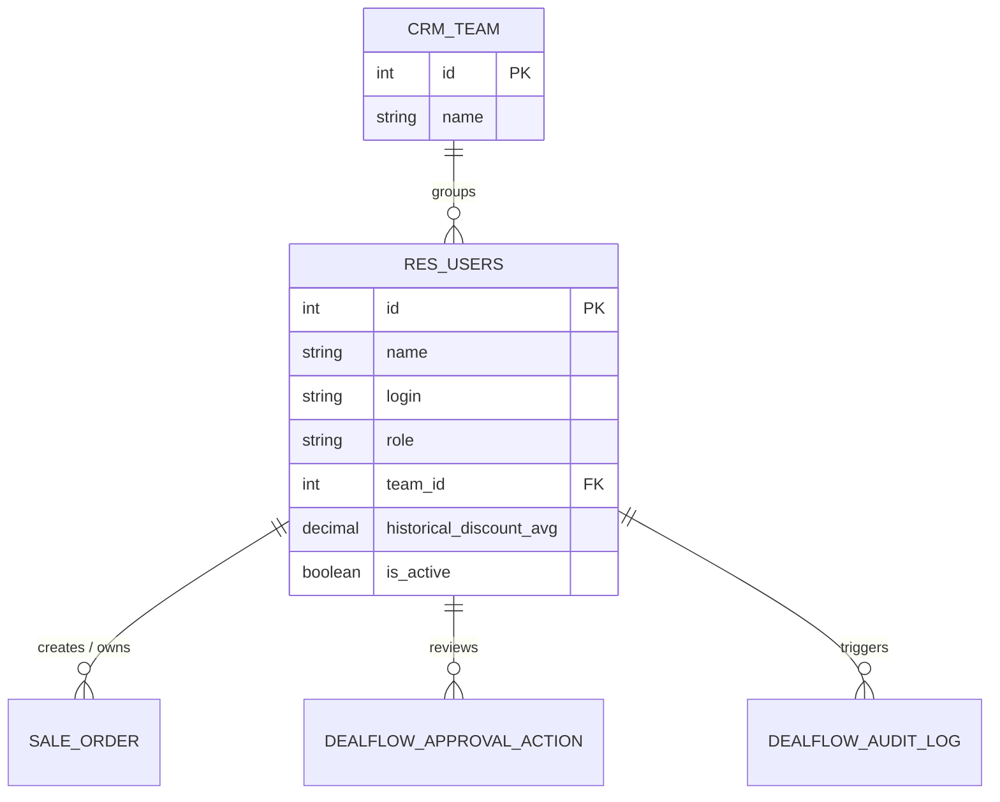
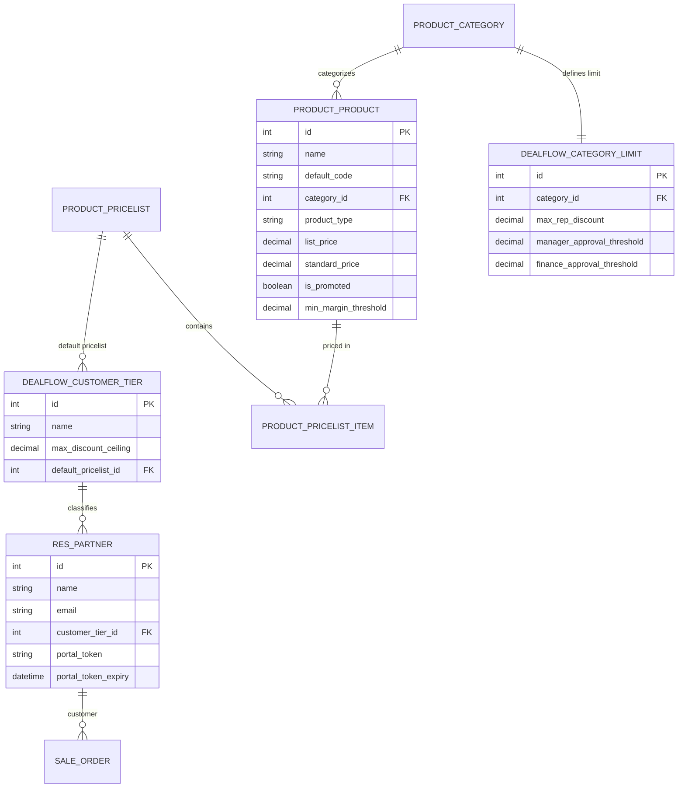
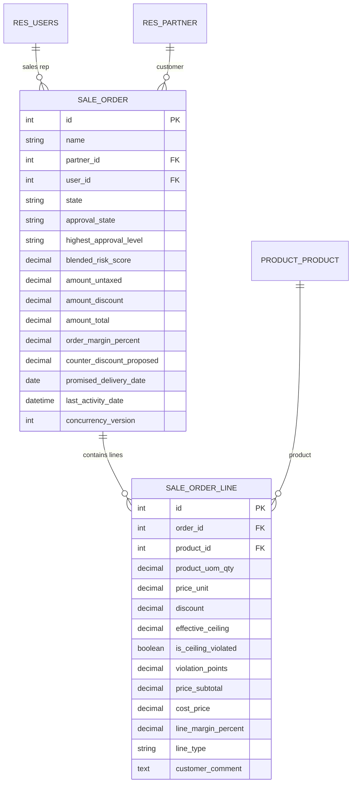
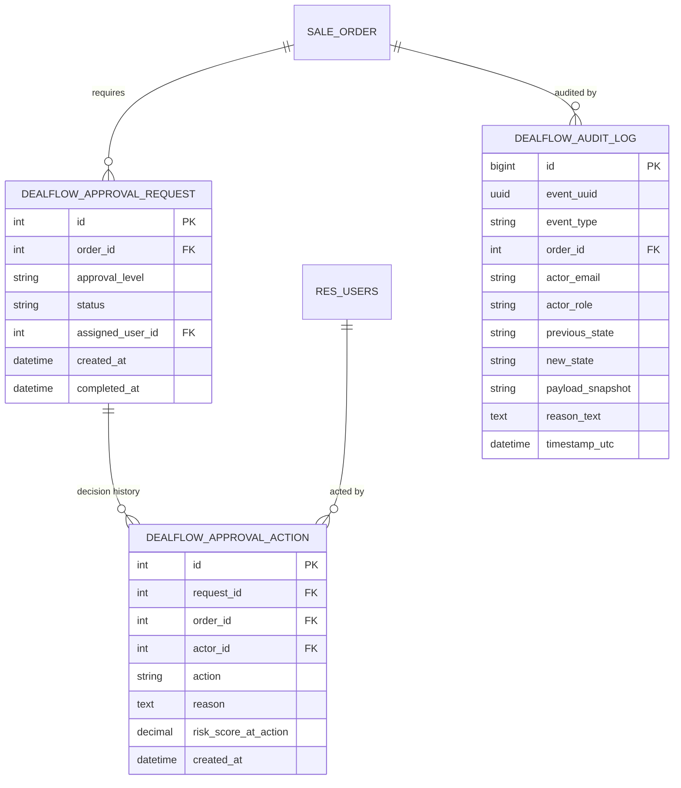
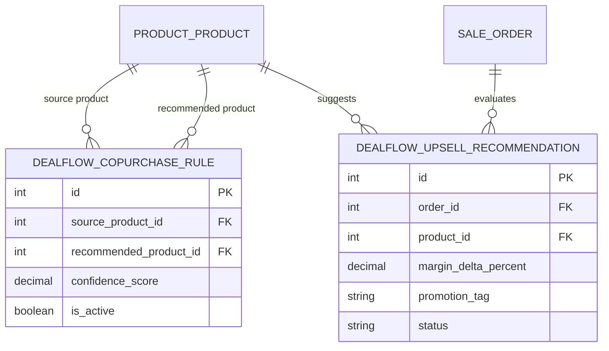
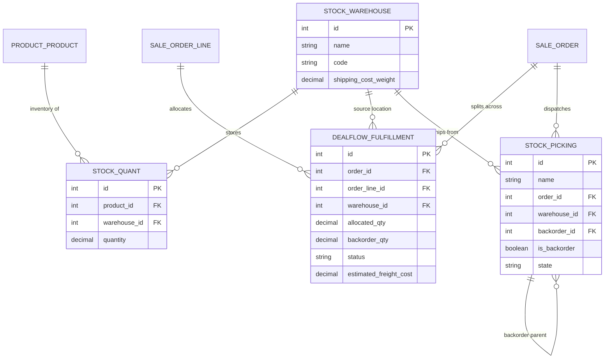
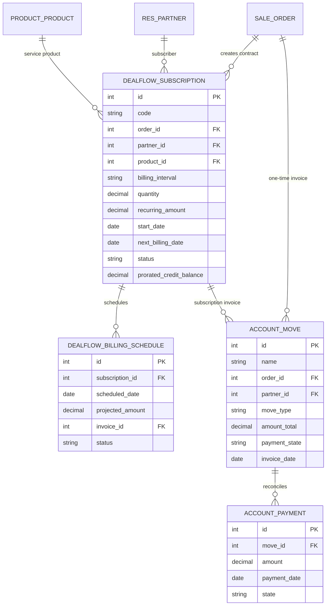
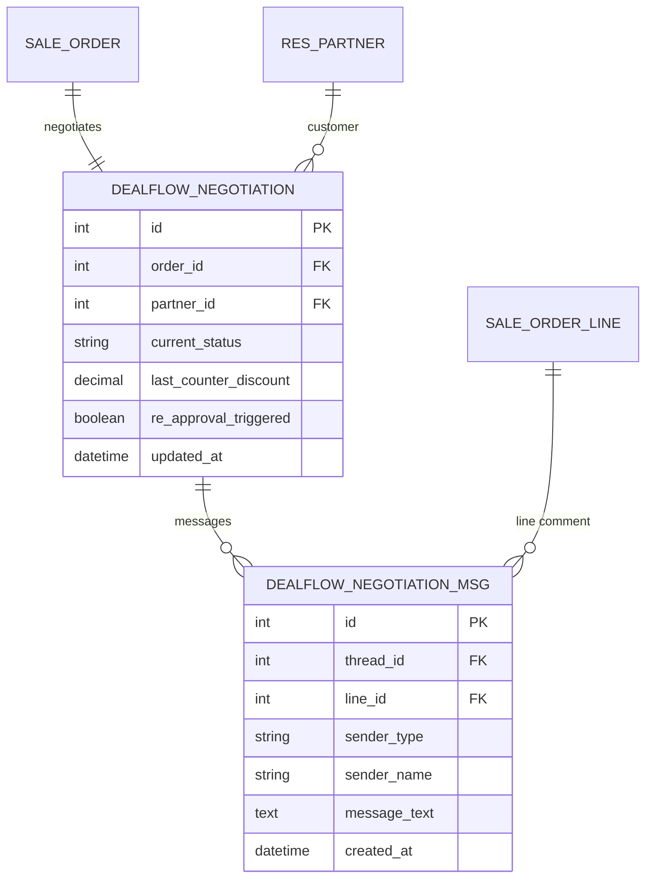
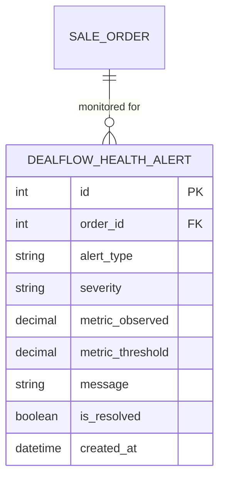
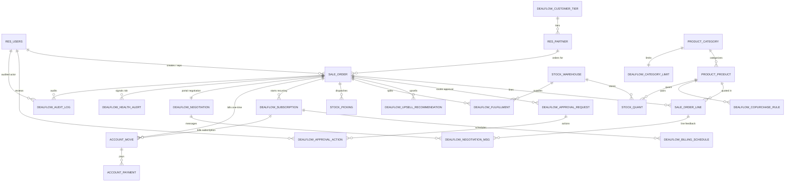

# DealFlow360: Master Entity-Relationship Diagrams (ERD)

---

## Overview
This document contains the complete visual Entity-Relationship Diagrams (ERD) for DealFlow360, rendered using standard GitHub-compatible Mermaid notation. It is partitioned into 9 domain-focused diagrams followed by the Complete System ERD connecting all domains.

---

## 1. Identity & Access ERD

---

## 2. Customer Master, Tiering & Product Pricing ERD

---

## 3. Quotation & Discount Governance ERD

---

## 4. Multi-Level Approval Chain & Audit ERD

---

## 5. Live Upsell & Cross-Sell ERD

---

## 6. Multi-Warehouse Fulfillment & Backorders ERD

---

## 7. Hybrid Billing, Subscriptions & Proration ERD

---

## 8. Customer Portal Negotiation ERD

---

## 9. Deal Health & Anomaly Alerts ERD

---

## 10. Complete DealFlow360 System ERD

