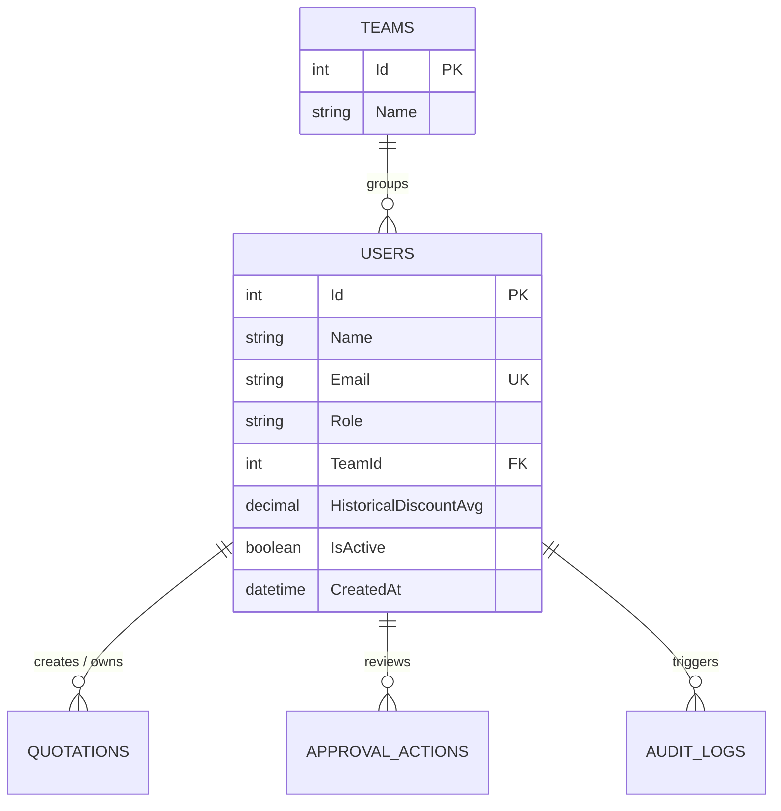
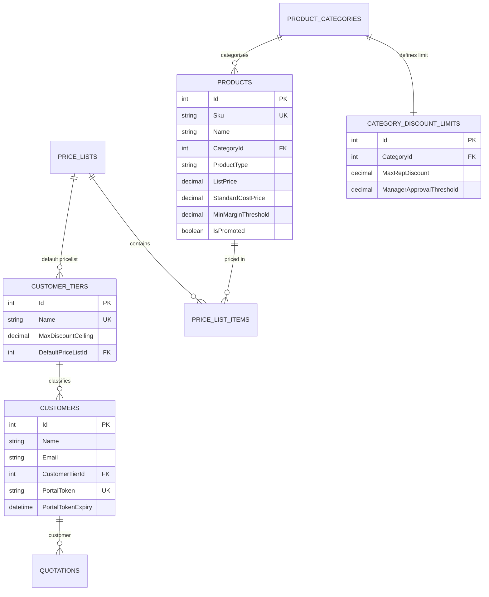
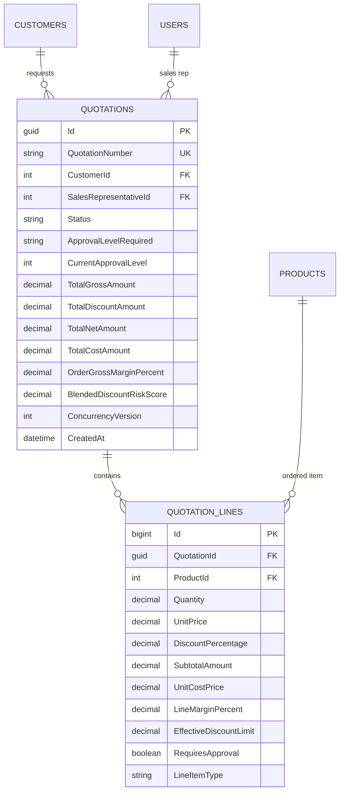
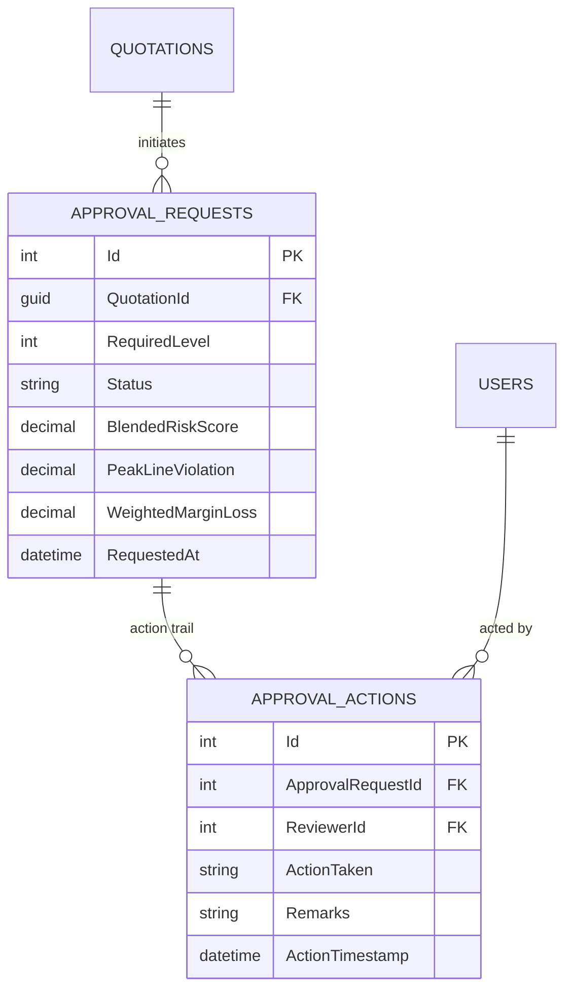
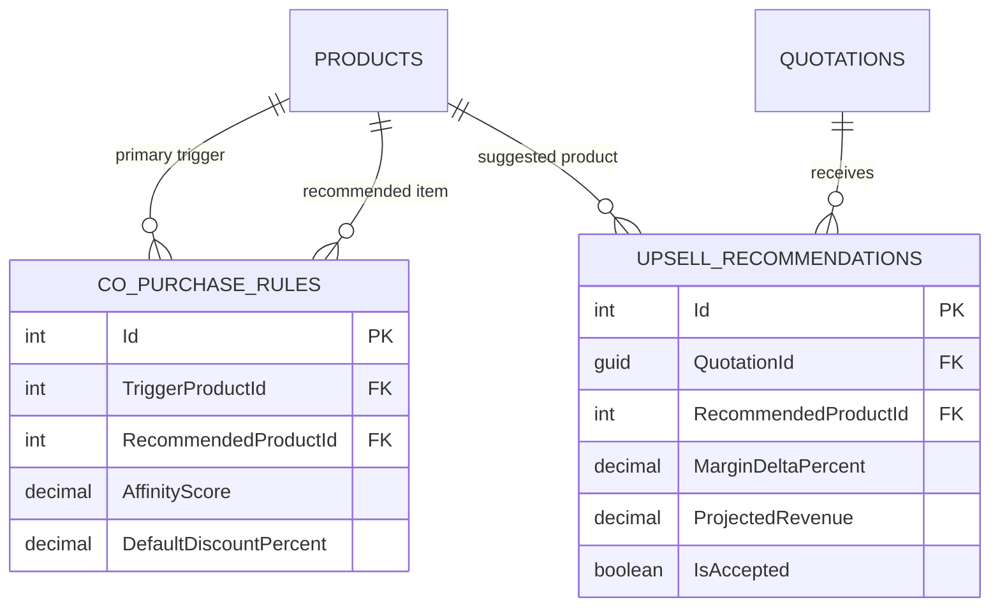
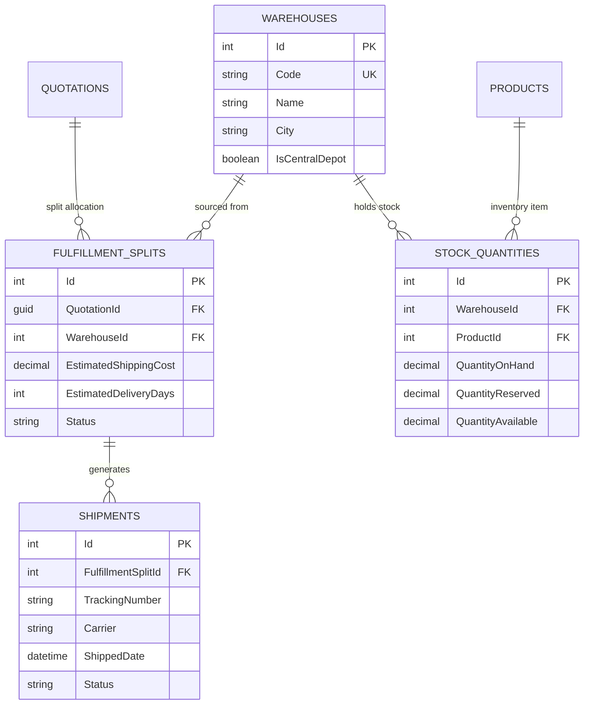
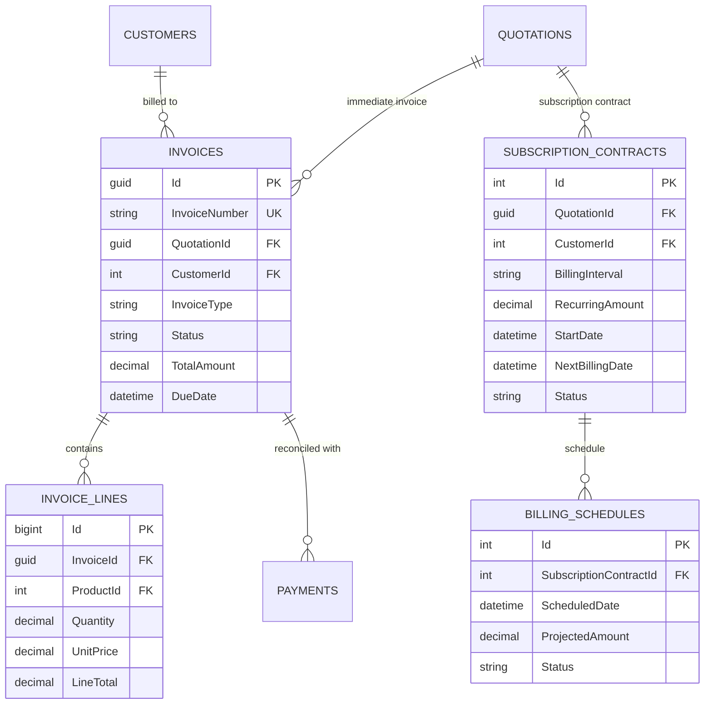
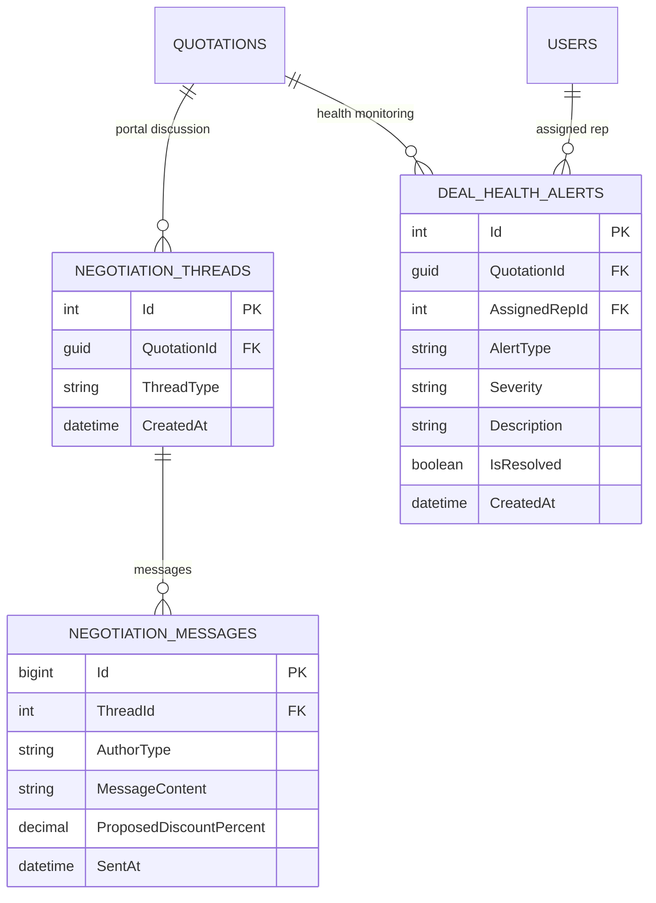
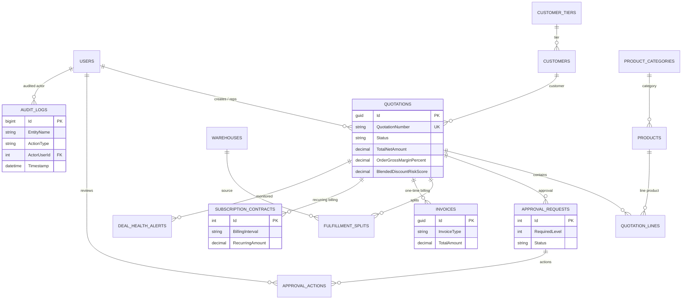

# DealFlow360: Master Entity-Relationship Diagrams (ERD)

---

## Overview
This document contains the complete visual Entity-Relationship Diagrams (ERD) for DealFlow360's Microsoft SQL Server database schema, rendered using standard GitHub-compatible Mermaid notation. It is partitioned into 9 domain-focused diagrams followed by the Complete System ERD.

---

## 1. Identity & Access ERD

---

## 2. Customer Master, Tiering & Product Pricing ERD

---

## 3. Core Quotation & Line Items ERD

---

## 4. Multi-Tier Approval Governance ERD

---

## 5. Live Upsell & Co-Purchase Engine ERD

---

## 6. Multi-Warehouse Fulfillment & Backorders ERD

---

## 7. Hybrid Billing & Subscriptions ERD

---

## 8. Customer Portal Negotiation & Health Monitoring ERD

---

## 9. Complete DealFlow360 System ERD

