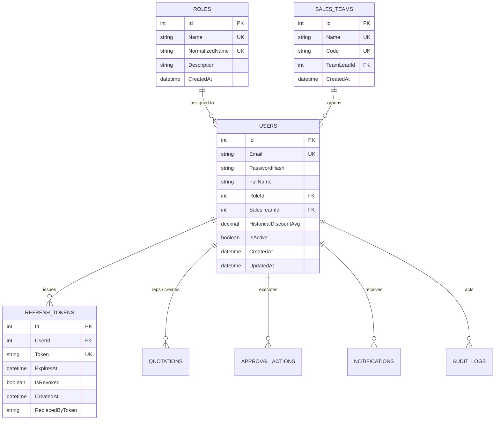
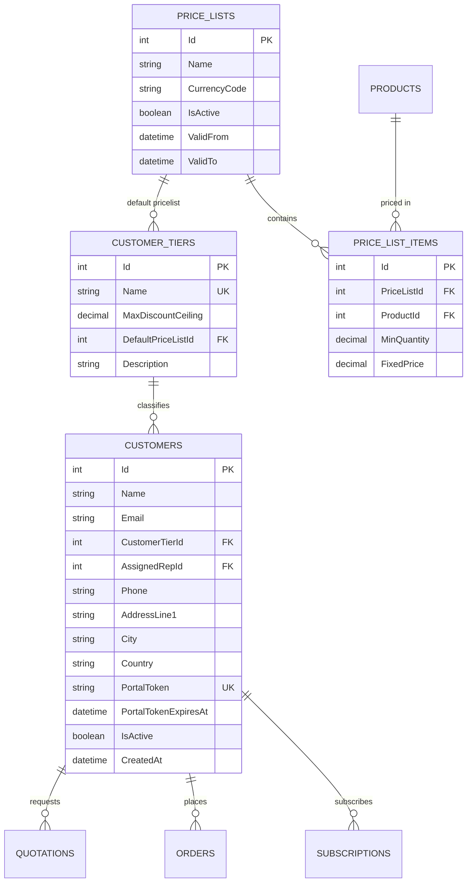
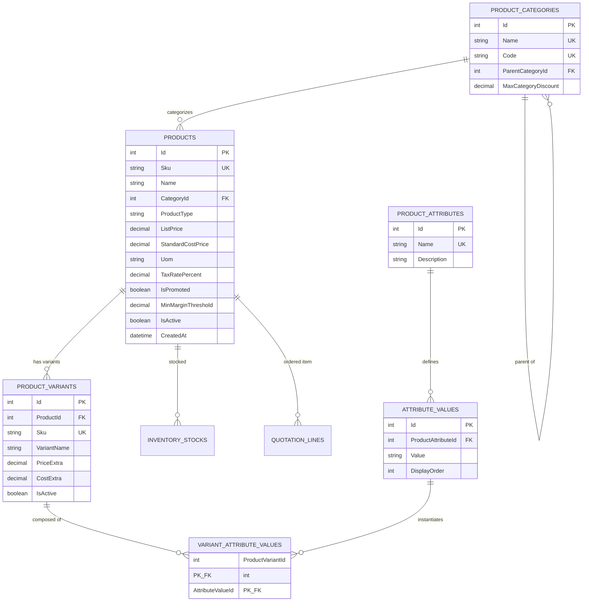
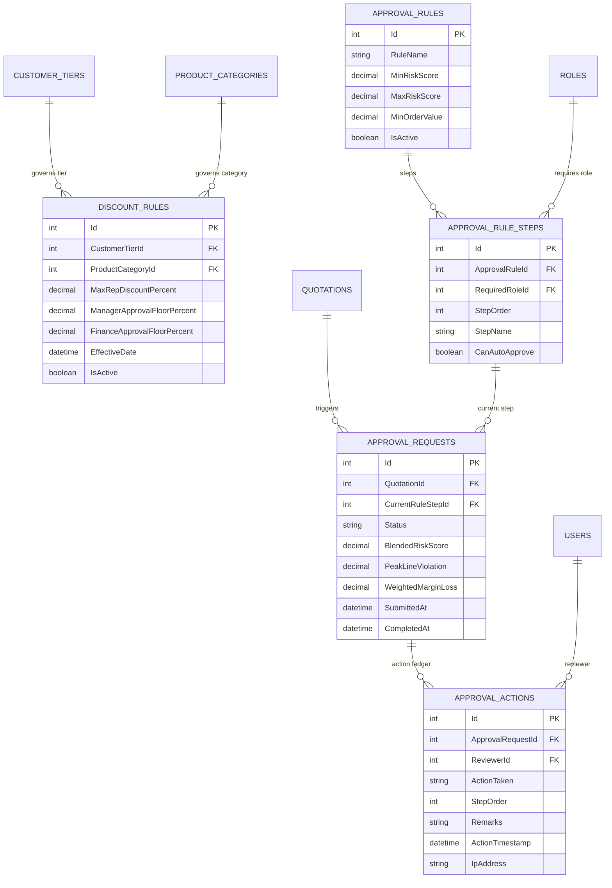
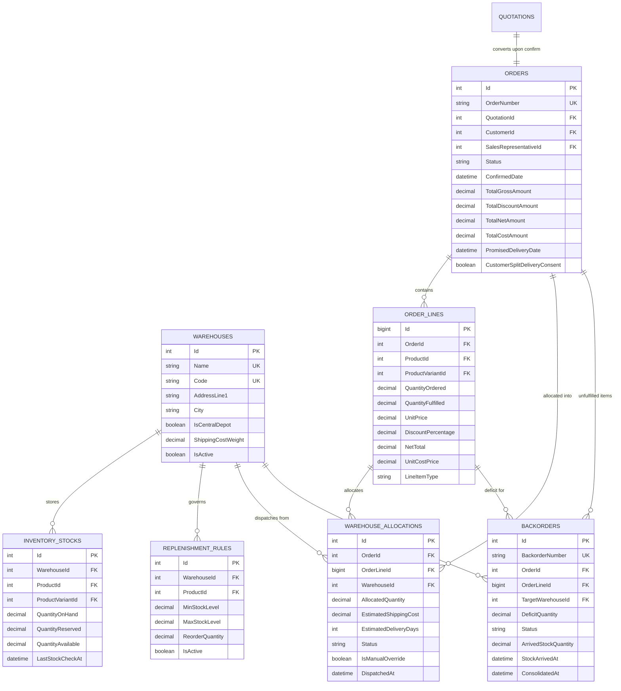
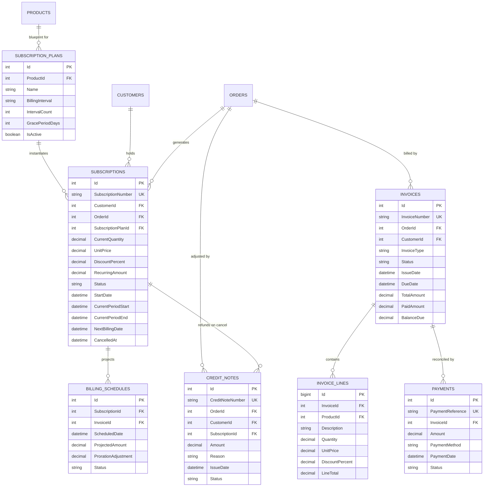
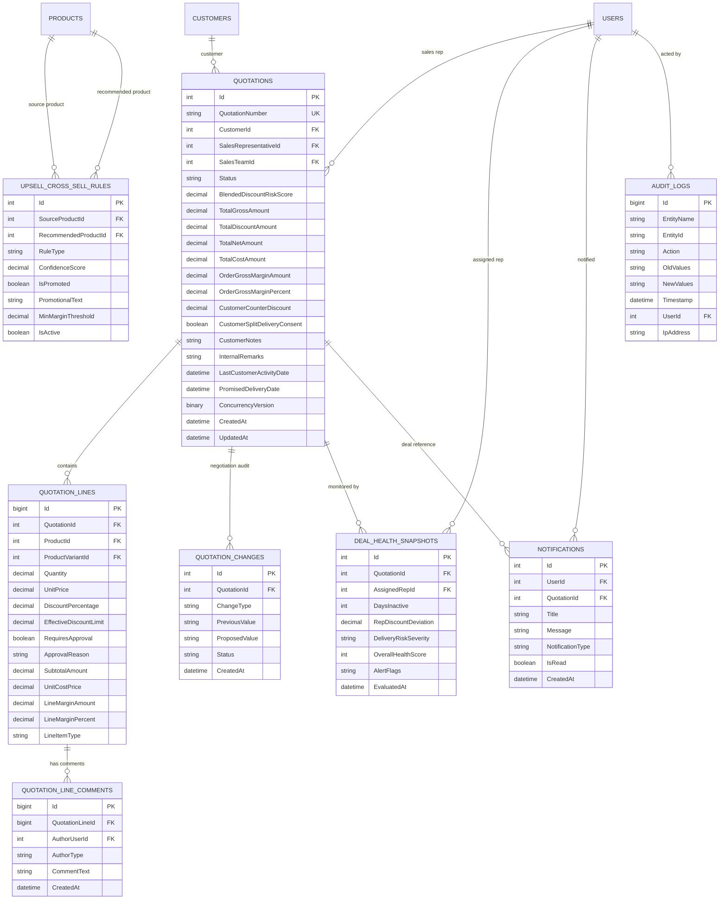

# DealFlow360: Master Entity-Relationship Diagrams (ERD)

---

## Overview
This document contains the complete visual Entity-Relationship Diagrams (ERD) for DealFlow360's Microsoft SQL Server database schema, rendered using standard GitHub-compatible Mermaid notation. It represents all **41 normalized entities** across 7 architectural domains.

---

## 1. Domain 1: Identity, Access & Governance ERD

---

## 2. Domain 2: Customer Master & Pricing Architecture ERD

---

## 3. Domain 3: Catalog & Multi-Attribute Variants ERD

---

## 4. Domain 4: Discount Governance & Multi-Tier Approvals ERD

---

## 5. Domain 5: Warehouses, Logistics & Order Fulfillment ERD

---

## 6. Domain 6: Hybrid Billing, Subscriptions & Financials ERD

---

## 7. Domain 7: Deal Intelligence, Negotiation & Platform Auditing ERD

---

## 8. Complete System Global ERD (All 41 Entities)

```mermaid
erDiagram
    %% Identity & Access
    ROLES ||--o{ USERS : "assigned"
    SALES_TEAMS ||--o{ USERS : "groups"
    USERS ||--o{ REFRESH_TOKENS : "owns"
    
    %% Customers & Pricing
    CUSTOMER_TIERS ||--o{ CUSTOMERS : "classifies"
    CUSTOMER_TIERS ||--o{ DISCOUNT_RULES : "governs"
    PRICE_LISTS ||--o{ CUSTOMER_TIERS : "default"
    PRICE_LISTS ||--o{ PRICE_LIST_ITEMS : "contains"
    PRODUCTS ||--o{ PRICE_LIST_ITEMS : "priced"

    %% Catalog & Variants
    PRODUCT_CATEGORIES ||--o{ PRODUCTS : "categorizes"
    PRODUCT_CATEGORIES ||--o{ DISCOUNT_RULES : "limits"
    PRODUCTS ||--o{ PRODUCT_VARIANTS : "variants"
    PRODUCT_ATTRIBUTES ||--o{ ATTRIBUTE_VALUES : "values"
    PRODUCT_VARIANTS ||--o{ VARIANT_ATTRIBUTE_VALUES : "combines"
    ATTRIBUTE_VALUES ||--o{ VARIANT_ATTRIBUTE_VALUES : "joined"
    PRODUCTS ||--o{ UPSELL_CROSS_SELL_RULES : "source/target"

    %% Quotations & Negotiation
    USERS ||--o{ QUOTATIONS : "reps"
    CUSTOMERS ||--o{ QUOTATIONS : "buys"
    QUOTATIONS ||--o{ QUOTATION_LINES : "lines"
    PRODUCTS ||--o{ QUOTATION_LINES : "selected"
    QUOTATION_LINES ||--o{ QUOTATION_LINE_COMMENTS : "comments"
    QUOTATIONS ||--o{ QUOTATION_CHANGES : "negotiation"

    %% Approvals
    APPROVAL_RULES ||--o{ APPROVAL_RULE_STEPS : "steps"
    ROLES ||--o{ APPROVAL_RULE_STEPS : "approver role"
    QUOTATIONS ||--o{ APPROVAL_REQUESTS : "approval"
    APPROVAL_REQUESTS ||--o{ APPROVAL_ACTIONS : "actions"
    USERS ||--o{ APPROVAL_ACTIONS : "reviewer"

    %% Fulfillment & Stock
    WAREHOUSES ||--o{ INVENTORY_STOCKS : "stores"
    PRODUCTS ||--o{ INVENTORY_STOCKS : "stocked"
    WAREHOUSES ||--o{ REPLENISHMENT_RULES : "rules"
    PRODUCTS ||--o{ REPLENISHMENT_RULES : "reorders"
    QUOTATIONS ||--|| ORDERS : "converts"
    ORDERS ||--o{ ORDER_LINES : "lines"
    ORDERS ||--o{ WAREHOUSE_ALLOCATIONS : "splits"
    ORDERS ||--o{ BACKORDERS : "deficits"
    WAREHOUSES ||--o{ WAREHOUSE_ALLOCATIONS : "sources"
    WAREHOUSES ||--o{ BACKORDERS : "replenishes"

    %% Hybrid Billing & Subscriptions
    PRODUCTS ||--o{ SUBSCRIPTION_PLANS : "blueprint"
    SUBSCRIPTION_PLANS ||--o{ SUBSCRIPTIONS : "plans"
    ORDERS ||--o{ SUBSCRIPTIONS : "initiates"
    SUBSCRIPTIONS ||--o{ BILLING_SCHEDULES : "prorations"
    ORDERS ||--o{ INVOICES : "invoices"
    INVOICES ||--o{ INVOICE_LINES : "lines"
    INVOICES ||--o{ PAYMENTS : "payments"
    ORDERS ||--o{ CREDIT_NOTES : "credits"

    %% Deal Health, Notifications & Audit
    QUOTATIONS ||--o{ DEAL_HEALTH_SNAPSHOTS : "health"
    USERS ||--o{ NOTIFICATIONS : "alerts"
    USERS ||--o{ AUDIT_LOGS : "audits"
```

