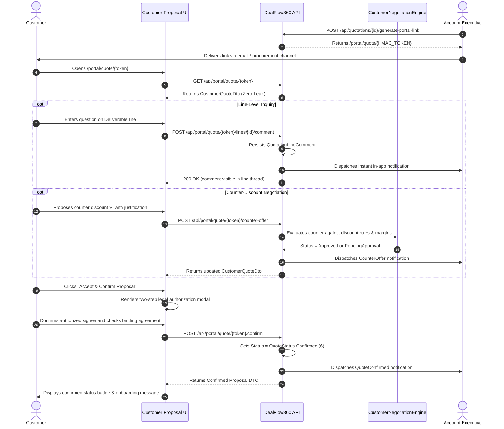

# DealFlow360 — Customer Portal Architecture & Integration

## Executive Overview
The **DealFlow360 Customer Portal** provides a premier, high-trust B2B client interaction surface. Rather than an internal CRM clone or a simplified read-only page, the portal is an active, secure commercial negotiation and confirmation experience that closes deals faster and eliminates communication friction between Enterprise clients and sales teams.

---

## 1. Dual-Path Client Access

DealFlow360 supports two distinct client access paradigms tailored to enterprise procurement realities:

### A. Cryptographically Signed Magic Link Portal (`/portal/quote/:token`)
- **Use Case**: One-click, friction-free proposal review for executive decision makers who do not require or want a portal login.
- **Security Mechanism**: SHA-256 HMAC signed token generated by `JwtService.GeneratePortalToken(quotationId, customerEmail)`.
- **Controller**: `DealFlow360.API.Controllers.PortalController` with `[AllowAnonymous]`.
- **Token Authorization**: Enforced cryptographically within `PortalService`.
- **Capabilities**:
  - Full document inspection
  - Line-item inquiry and threaded commentary
  - Counter-discount proposal submission with real-time negotiation engine evaluation
  - Two-step legal proposal confirmation

### B. Authenticated Customer Account Hub (`/portal/my-account`)
- **Use Case**: Continuous account relationship management for procurement leads, finance teams, and verified customer users (seeded: `customer@dealflow360.io`).
- **Security Mechanism**: Standard JWT Bearer token with Role `Customer`. Enforced with `[Authorize(Roles = "Customer,Admin")]`.
- **Controller**: `DealFlow360.API.Controllers.CustomersController` (`/api/customers/me/*`).
- **Data Isolation**: Strictly bounded by `CustomerId` claim in JWT. Customers can only read and mutate their own proposals, orders, and invoices. Attempts to access CRM internal routes (`/api/quotations`, `/api/invoices`, etc.) return `HTTP 403 Forbidden`.
- **Capabilities**:
  - Action-required proposal notification banner
  - KPI overview: Active Proposals, Confirmed Orders, Invoices & Balances
  - Multi-tab management: My Proposals, My Execution Orders, Invoices & Billing
  - In-place slide-out proposal inspector with full line deliverables and binding acceptance

---

## 2. Zero-Leak Security Invariants

In B2B commercial negotiations, exposing internal margins, supplier costs, risk metrics, or approval chains to clients causes irreversible negotiation damage. DealFlow360 strictly enforces the **Zero-Leak Invariant** at the ASP.NET Core DTO boundary:

| Field / Attribute | Internal CRM Representation | Customer Portal DTO Representation |
| :--- | :--- | :--- |
| **Cost Price** | `QuotationLine.CostPrice` | **COMPLETELY STRIPPED** (not in `CustomerQuoteLineDto`) |
| **Unit Margin** | `QuotationLine.MarginAmount` | **COMPLETELY STRIPPED** |
| **Margin Percent** | `Quotation.MarginPercent` | **COMPLETELY STRIPPED** |
| **Risk Score** | `Quotation.RiskScore` | **COMPLETELY STRIPPED** |
| **Governance Violations** | `Quotation.ViolationCount` | **COMPLETELY STRIPPED** |
| **Approval Remarks** | `QuotationApproval.ApproverRemarks` | **COMPLETELY STRIPPED** |
| **Discount Limits** | Internal discount rules & approval thresholds | **COMPLETELY STRIPPED** |

Customers only ever see:
- Product Name & SKU
- Quantity & Units
- Agreed Customer Unit Price
- Customer Discount Percentage & Calculated Savings
- Net Line Total & Grand Total
- Delivery SLA, Warranty, and Commercial Notes

---

## 3. Commercial Structure: One-Time vs. Recurring SaaS / Support

The proposal presentation cleanly segments commercial commitments:

### One-Time Deliverables & Equipment
- Physical hardware, appliances, installation, professional consulting, and setup.
- Structured with Deliverable Name, SKU, Quantity, Unit Price, Savings %, and Net Deliverable Total.

### Recurring SaaS & Support Schedules
- Cloud subscriptions, software licenses, maintenance SLAs, and support schedules.
- Clearly flags billing frequency (Annual, Quarterly, Monthly), license/seat count, periodic rate, and recurring net commitment.
- Backed by `SubscriptionPlan` metadata in backend Entity Framework model.

---

## 4. Complete Customer Interaction Lifecycle



---

## 5. Automated Verification Results

All 22 integration points were verified via end-to-end automated test runner `scratch/test_customer_portal.js`:

```
========================================
TEST SUMMARY: 22 PASSED, 0 FAILED
========================================
- Customer Authentication: PASS (Role: Customer)
- Isolation & Boundary Check: PASS (Customer receives 403 on internal CRM /api/quotations and /api/invoices)
- Customer Hub Data Endpoints: PASS (9 quotes, 4 orders, 3 invoices retrieved)
- Zero-Leak Invariant Audit: PASS (No internal costs, margins, or risk scores exposed)
- Magic Link HMAC Token Generation: PASS (Cryptographic token validated)
- Anonymous Token Portal Access: PASS (Quotation QT-20260905-DC784C retrieved)
- Line Inquiry Submission & Persistence: PASS (Comment stored in QuotationLineComment and reflected in thread)
- Counter-Offer Proposal: PASS (Evaluated by CustomerNegotiationEngine, status updated)
- Proposal Confirmation via Token: PASS (Quotation status transitioned to Confirmed)
- Proposal Confirmation via Customer Account Hub: PASS (Quotation status transitioned to Confirmed)
```
