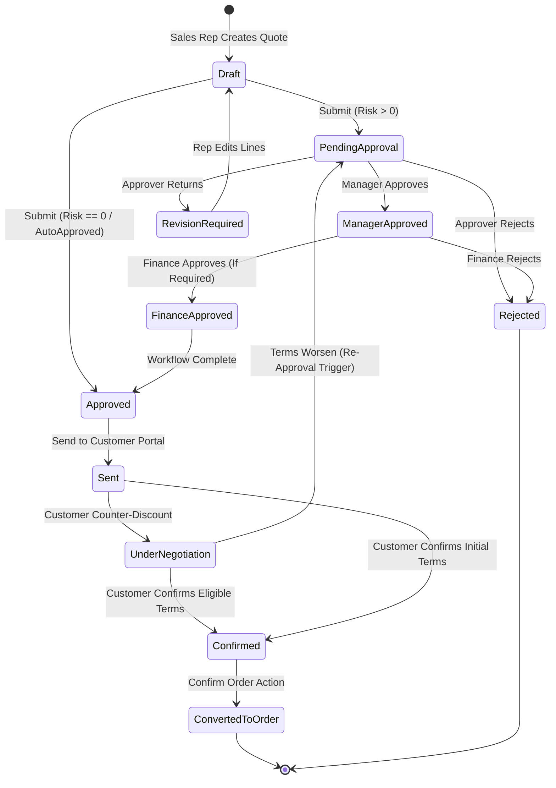
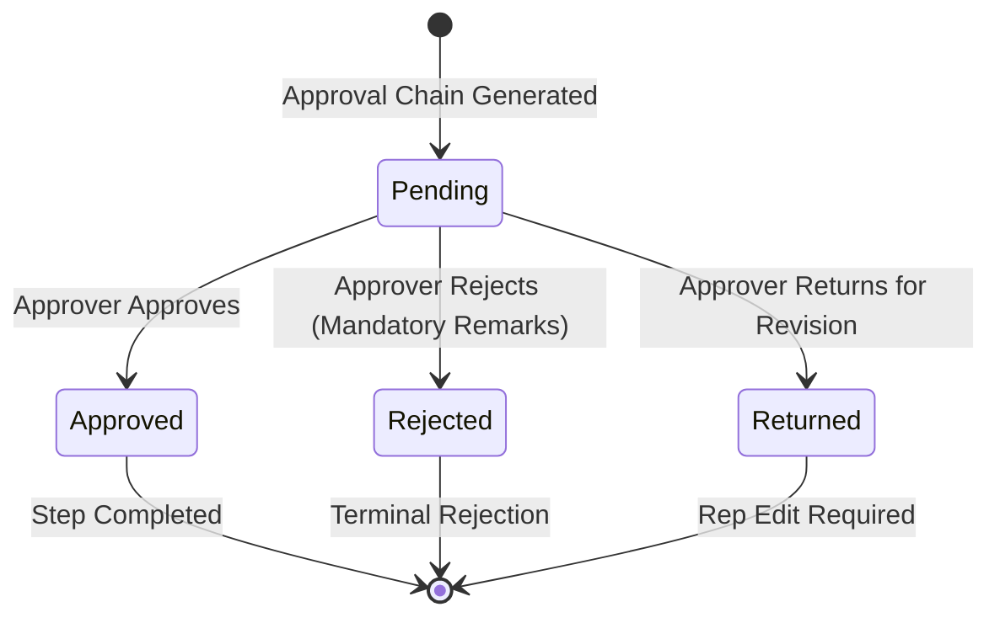
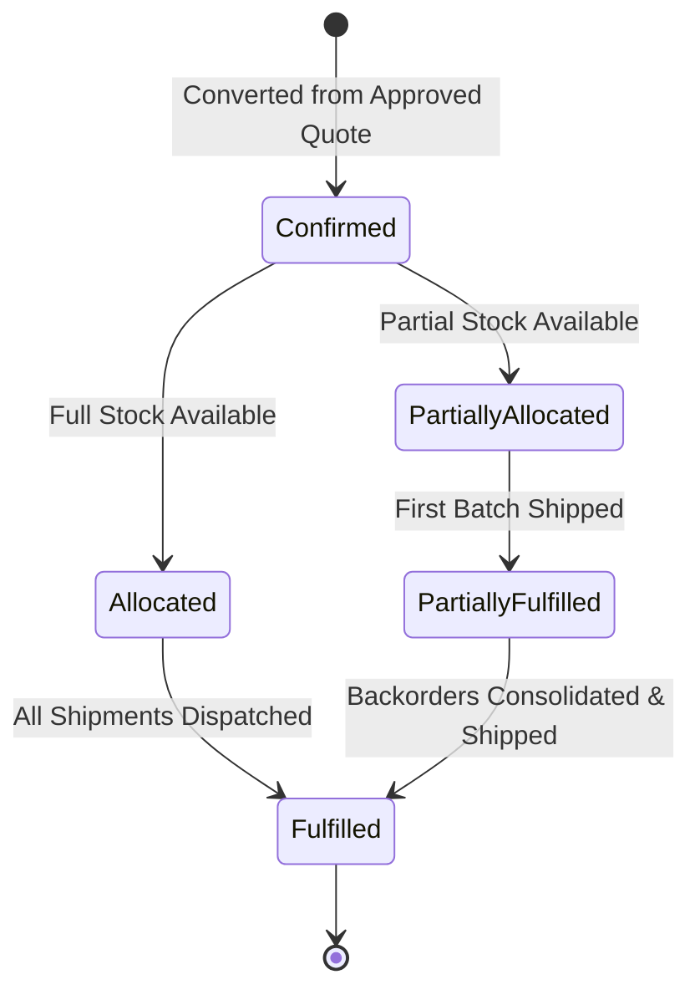
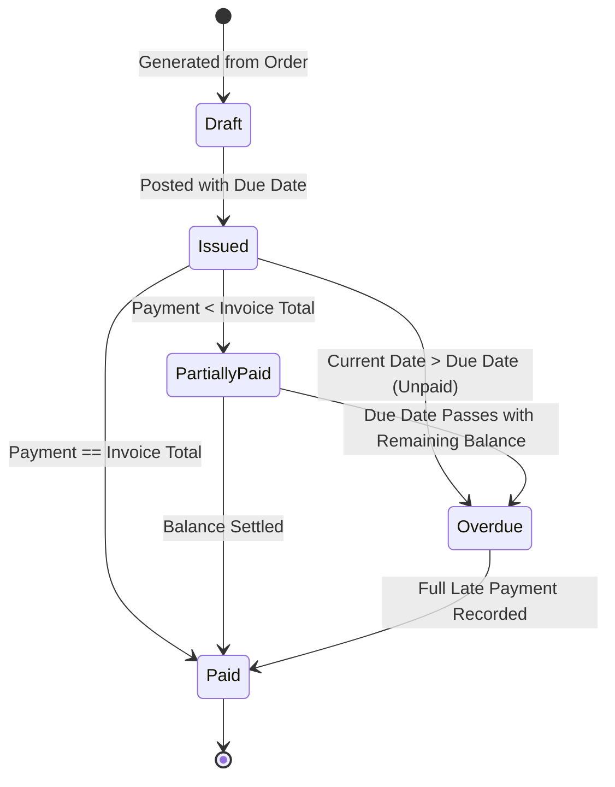
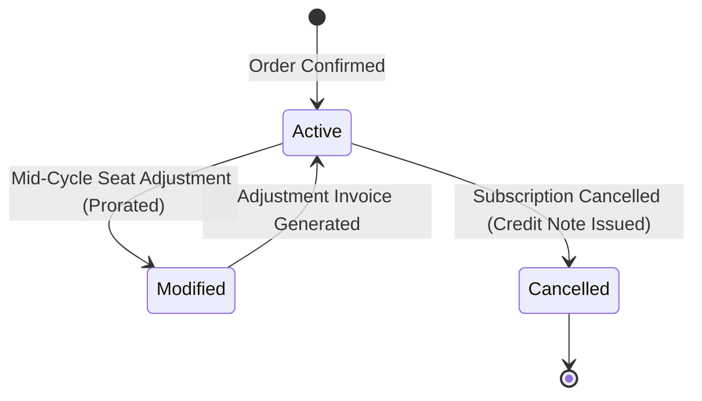
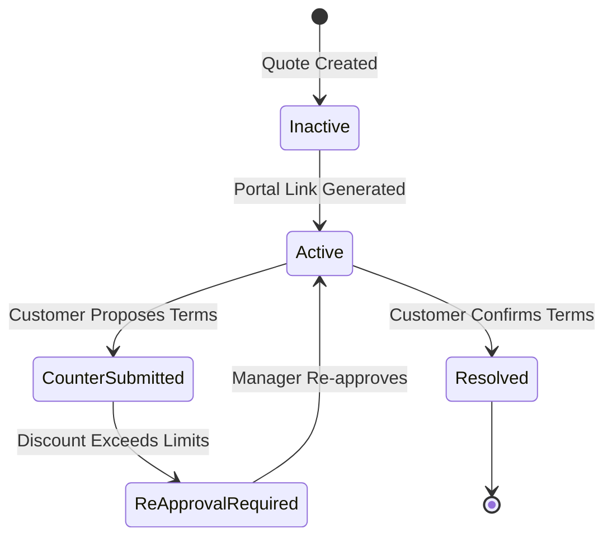
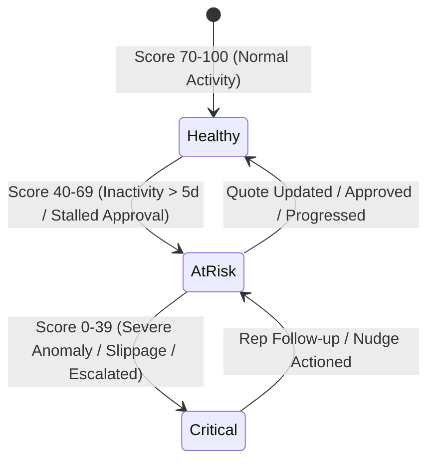

# DealFlow360: Master End-to-End Workflows & State Machine Architecture

---

## 1. Document Control & Architectural Foundation

| Attribute | Value |
| :--- | :--- |
| **Document Title** | Master End-to-End Workflows & State Machine Architecture |
| **System Name** | DealFlow360: Intelligent, Self-Governing Sales Operations Platform |
| **Version** | 3.0.0 (Locked Stack: React + ASP.NET Core + SQL Server) |
| **Primary References** | `DealFlow360.pdf` (13-Page Problem Statement), `DealFlow360_ASPNet_SQLServer_React_Complete_Implementation_Spec.pdf` (39-Page Master Spec) |
| **Last Updated** | 2026-09-05 |

---

## 2. The 17 Core End-to-End Business Workflows

```text
  [1. Login] ──► [2. Create Quote] ──► [3. Price & Margin] ──► [4. Discount Ceilings]
                                                                        │
  ┌─────────────────────────────────────────────────────────────────────┘
  ▼
[5. Blended Risk] ──► [6. Auto Route] ──► [7. Approval Action] ──► [8. Upsell / Reprice]
                                                                          │
  ┌───────────────────────────────────────────────────────────────────────┘
  ▼
[9. Warehouse Split] ──► [10. Backorder] ──► [11. Hybrid Billing] ──► [12. Portal Send]
                                                                            │
  ┌─────────────────────────────────────────────────────────────────────────┘
  ▼
[13. Negotiation] ──► [14. Re-Approval] ──► [15. Confirm Order] ──► [16. Payment] ──► [17. Deal Health]
```

### Workflow 1: User Login & Session Establishment
1. User enters email and password on React `/login` screen.
2. `AuthService` verifies Argon2 hash, checks `IsActive == true`, and issues JWT Bearer token with user ID, role, and sales team ID claims.
3. React stores token in memory/secure storage, decodes role, and navigates to role-specific dashboard.

### Workflow 2: Quotation Creation & Line Assembly
1. Sales Rep selects Customer on `/workspace/quotations/new`.
2. Rep adds items from product catalog picker with quantities and requested discount percentages.
3. React issues `POST /api/quotations` and `POST /api/quotations/{id}/lines`.

### Workflow 3: Authoritative Pricing & Margin Calculation
1. Backend `PriceListService` loads customer tier (`Gold`, `Silver`, `Bronze`) and resolves authoritative unit list prices.
2. `QuotationService` computes:
   $$\text{Line Revenue} = \text{UnitPrice} \times (1 - \frac{\text{Discount}}{100}) \times \text{Quantity}$$
   $$\text{Line Margin} = \text{Line Revenue} - (\text{StandardCostPrice} \times \text{Quantity})$$
   $$\text{Order Gross Margin \%} = \frac{\sum \text{Line Margins}}{\sum \text{Line Revenues}} \times 100$$
3. Response returns updated lines, totals, and gross margin percentage to React.

### Workflow 4: Discount Governance & Ceiling Evaluation
1. For each quotation line, `DiscountService` resolves:
   $$\text{AllowedPercent} = \min(\text{CustomerTierCeiling}, \text{CategoryCeiling})$$
2. Computes line overage:
   $$\text{OveragePoints} = \max(0, \text{ActualDiscountPercent} - \text{AllowedPercent})$$
3. Lines with $\text{OveragePoints} > 0$ are flagged with `RequiresApproval = true` and explanatory violation reason.

### Workflow 5: Blended Risk Score Calculation
1. `DiscountService` computes volume-weighted blended risk score across all quotation lines:
   $$\text{Blended Risk Score} = \frac{\sum (\text{LineNetBeforeDiscount} \times \text{OveragePoints})}{\sum \text{LineNetBeforeDiscount}}$$
2. Server binds the score to configured approval bands in `ApprovalRules`:
   - Score $0.00$: No approval required (`AutoApproved`).
   - Score $> 0.00 - 5.00$: Level 1 Approval Required (`SalesManager`).
   - Score $> 5.00 - 10.00$: Level 1 + Level 2 Required (`SalesManager` + `FinanceOperations`).
   - Score $> 10.00$: Level 1 + Level 2 + Critical Escalation Flag.

### Workflow 6: Automatic Approval Routing
1. Sales Rep clicks *"Submit for Approval"* (`POST /api/quotations/{id}/submit`).
2. Server locks quotation lines from further rep edits.
3. If risk score requires no approval, quotation status transitions directly to `Approved/Ready`.
4. If approval is required:
   - Creates `ApprovalRequests` record with `Status = Pending`, `Sequence = 1` (Manager).
   - Sets quotation `Status = PendingApproval`.
   - Dispatches in-app notification to Sales Manager.

### Workflow 7: Approval Action Execution
1. Sales Manager inspects quote on `/workspace/quotations/:id/approval`.
2. Manager submits decision via `POST /api/approvals/{id}/[approve|reject|return]` with mandatory remarks.
3. **Approve**: If Finance step required, creates Step 2 (`FinanceOperations`). When all steps approve, status transitions to `Approved`.
4. **Reject**: Quotation status transitions to `Rejected` (terminal).
5. **Return**: Status transitions to `RevisionRequired`. Rep edits quotation $\rightarrow$ server automatically recalculates risk and invalidates prior approval chain.

### Workflow 8: Live Upsell / Cross-Sell Suggestion & Cart Reprice
1. While quote is in `Draft`, React queries `GET /api/quotations/{id}/recommendations`.
2. `RecommendationService` scores candidates: $+30$ Promoted, $+20$ Co-purchase affinity rule, $+20$ Margin above minimum threshold, $+10$ Compatible category.
3. Server simulates live gross margin delta: $\Delta \text{Margin \%} = \text{NewMargin \%} - \text{CurrentMargin \%}$.
4. Rep clicks *"Accept Suggestion"*; server appends line, recalculates totals/risk, and returns refreshed quote.

### Workflow 9: Multi-Warehouse Fulfillment & Cost-Weighted Split
1. On confirmed order, `FulfillmentService` loads warehouse inventory: $\text{AvailableStock} = \text{OnHand} - \text{Reserved}$.
2. Algorithm prioritizes single warehouse satisfying entire quantity with lowest shipping cost weight.
3. If no single warehouse satisfies order, allocates greedily from warehouse with largest stock fraction.
4. Generates `WarehouseAllocations` preview for Operations review.

### Workflow 10: Backorder Reservation & Auto-Consolidation on Restock
1. Any unfulfilled line quantity is assigned to `Backorders` table.
2. When a replenishment goods receipt arrives at a warehouse, `FulfillmentService.ConsolidateBackordersAsync()` executes:
   - Matches active backorders against new available stock.
   - Converts backorders into pending shipment allocations.
   - Emits consolidation alert on Operations dashboard.

### Workflow 11: Hybrid Billing (Immediate Invoices + Subscription Schedules)
1. Single quotation contains hardware/services (`OneTime`) and software subscriptions (`Recurring`).
2. `BillingService` partitions line types:
   - One-time items generate an immediate commercial `Invoice` with due date.
   - Subscription items generate a `SubscriptionContract` and projected `BillingSchedules` (Monthly/Quarterly/Annual).
3. Payments against invoices update `PaidAmount` and status (`Unpaid` $\rightarrow$ `PartiallyPaid` $\rightarrow$ `Paid`).

### Workflow 12: Customer Portal Magic-Link Generation & Restricted View
1. Rep clicks *"Send to Customer"* (`POST /api/quotations/{id}/send-portal`).
2. Server generates cryptographic SHA-256 HMAC token and sets quote status to `Sent`.
3. Customer accesses `/portal/quotations/:token`.
4. Server returns `PortalQuotationResponse` strictly stripping all cost prices, unit margins, deal risk scores, and internal manager remarks.

### Workflow 13: Customer Negotiation (Line Inquiries & Counter-Offers)
1. Customer asks line-specific questions via `POST /api/portal/quotations/{id}/line-requests`.
2. Customer proposes higher counter-discount via `POST /api/portal/quotations/{id}/counter-discount`.
3. System logs `QuotationChanges` audit record and sets quote status to `UnderNegotiation`.

### Workflow 14: Negotiation Re-Approval Trigger & Invalidation
1. Backend recalculates blended risk score on customer's proposed terms.
2. If the counter-proposal worsens risk beyond allowable limits:
   - Previous approval is **immediately invalidated**.
   - Server creates a fresh `ApprovalRequest` chain.
   - Quotation transitions back to `PendingApproval`.
   - Customer UI displays *"Under Review by Sales Management"*; internal approval reasons remain hidden.

### Workflow 15: Final Customer Confirmation & Order Conversion
1. Once terms are approved and eligible, customer clicks *"Confirm Quotation"* on portal.
2. Quote transitions to `Confirmed`.
3. Operations/System executes `POST /api/quotations/{id}/confirm-order`:
   - Creates immutable `Orders` and `OrderLines` snapshots.
   - Triggers stock reservation in `InventoryStocks`.
   - Dispatches fulfillment and billing workflows.

### Workflow 16: Payment Processing & Cumulative Balance Updates
1. Customer or Finance records payment (`POST /api/invoices/{id}/payments`).
2. `BillingService` calculates:
   $$\text{Outstanding} = \text{InvoiceTotal} - \sum \text{ValidPayments}$$
   - If $\text{Outstanding} \le 0 \implies \text{Paid}$.
   - If $\text{Payments} > 0 \text{ and } \text{Outstanding} > 0 \implies \text{PartiallyPaid}$.
   - If $\text{No Payment and DueDate passed} \implies \text{Overdue}$.
3. Overpayment attempts are rejected by validation rule.

### Workflow 17: Deal Health Anomaly Monitoring & Rep Nudge/Escalation
1. `DealHealthBackgroundService` executes daily:
   - **Stalled Deals**: Quotes in `Sent` or `UnderNegotiation` with no activity $> 5$ days.
   - **Discount Anomalies**: Rep discount $> \text{RepHistoricalAvg} + 2\sigma$.
   - **Delivery Slippage**: Current projected dispatch date $>$ Customer promised delivery date.
2. Transparent health score computed ($100 - \sum \text{Penalties}$):
   - $70–100$: Healthy (Green).
   - $40–69$: At Risk (Amber).
   - $0–39$: Critical (Red).
3. Manager executes `POST /api/deal-health/alerts/{id}/nudge` or `.../escalate`.

---

## 3. The 7 Authoritative State Machines

### 3.1 Quotation Lifecycle State Machine



**Quotation Invariant Rules**:
- Editing quotation lines while in `Approved` or `Sent` **invalidates** prior approval and forces quote back to `Draft` / `PendingApproval`.
- Customer cannot confirm a quote that is in `PendingApproval` or `Rejected`.
- No generic `UpdateStatusAsync()` endpoint; state changes require explicit domain commands (`SubmitQuotationAsync`, `ApproveQuotationAsync`, `ConfirmOrderAsync`).

---

### 3.2 Approval Workflow State Machine



**Approval Invariant Rules**:
- Rejection and Return require mandatory explanation remarks ($\ge 10$ characters).
- Once acted upon, an approval step is immutable. Changes to the quotation generate a brand new approval chain rather than modifying historical decisions.

---

### 3.3 Commercial Order State Machine



---

### 3.4 Invoice & Payment State Machine



---

### 3.5 Subscription Contract State Machine



---

### 3.6 Negotiation Thread State Machine



---

### 3.7 Deal Health Anomaly State Machine


